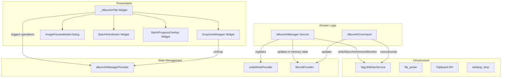

# Design Document: Album Art Management

## Overview

This feature completes the album art write/remove workflow in Open Tag Editor. The existing `_AlbumArtTab` widget has Add and Remove buttons with TODO stubs — this design wires them to the `TagWriterService`, adds drag-and-drop and clipboard paste input methods, implements undo support, and provides batch progress feedback and a mixed-art indicator for multi-file selections.

The design introduces an `AlbumArtManager` service that orchestrates all album art operations, an `AlbumArtCommand` for undo/redo, and a rewritten `_AlbumArtTab` widget with drop zone, preview modal, and batch indicator support.

### Key Design Decisions

1. **AlbumArtManager service over inline widget logic** — All album art operations (add, remove, batch write) are coordinated by a dedicated service class. This keeps the widget thin, makes operations testable without widget infrastructure, and provides a single place to handle progress tracking and error aggregation.

2. **Implement `writeAlbumArt` via `taglib_complex_property_set`** — The existing TODO in `TagLibWriterService.writeAlbumArt` will be implemented by constructing a `TagLib_Complex_Property_Attribute` array with data (ByteVector), mimeType (String), description (String), and pictureType (String) entries, then calling `taglib_complex_property_set(file, "PICTURE", attributes)`.

3. **Sentinel pattern for nullable `albumArt` in `copyWith`** — The current `AudioFile.copyWith` cannot set `albumArt` to `null` (it uses `??`). We add a `clearAlbumArt` boolean parameter to `copyWith` to support explicit null assignment without breaking the existing API.

4. **Single undoable command for batch operations** — Whether adding or removing art from 1 or 50 files, the operation registers as one `AlbumArtCommand` with the `UndoRedoManager`. The command stores the previous `AlbumArtData?` for each affected file path, enabling full reversal.

5. **Progress via stream** — Batch operations emit progress events through a `StreamController`, allowing the UI to show a progress indicator without tight coupling between the service and widget layers.

6. **Drop zone as widget wrapper** — The drop zone is implemented as a `DragTarget<List<XFile>>` wrapping the album art panel content, providing hover feedback via a border highlight. This uses the `desktop_drop` package for native file drop support on Windows.

## Architecture



### Data Flow

1. **Add via file picker**: User clicks Add → file picker opens → user selects image → `AlbumArtManager.addAlbumArt(files, imageBytes, mimeType)` → writes to each file via `TagWriterService.writeAlbumArt` → updates `FileListNotifier` with new `AlbumArtData` → registers `AlbumArtCommand` with `UndoRedoManager`
2. **Add via drag-and-drop**: User drops image on panel → `DropZoneWrapper` reads file bytes → delegates to `AlbumArtManager.addAlbumArt`
3. **Add via clipboard**: User presses Ctrl+V → widget reads clipboard image data or file path → delegates to `AlbumArtManager.addAlbumArt`
4. **Remove**: User clicks Remove → (if multi-file: confirmation dialog) → `AlbumArtManager.removeAlbumArt(files)` → calls `TagWriterService.removeAlbumArt` per file → updates `FileListNotifier` to clear `albumArt` → registers `AlbumArtCommand`
5. **Undo add**: `AlbumArtCommand.undo()` → restores previous art state (null or prior art) by calling `removeAlbumArt` or `writeAlbumArt` per file → updates `FileListNotifier`
6. **Undo remove**: `AlbumArtCommand.undo()` → re-writes the original art via `writeAlbumArt` per file → updates `FileListNotifier`

## Components and Interfaces

### AlbumArtManager (new service)

```dart
/// Coordinates album art add/remove operations with undo support,
/// batch progress tracking, and in-memory state updates.
class AlbumArtManager {
  AlbumArtManager({
    required this.tagWriter,
    required this.fileListNotifier,
    required this.undoRedoManager,
  });

  final TagWriterService tagWriter;
  final FileListNotifier fileListNotifier;
  final UndoRedoManager undoRedoManager;

  /// Adds album art to all specified files.
  /// Returns a stream of progress events for batch UI feedback.
  /// Registers a single undoable command on completion.
  Stream<BatchProgress> addAlbumArt({
    required List<AudioFile> files,
    required Uint8List imageBytes,
    required String mimeType,
  });

  /// Removes album art from all specified files.
  /// Returns a stream of progress events.
  /// Registers a single undoable command on completion.
  Stream<BatchProgress> removeAlbumArt({
    required List<AudioFile> files,
  });
}
```

### AlbumArtCommand (new undoable command)

```dart
/// Undoable command for album art add/remove operations.
/// Stores the previous album art state for each affected file.
class AlbumArtCommand implements UndoableCommand {
  AlbumArtCommand({
    required this.tagWriter,
    required this.fileListNotifier,
    required this.filePaths,
    required this.previousArtMap,
    required this.newArt,
    required this.operationType,
  });

  final TagWriterService tagWriter;
  final FileListNotifier fileListNotifier;
  final List<String> filePaths;

  /// Map of file path → previous AlbumArtData (null if file had no art).
  final Map<String, AlbumArtData?> previousArtMap;

  /// The new art applied (null for remove operations).
  final AlbumArtData? newArt;

  final AlbumArtOperationType operationType;

  @override
  String get description;

  @override
  void execute();

  @override
  void undo();
}

enum AlbumArtOperationType { add, remove }
```

### BatchProgress (new data class)

```dart
/// Progress event emitted during batch album art operations.
class BatchProgress {
  const BatchProgress({
    required this.completed,
    required this.total,
    required this.failures,
    this.currentFile,
  });

  final int completed;
  final int total;
  final List<BatchFailure> failures;
  final String? currentFile;

  bool get isComplete => completed == total;
  bool get hasFailures => failures.isNotEmpty;
}

class BatchFailure {
  const BatchFailure({required this.path, required this.error});

  final String path;
  final String error;
}
```

### AudioFile.copyWith (modified)

```dart
/// Creates a copy with updated fields.
/// Set [clearAlbumArt] to true to explicitly set albumArt to null.
AudioFile copyWith({
  String? path,
  String? filename,
  String? extension,
  int? fileSize,
  Map<String, String>? tags,
  AlbumArtData? albumArt,
  bool clearAlbumArt = false,
  double? duration,
  int? bitrate,
  int? sampleRate,
  int? channels,
  TagFormat? tagFormat,
  bool? isModified,
}) {
  return AudioFile(
    path: path ?? this.path,
    filename: filename ?? this.filename,
    extension: extension ?? this.extension,
    fileSize: fileSize ?? this.fileSize,
    tags: tags ?? this.tags,
    albumArt: clearAlbumArt ? null : (albumArt ?? this.albumArt),
    duration: duration ?? this.duration,
    bitrate: bitrate ?? this.bitrate,
    sampleRate: sampleRate ?? this.sampleRate,
    channels: channels ?? this.channels,
    tagFormat: tagFormat ?? this.tagFormat,
    isModified: isModified ?? this.isModified,
  );
}
```

### TagLibWriterService.writeAlbumArt (implemented)

```dart
@override
Future<void> writeAlbumArt(String path, AlbumArtData art) async {
  _assertFileExists(path);
  await _backupManager.createBackupIfEnabled(path);

  await _atomicWriteManager.writeAtomic(path, (tempPath) async {
    final nativePath = tempPath.toNativeUtf8();
    Pointer<TagLib_File> file = nullptr;

    try {
      file = _bindings.taglib_file_new(nativePath);
      if (file == nullptr) {
        throw TagWriteException('Failed to open file for writing', path);
      }

      _writeAlbumArtToFile(file, art);

      final result = _bindings.taglib_file_save(file);
      if (result == 0) {
        throw TagWriteException('TagLib failed to save file', path);
      }
    } finally {
      malloc.free(nativePath);
      if (file != nullptr) {
        _bindings.taglib_file_free(file);
      }
    }
  });
}

/// Constructs the TagLib_Complex_Property_Attribute array and writes
/// album art to the open file handle.
void _writeAlbumArtToFile(Pointer<TagLib_File> file, AlbumArtData art) {
  // Build attribute array: [data, mimeType, description, pictureType, null]
  // Each attribute is a key-value pair with a TagLib_Variant value.
  // The array is null-terminated (last element is nullptr).
  // ... (FFI memory management with try/finally)
}
```

### DropZoneWrapper (new widget)

```dart
/// Wraps the album art panel content with drag-and-drop support.
/// Shows a visual border highlight when a valid image is dragged over.
class DropZoneWrapper extends StatefulWidget {
  const DropZoneWrapper({
    super.key,
    required this.child,
    required this.onImageDropped,
  });

  final Widget child;
  final void Function(Uint8List bytes, String mimeType) onImageDropped;
}
```

### ImagePreviewModal (new widget)

```dart
/// Full-screen modal dialog displaying album art at full resolution.
/// Closes on tap outside or Escape key.
class ImagePreviewModal extends StatelessWidget {
  const ImagePreviewModal({super.key, required this.albumArt});

  final AlbumArtData albumArt;
}
```

## Data Models

### AlbumArtData (existing, unchanged)

```dart
class AlbumArtData extends Equatable {
  const AlbumArtData({
    required this.bytes,
    required this.mimeType,
    this.description,
    this.type = AlbumArtType.frontCover,
  });

  final Uint8List bytes;
  final String mimeType;
  final String? description;
  final AlbumArtType type;
}
```

### BatchProgress (new)

See Components section above.

### AlbumArtCommand (new)

See Components section above.

## Correctness Properties

### Property 1: Undo restores previous art state

*For any* album art add operation on a set of files with arbitrary prior art states (some with art, some without), undoing the operation SHALL restore each file's `albumArt` field to its exact prior value (including `null` for files that had no art).

**Validates: Requirements 3.1, 3.3, 3.5**

### Property 2: Undo remove restores original art

*For any* album art remove operation on a set of files that all have album art, undoing the operation SHALL restore each file's `albumArt` field to its original `AlbumArtData` value with identical bytes, mimeType, description, and type.

**Validates: Requirements 3.2, 3.4, 3.5**

### Property 3: Batch progress completeness

*For any* batch operation on N files, the progress stream SHALL emit exactly N completion increments, and the final event SHALL have `completed == total == N` with a failures list whose length equals the number of files that threw during write.

**Validates: Requirements 4.1, 4.2, 4.3, 4.4**

### Property 4: Mixed art detection

*For any* set of selected files, the batch indicator SHALL display "mixed" if and only if there exist at least two files with different album art byte content (including one having art and another having none).

**Validates: Requirements 8.1, 8.2, 8.3, 8.4**

### Property 5: Image validation

*For any* file dropped or pasted, the system SHALL accept it if and only if its MIME type is one of: image/jpeg, image/png, image/bmp, image/gif, image/webp. All other types SHALL be rejected with an error message.

**Validates: Requirements 1.1, 5.2, 5.3**

### Property 6: Large image warning threshold

*For any* image file, the system SHALL display a size warning if and only if the file size exceeds 5 MB (5,242,880 bytes). Images at or below this threshold SHALL proceed without warning.

**Validates: Requirements 1.5**

## Error Handling

### Write Failures

- **Single file write failure**: Display error message with file name and error detail. Mark operation as partially failed.
- **Batch write failure**: Continue processing remaining files. Aggregate failures into `BatchProgress.failures` list. Display summary showing N successes and M failures.
- **TagLib not available**: `DisabledWriterService` throws immediately. UI shows "Writing is disabled — native library not available."

### Input Validation Errors

- **Non-image file dropped**: Reject with "Only image files (JPEG, PNG, BMP, GIF, WebP) are supported."
- **Image exceeds 5 MB**: Show warning dialog with file size. User can proceed or cancel.
- **Empty clipboard**: No action taken (Requirement 6.3).
- **Clipboard contains non-image data**: No action taken.

### Undo/Redo Errors

- **Undo write failure**: If restoring previous art fails (file moved/deleted), show error but leave undo stack intact. The command remains on the redo stack for retry.
- **File no longer exists during undo**: Skip that file, report warning, continue with remaining files.

### File System Errors

- **File locked by another process**: `AtomicWriteManager` will fail on rename. Report as write failure for that file.
- **Insufficient disk space**: Atomic write fails. Report as write failure.

## Testing Strategy

### Property-Based Tests (using `package:fast_check`)

**Test file:** `test/features/album_art/album_art_properties_test.dart`

**Generators needed:**
- `albumArtDataGen`: Generates random `AlbumArtData` with valid MIME types and random byte arrays (1-100 KB)
- `fileListGen`: Generates lists of `AudioFile` with random album art states (some with art, some without)
- `imageBytesGen`: Generates random `Uint8List` of varying sizes (1 byte to 10 MB)
- `mimeTypeGen`: Generates random MIME type strings (mix of valid image types and invalid types)

**Properties tested:**
- Property 1: Undo add restores previous state
- Property 2: Undo remove restores original art
- Property 3: Batch progress completeness
- Property 4: Mixed art detection
- Property 5: Image validation
- Property 6: Large image warning threshold

### Unit Tests

- **AlbumArtManager.addAlbumArt**: Single file, multiple files, file with existing art replaced
- **AlbumArtManager.removeAlbumArt**: Single file, multiple files, file already without art
- **AlbumArtCommand.execute/undo**: Add then undo, remove then undo, batch operations
- **TagLibWriterService.writeAlbumArt**: Valid JPEG, valid PNG, FFI memory management
- **Image validation**: Valid types accepted, invalid types rejected, size threshold
- **Mixed art detection**: All same, all different, mixed with nulls, single file

### Widget Tests

- **_AlbumArtTab**: Add button triggers file picker, Remove button shows confirmation for multi-file
- **DropZoneWrapper**: Visual indicator on drag hover, accepts valid images, rejects non-images
- **ImagePreviewModal**: Opens on thumbnail click, closes on Escape, closes on outside tap
- **BatchProgressOverlay**: Shows progress count, displays completion summary
- **BatchArtIndicator**: Shows shared art, shows mixed indicator, shows placeholder for no art

## Dependencies

### New packages

- `desktop_drop: ^0.5.0` — Native file drag-and-drop support for Windows desktop
- `image: ^4.3.0` — Image dimension reading (width × height) for the resolution display

### Existing packages used

- `file_picker` — Already used for the Add button file picker
- `flutter_riverpod` — State management
- `equatable` — Value equality for data classes
