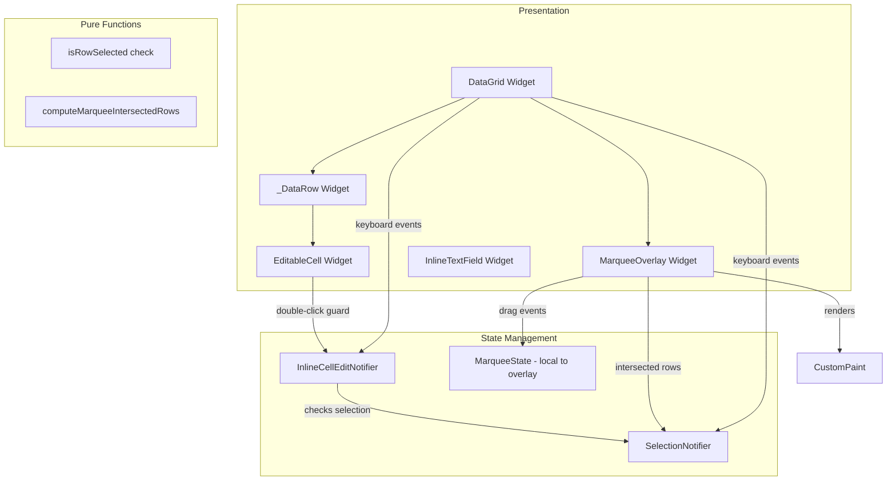

# Design Document: Cell Edit Row Selection Guard & Multi-Selection

## Overview

This feature refines the DataGrid's selection and editing interaction model to match standard desktop list-view conventions. It adds three capabilities on top of the existing inline cell editing:

1. **Row selection guard** — Edit mode entry requires the row to already be selected
2. **Focus-loss exit** — Clicking outside the active cell confirms the edit and exits immediately
3. **Marquee (rubber-band) selection** — Click-drag to draw a rectangle and select all intersected rows
4. **Standard multi-selection** — Full Ctrl+click, Shift+click, Shift+arrow, Ctrl+A behaviour

### Key Design Decisions

1. **Guard logic in the notifier, not the widget** — The `enterEditMode` method on `InlineCellEditNotifier` checks whether the target row is selected before allowing edit mode. This keeps the widget layer thin and makes the guard testable without widget tests.

2. **Anchor-based range selection** — The existing `SelectionState.anchorPath` is reused for Shift+click and Shift+arrow range operations. The anchor is set on plain click or Ctrl+click and preserved during Shift operations.

3. **Marquee as a separate overlay widget** — The marquee rectangle is rendered as a `CustomPaint` overlay on top of the DataGrid's scroll view. This avoids interfering with row hit-testing and keeps the visual layer decoupled from selection logic.

4. **Dead-zone threshold for marquee** — A 4-pixel minimum drag distance distinguishes a click from a drag. Below this threshold the gesture is treated as a normal row click.

5. **Focus-loss confirms (not cancels)** — Consistent with spreadsheet conventions, losing focus confirms the edit. Only Escape explicitly cancels. This is already partially implemented in `InlineTextField`'s `onFocusChange` but needs to be made reliable across all blur paths.

6. **SelectionNotifier gains keyboard navigation methods** — Rather than putting arrow-key selection logic in the widget, `SelectionNotifier` gets `moveUp`, `moveDown`, `extendUp`, `extendDown`, `extendToStart`, `extendToEnd` methods that operate on ordered paths.

## Architecture



### Data Flow

1. **Row selection guard**: User double-clicks cell → `EditableCell.onDoubleTap` → reads `selectionProvider` to check if row is selected → if yes, calls `enterEditMode`; if no, calls `selectionNotifier.select(path)` (selects row without editing)
2. **Focus-loss exit**: User clicks another row → `InlineTextField.onFocusChange(false)` fires → calls `confirmEdit()` → edit mode exits → row tap handler fires → new row selected
3. **Marquee selection**: User presses mouse button and drags > 4px → `MarqueeOverlay` activates → `CustomPaint` draws rectangle → on each pointer move, `computeMarqueeIntersectedRows` determines which rows overlap → `SelectionNotifier` updated live → on pointer up, marquee hides
4. **Ctrl+click**: Row tap handler detects Ctrl modifier → calls `selectionNotifier.toggleSelect(path)` (already implemented)
5. **Shift+click**: Row tap handler detects Shift modifier → calls `selectionNotifier.rangeSelect(path, orderedPaths)` (already implemented)
6. **Shift+Arrow**: DataGrid key handler detects Shift+Down → calls `selectionNotifier.extendDown(orderedPaths)` → selection grows by one row
7. **Ctrl+A**: DataGrid key handler detects Ctrl+A → calls `selectionNotifier.selectAll(orderedPaths)`

## Components and Interfaces

### Modified: InlineCellEditNotifier.enterEditMode

```dart
/// Enters edit mode on the given cell.
///
/// Guards:
/// 1. Column must be editable (existing)
/// 2. Row must be in the current selection (NEW)
void enterEditMode(
  CellCoordinate cell, {
  bool prePopulate = false,
  bool selectAll = false,
  String? initialCharacter,
}) {
  if (!isColumnEditable(cell.columnId)) return;

  final files = ref.read(filteredSortedFileListProvider);
  if (cell.rowIndex < 0 || cell.rowIndex >= files.length) return;

  // NEW: Row selection guard
  final selection = ref.read(selectionProvider);
  final filePath = files[cell.rowIndex].path;
  if (!selection.isSelected(filePath)) return;

  // ... rest of existing logic unchanged
}
```

### Modified: EditableCell.onDoubleTap

```dart
onDoubleTap: editable
    ? () {
        final selection = ref.read(selectionProvider);
        final files = ref.read(filteredSortedFileListProvider);
        final filePath = files[coordinate.rowIndex].path;

        if (selection.isSelected(filePath)) {
          // Row already selected — enter edit mode
          ref.read(inlineCellEditProvider.notifier)
              .enterEditMode(coordinate, prePopulate: true);
        }
        // If not selected, the row tap handler already selected it
      }
    : null,
```

### Modified: SelectionNotifier (new methods)

```dart
class SelectionNotifier extends StateNotifier<SelectionState> {
  // ... existing methods unchanged ...

  /// Ctrl+Shift+click: add range to existing selection.
  void addRangeSelect(String path, List<String> orderedPaths) {
    final anchor = state.anchorPath;
    if (anchor == null) {
      toggleSelect(path);
      return;
    }

    final anchorIndex = orderedPaths.indexOf(anchor);
    final targetIndex = orderedPaths.indexOf(path);
    if (anchorIndex < 0 || targetIndex < 0) return;

    final start = min(anchorIndex, targetIndex);
    final end = max(anchorIndex, targetIndex);
    final rangePaths = orderedPaths.sublist(start, end + 1).toSet();

    state = SelectionState(
      selectedPaths: state.selectedPaths.union(rangePaths),
      anchorPath: anchor, // preserve anchor
    );
  }

  /// Move selection one row down (plain Down arrow).
  void moveDown(List<String> orderedPaths) {
    final anchor = state.anchorPath;
    if (anchor == null && orderedPaths.isNotEmpty) {
      select(orderedPaths.first);
      return;
    }
    final currentIndex = orderedPaths.indexOf(anchor!);
    if (currentIndex < 0 || currentIndex >= orderedPaths.length - 1) return;
    select(orderedPaths[currentIndex + 1]);
  }

  /// Move selection one row up (plain Up arrow).
  void moveUp(List<String> orderedPaths) {
    final anchor = state.anchorPath;
    if (anchor == null && orderedPaths.isNotEmpty) {
      select(orderedPaths.last);
      return;
    }
    final currentIndex = orderedPaths.indexOf(anchor!);
    if (currentIndex <= 0) return;
    select(orderedPaths[currentIndex - 1]);
  }

  /// Extend selection one row down (Shift+Down).
  void extendDown(List<String> orderedPaths) {
    _extendSelection(orderedPaths, 1);
  }

  /// Extend selection one row up (Shift+Up).
  void extendUp(List<String> orderedPaths) {
    _extendSelection(orderedPaths, -1);
  }

  /// Extend selection to first row (Ctrl+Shift+Home).
  void extendToStart(List<String> orderedPaths) {
    final anchor = state.anchorPath;
    if (anchor == null || orderedPaths.isEmpty) return;
    final anchorIndex = orderedPaths.indexOf(anchor);
    if (anchorIndex < 0) return;

    final rangePaths = orderedPaths.sublist(0, anchorIndex + 1).toSet();
    state = SelectionState(
      selectedPaths: rangePaths,
      anchorPath: anchor,
    );
  }

  /// Extend selection to last row (Ctrl+Shift+End).
  void extendToEnd(List<String> orderedPaths) {
    final anchor = state.anchorPath;
    if (anchor == null || orderedPaths.isEmpty) return;
    final anchorIndex = orderedPaths.indexOf(anchor);
    if (anchorIndex < 0) return;

    final rangePaths = orderedPaths.sublist(anchorIndex).toSet();
    state = SelectionState(
      selectedPaths: rangePaths,
      anchorPath: anchor,
    );
  }

  /// Replace selection with the given paths (used by marquee).
  void replaceSelection(Set<String> paths) {
    state = SelectionState(
      selectedPaths: paths,
      anchorPath: paths.isNotEmpty ? paths.first : null,
    );
  }

  /// Add paths to existing selection (Ctrl+marquee).
  void addToSelection(Set<String> paths) {
    state = SelectionState(
      selectedPaths: state.selectedPaths.union(paths),
      anchorPath: state.anchorPath,
    );
  }

  void _extendSelection(List<String> orderedPaths, int direction) {
    final anchor = state.anchorPath;
    if (anchor == null || orderedPaths.isEmpty) return;

    // Find the furthest selected row in the direction of extension
    final selectedIndices = state.selectedPaths
        .map((p) => orderedPaths.indexOf(p))
        .where((i) => i >= 0)
        .toList()
      ..sort();

    if (selectedIndices.isEmpty) return;

    final edgeIndex = direction > 0 ? selectedIndices.last : selectedIndices.first;
    final newIndex = edgeIndex + direction;
    if (newIndex < 0 || newIndex >= orderedPaths.length) return;

    final newPaths = Set<String>.from(state.selectedPaths)
      ..add(orderedPaths[newIndex]);

    state = SelectionState(
      selectedPaths: newPaths,
      anchorPath: anchor,
    );
  }
}
```

### New: MarqueeOverlay widget

```dart
/// Overlay widget that handles rubber-band (marquee) selection.
///
/// Wraps the DataGrid's scrollable content and draws a semi-transparent
/// rectangle during drag operations. Computes row intersection on each
/// pointer move and updates the SelectionNotifier.
class MarqueeOverlay extends ConsumerStatefulWidget {
  const MarqueeOverlay({
    super.key,
    required this.child,
    required this.rowHeight,
    required this.scrollController,
    required this.orderedPaths,
  });

  final Widget child;
  final double rowHeight;
  final ScrollController scrollController;
  final List<String> orderedPaths;

  @override
  ConsumerState<MarqueeOverlay> createState() => _MarqueeOverlayState();
}
```

### New: computeMarqueeIntersectedRows (pure function)

```dart
/// Computes which row indices are intersected by the marquee rectangle.
///
/// [marqueeTop] and [marqueeBottom] are in scroll-content coordinates
/// (accounting for scroll offset).
/// [rowHeight] is the fixed height of each row.
/// [totalRows] is the total number of rows in the list.
///
/// Returns the set of row indices whose vertical bounds overlap the marquee.
Set<int> computeMarqueeIntersectedRows({
  required double marqueeTop,
  required double marqueeBottom,
  required double rowHeight,
  required int totalRows,
}) {
  final firstRow = (marqueeTop / rowHeight).floor().clamp(0, totalRows - 1);
  final lastRow = (marqueeBottom / rowHeight).floor().clamp(0, totalRows - 1);
  return {for (var i = firstRow; i <= lastRow; i++) i};
}
```

### Modified: DataGrid._handleKeyEvent

```dart
KeyEventResult _handleKeyEvent(WidgetRef ref, KeyEvent event) {
  if (event is! KeyDownEvent) return KeyEventResult.ignored;

  final editState = ref.read(inlineCellEditProvider);
  final editNotifier = ref.read(inlineCellEditProvider.notifier);
  final selNotifier = ref.read(selectionProvider.notifier);
  final files = ref.read(filteredSortedFileListProvider);
  final orderedPaths = files.map((f) => f.path).toList();

  final isCtrl = HardwareKeyboard.instance.logicalKeysPressed.any((k) =>
      k == LogicalKeyboardKey.controlLeft ||
      k == LogicalKeyboardKey.controlRight);
  final isShift = HardwareKeyboard.instance.logicalKeysPressed.any((k) =>
      k == LogicalKeyboardKey.shiftLeft ||
      k == LogicalKeyboardKey.shiftRight);

  // If editing, let InlineTextField handle most keys
  if (editState.isEditing) return KeyEventResult.ignored;

  // Ctrl+A: select all
  if (isCtrl && event.logicalKey == LogicalKeyboardKey.keyA) {
    selNotifier.selectAll(orderedPaths);
    return KeyEventResult.handled;
  }

  // Arrow Down
  if (event.logicalKey == LogicalKeyboardKey.arrowDown) {
    if (isShift) {
      selNotifier.extendDown(orderedPaths);
    } else {
      selNotifier.moveDown(orderedPaths);
    }
    return KeyEventResult.handled;
  }

  // Arrow Up
  if (event.logicalKey == LogicalKeyboardKey.arrowUp) {
    if (isShift) {
      selNotifier.extendUp(orderedPaths);
    } else {
      selNotifier.moveUp(orderedPaths);
    }
    return KeyEventResult.handled;
  }

  // Ctrl+Shift+Home: extend to start
  if (isCtrl && isShift && event.logicalKey == LogicalKeyboardKey.home) {
    selNotifier.extendToStart(orderedPaths);
    return KeyEventResult.handled;
  }

  // Ctrl+Shift+End: extend to end
  if (isCtrl && isShift && event.logicalKey == LogicalKeyboardKey.end) {
    selNotifier.extendToEnd(orderedPaths);
    return KeyEventResult.handled;
  }

  // F2: enter edit mode (with row selection guard)
  if (event.logicalKey == LogicalKeyboardKey.f2) {
    final focused = editState.focusedCell;
    if (focused != null && isColumnEditable(focused.columnId)) {
      editNotifier.enterEditMode(focused, prePopulate: true, selectAll: true);
      return KeyEventResult.handled;
    }
  }

  // Printable character: enter edit mode (with row selection guard)
  if (event.character != null &&
      event.character!.length == 1 &&
      !isCtrl) {
    final focused = editState.focusedCell;
    if (focused != null && isColumnEditable(focused.columnId)) {
      editNotifier.enterEditMode(focused, initialCharacter: event.character!);
      return KeyEventResult.handled;
    }
  }

  return KeyEventResult.ignored;
}
```

### Modified: DataGrid._handleRowTap

```dart
void _handleRowTap(
  WidgetRef ref,
  String path,
  _KeyModifiers modifiers,
  List<String> orderedPaths,
) {
  // Exit edit mode on any row tap
  final editState = ref.read(inlineCellEditProvider);
  if (editState.isEditing) {
    ref.read(inlineCellEditProvider.notifier).confirmEdit();
  }

  final notifier = ref.read(selectionProvider.notifier);

  if (modifiers.isCtrl && modifiers.isShift) {
    notifier.addRangeSelect(path, orderedPaths);
  } else if (modifiers.isShift) {
    notifier.rangeSelect(path, orderedPaths);
  } else if (modifiers.isCtrl) {
    notifier.toggleSelect(path);
  } else {
    notifier.select(path);
  }
}
```

## Data Models

### MarqueeState (widget-local, not in provider)

| Field | Type | Description |
|-------|------|-------------|
| `isActive` | `bool` | Whether a marquee drag is in progress |
| `startPosition` | `Offset` | Pointer-down position in local coordinates |
| `currentPosition` | `Offset` | Current pointer position during drag |
| `isCtrlHeld` | `bool` | Whether Ctrl was held at drag start |
| `preExistingSelection` | `Set<String>` | Selection snapshot at drag start (for Ctrl+drag additive mode) |

### Constants

| Name | Value | Description |
|------|-------|-------------|
| `kMarqueeDragThreshold` | `4.0` | Minimum drag distance (logical pixels) to activate marquee |
| `kMarqueeColor` | `primaryContainer @ 0.3 alpha` | Fill colour of the marquee rectangle |
| `kMarqueeBorderColor` | `primary @ 0.7 alpha` | Border colour of the marquee rectangle |
| `kAutoScrollEdgeInset` | `40.0` | Distance from viewport edge that triggers auto-scroll |
| `kAutoScrollSpeed` | `200.0` | Pixels per second for auto-scroll |

## Correctness Properties

### Property 1: Row selection guard prevents edit on unselected rows

*For any* row index and editable column ID, if the file at that row index is NOT in `selectionProvider.selectedPaths`, then calling `enterEditMode` SHALL result in no state change (editingCell remains null).

**Validates: Requirements 1.2, 1.4, 1.5**

### Property 2: Row selection guard allows edit on selected rows

*For any* row index and editable column ID, if the file at that row index IS in `selectionProvider.selectedPaths`, then calling `enterEditMode` SHALL result in `editingCell` being set to the given coordinate.

**Validates: Requirements 1.1, 1.3, 1.6**

### Property 3: Focus loss always confirms (never silently discards)

*For any* active edit state where `currentValue != originalValue`, when focus is lost (not via Escape), the edit SHALL be confirmed and a `TagEditCommand` SHALL be created.

**Validates: Requirements 2.1, 2.3, 2.4**

### Property 4: Escape cancels without applying changes

*For any* active edit state, pressing Escape SHALL result in no `TagEditCommand` being created and the file's tag value remaining equal to `originalValue`.

**Validates: Requirement 2.5**

### Property 5: Marquee intersects correct rows

*For any* marquee rectangle defined by top and bottom Y coordinates, `computeMarqueeIntersectedRows` SHALL return exactly the set of row indices whose vertical bounds `[i * rowHeight, (i+1) * rowHeight)` overlap with `[marqueeTop, marqueeBottom]`.

**Validates: Requirements 3.1, 3.2, 3.3**

### Property 6: Ctrl+marquee is additive

*For any* pre-existing selection and any set of marquee-intersected rows, Ctrl+marquee SHALL result in a selection equal to the union of the pre-existing selection and the marquee-intersected rows.

**Validates: Requirement 3.4**

### Property 7: Plain marquee replaces selection

*For any* pre-existing selection and any set of marquee-intersected rows, a plain marquee (no Ctrl) SHALL result in a selection equal to exactly the marquee-intersected rows.

**Validates: Requirement 3.5**

### Property 8: Shift+click selects contiguous range from anchor

*For any* anchor row and target row in an ordered list, Shift+click SHALL result in a selection containing exactly the rows between anchor and target (inclusive), with the anchor unchanged.

**Validates: Requirement 4.3**

### Property 9: Ctrl+click toggles without affecting others

*For any* existing selection and any row, Ctrl+click SHALL result in a selection where only the clicked row's membership is toggled and all other rows remain unchanged.

**Validates: Requirement 4.2**

### Property 10: Shift+Arrow extends selection by exactly one row

*For any* existing selection with an anchor, Shift+Down SHALL add exactly one row below the current selection edge, and Shift+Up SHALL add exactly one row above the current selection edge.

**Validates: Requirements 4.7, 4.8**

## Error Handling

### Marquee Edge Cases

- **Empty file list**: Marquee drag produces no selection changes. The overlay still renders the rectangle visually but `computeMarqueeIntersectedRows` returns an empty set.
- **Scroll during marquee**: The marquee coordinates are computed in scroll-content space (accounting for `scrollController.offset`), so scrolling during a drag correctly updates which rows are intersected.
- **Pointer leaves window**: The marquee remains active (pointer is captured). The last known position is used until pointer-up or pointer-cancel.

### Selection Edge Cases

- **Shift+click with no anchor**: Falls back to single-select behaviour (sets the clicked row as both selection and anchor).
- **Arrow key at list boundary**: `moveDown` at the last row and `moveUp` at the first row are no-ops.
- **Ctrl+A on empty list**: Results in an empty selection (no-op).

### Edit Mode Interaction

- **Marquee starts during edit**: `confirmEdit()` is called before marquee activation begins. The edit is saved, not discarded.
- **Ctrl+click during edit**: `confirmEdit()` is called first, then the Ctrl+click toggle is applied.
- **Shift+arrow during edit**: Not reachable — Shift+arrow is only handled when `editState.isEditing` is false.

## Testing Strategy

### Property-Based Tests (using `package:fast_check`)

**Generators needed (in addition to existing):**
- `selectionStateGen`: Generates random `SelectionState` with 0-50 selected paths and an anchor
- `orderedPathsGen`: Generates ordered lists of 1-200 unique file paths
- `marqueeRectGen`: Generates random top/bottom Y values within valid scroll bounds
- `rowHeightGen`: Always `28.0` (fixed row height)

**Property test file:**
- `test/features/tag_editor/selection/selection_properties_test.dart`

### Unit Tests

- **SelectionNotifier.moveUp/moveDown**: Verify single-step movement, boundary clamping
- **SelectionNotifier.extendUp/extendDown**: Verify selection grows by one row, anchor preserved
- **SelectionNotifier.extendToStart/extendToEnd**: Verify full range from anchor
- **SelectionNotifier.addRangeSelect**: Verify union with existing selection
- **computeMarqueeIntersectedRows**: Verify correct row indices for various rectangle positions
- **enterEditMode with row guard**: Verify rejection when row not selected, acceptance when selected

### Widget Tests

- **MarqueeOverlay**: Verify rectangle renders during drag, hides on release
- **Dead-zone threshold**: Verify < 4px drag treated as click
- **Auto-scroll**: Verify scroll controller offset changes when dragging near edge
- **EditableCell double-click guard**: Verify no edit mode on unselected row double-click
- **Focus-loss confirm**: Verify clicking another row confirms edit and exits
