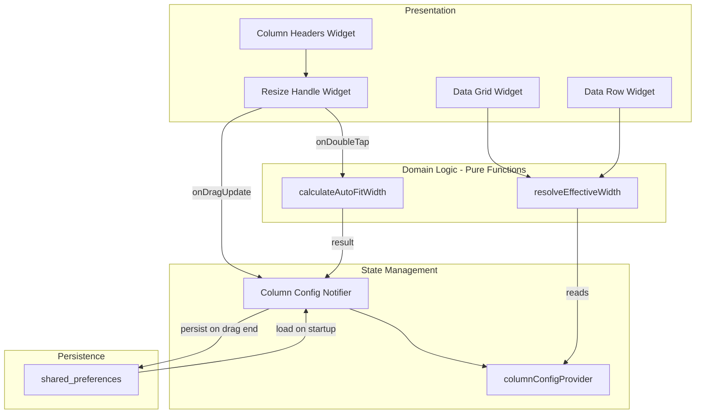

# Design Document: Column Resize

## Overview

This feature adds drag-to-resize column headers to the Data Grid in Open Tag Editor. Users can drag the right edge of any resizable column header to adjust its width, double-click to auto-fit content, and reset all columns to defaults via context menu. Custom widths persist across sessions via `shared_preferences`.

The design extends the existing `ColumnConfig` model and `ColumnConfigNotifier` with a width overrides map, adds a `ResizeHandle` widget to column headers, and introduces a pure-function `ColumnWidthResolver` that computes effective widths from defaults + overrides.

### Key Design Decisions

1. **Width overrides map over mutating ColumnDefinition** — Column definitions remain immutable with their `defaultWidth`. A separate `Map<String, double>` in `ColumnConfig` stores user overrides. This keeps the source of truth for defaults clean and makes reset trivial (clear the map).

2. **Pure-function width resolution** — A `resolveEffectiveWidth` function takes a column ID, the overrides map, and the default columns list, returning the effective width. This is easily testable without widget infrastructure.

3. **GestureDetector-based resize handle** — A thin `MouseRegion` + `GestureDetector` widget overlaid on the right edge of each header cell handles hover cursor changes and drag gestures. No custom `RenderObject` needed for this interaction.

4. **Debounced persistence** — Width changes are applied to state immediately (for smooth real-time feedback) but persisted to `shared_preferences` only on drag end, avoiding excessive disk writes during drag.

5. **Auto-fit via TextPainter measurement** — The auto-fit calculation uses `TextPainter` to measure the widest visible cell content, keeping the logic within Flutter's text layout system.

## Architecture



### Data Flow

1. **Drag resize**: User drags handle → `GestureDetector.onHorizontalDragUpdate` fires → notifier updates width override in state → widget rebuilds with new width → on drag end, persist to `shared_preferences`
2. **Auto-fit**: User double-clicks handle → `TextPainter` measures visible cells + header → clamp result to [40, 500] → notifier updates width override → persist
3. **Reset**: User selects "Reset Column Widths" from context menu → notifier clears `widthOverrides` map → persist empty map → grid rebuilds with default widths
4. **Load**: App starts → notifier loads persisted JSON → filters out unknown column IDs → state populated with overrides → grid uses `resolveEffectiveWidth` for layout

## Components and Interfaces

### ColumnConfig (extended)

The existing `ColumnConfig` model gains a `widthOverrides` field.

```dart
class ColumnConfig {
  const ColumnConfig({
    required this.visibleColumnIds,
    required this.columnOrder,
    this.widthOverrides = const {},
  });

  final List<String> visibleColumnIds;
  final List<String> columnOrder;

  /// Map of column ID → user-set width in logical pixels.
  /// Columns not in this map use their ColumnDefinition.defaultWidth.
  final Map<String, double> widthOverrides;

  ColumnConfig copyWith({
    List<String>? visibleColumnIds,
    List<String>? columnOrder,
    Map<String, double>? widthOverrides,
  }) {
    return ColumnConfig(
      visibleColumnIds: visibleColumnIds ?? this.visibleColumnIds,
      columnOrder: columnOrder ?? this.columnOrder,
      widthOverrides: widthOverrides ?? this.widthOverrides,
    );
  }
}
```

### ColumnConfigNotifier (extended methods)

```dart
class ColumnConfigNotifier extends StateNotifier<ColumnConfig> {
  // ... existing methods ...

  /// Minimum allowed column width in logical pixels.
  static const double minColumnWidth = 40.0;

  /// Maximum allowed auto-fit width in logical pixels.
  static const double maxAutoFitWidth = 500.0;

  /// Sets the width override for a single column.
  /// Clamps to [minColumnWidth, ∞).
  void setColumnWidth(String columnId, double width) {
    if (_isNonResizable(columnId)) return;
    final clamped = width.clamp(minColumnWidth, double.infinity);
    final overrides = Map<String, double>.from(state.widthOverrides);
    overrides[columnId] = clamped;
    state = state.copyWith(widthOverrides: overrides);
  }

  /// Persists current width overrides to shared_preferences.
  /// Called on drag end, not during drag.
  Future<void> persistWidths() async => _persist();

  /// Clears all width overrides, restoring default widths.
  void resetColumnWidths() {
    state = state.copyWith(widthOverrides: {});
    _persist();
  }

  bool _isNonResizable(String columnId) => columnId == 'tagIndicator';
}
```

### resolveEffectiveWidth (pure function)

```dart
/// Returns the effective display width for a column.
///
/// If [widthOverrides] contains an entry for [columnId], returns that value.
/// Otherwise returns the column's [ColumnDefinition.defaultWidth].
double resolveEffectiveWidth(
  String columnId,
  Map<String, double> widthOverrides,
  List<ColumnDefinition> columns,
) {
  if (widthOverrides.containsKey(columnId)) {
    return widthOverrides[columnId]!;
  }
  return columns
      .firstWhere((c) => c.id == columnId, orElse: () => columns.first)
      .defaultWidth;
}
```

### calculateAutoFitWidth (pure function)

```dart
/// Calculates the optimal column width to fit content.
///
/// Takes the measured widths of all visible cell values and the header label,
/// returns the result clamped to [minWidth, maxWidth].
double calculateAutoFitWidth({
  required List<double> cellWidths,
  required double headerLabelWidth,
  double minWidth = 40.0,
  double maxWidth = 500.0,
  double padding = 16.0,
}) {
  final maxContent = [headerLabelWidth, ...cellWidths]
      .fold(0.0, (max, w) => w > max ? w : max);
  return (maxContent + padding).clamp(minWidth, maxWidth);
}
```

### ResizeHandle (widget)

```dart
/// A draggable handle on the right edge of a column header for resizing.
///
/// Displays as a thin invisible hit-target that changes the cursor on hover
/// and reports drag deltas to the parent.
class ResizeHandle extends StatelessWidget {
  const ResizeHandle({
    super.key,
    required this.columnId,
    required this.currentWidth,
    required this.onDragUpdate,
    required this.onDragEnd,
    required this.onDoubleTap,
  });

  final String columnId;
  final double currentWidth;
  final void Function(double newWidth) onDragUpdate;
  final VoidCallback onDragEnd;
  final VoidCallback onDoubleTap;

  /// Hit-target width in logical pixels.
  static const double hitTargetWidth = 8.0;
}
```

## Data Models

### ColumnConfig (updated)

```dart
class ColumnConfig {
  const ColumnConfig({
    required this.visibleColumnIds,
    required this.columnOrder,
    this.widthOverrides = const {},
  });

  /// Ordered list of currently visible column IDs.
  final List<String> visibleColumnIds;

  /// Full ordered list of all column IDs (visible + hidden).
  final List<String> columnOrder;

  /// User-set width overrides. Key: column ID, Value: width in logical pixels.
  /// Columns absent from this map use ColumnDefinition.defaultWidth.
  final Map<String, double> widthOverrides;

  ColumnConfig copyWith({
    List<String>? visibleColumnIds,
    List<String>? columnOrder,
    Map<String, double>? widthOverrides,
  }) {
    return ColumnConfig(
      visibleColumnIds: visibleColumnIds ?? this.visibleColumnIds,
      columnOrder: columnOrder ?? this.columnOrder,
      widthOverrides: widthOverrides ?? this.widthOverrides,
    );
  }
}
```

### Persistence Format (shared_preferences JSON)

```json
{
  "visible": ["tagIndicator", "filename", "title", "artist", "album"],
  "order": ["tagIndicator", "filename", "title", "artist", "album", "year", "genre"],
  "widths": {
    "filename": 250.0,
    "title": 180.0,
    "artist": 200.0
  }
}
```

The `widths` key is added to the existing persisted JSON structure. On load, entries referencing unknown column IDs are silently discarded.

## Correctness Properties

*A property is a characteristic or behavior that should hold true across all valid executions of a system — essentially, a formal statement about what the system should do. Properties serve as the bridge between human-readable specifications and machine-verifiable correctness guarantees.*

### Property 1: Resize width calculation

*For any* starting column width and any horizontal drag delta, the resulting column width SHALL equal `max(startWidth + delta, 40.0)` — clamped to the minimum of 40 logical pixels with no upper bound.

**Validates: Requirements 1.3, 1.4, 1.5**

### Property 2: Width persistence round-trip

*For any* valid map of column IDs to width values (where all values are ≥ 40.0 and all IDs exist in the column definitions), persisting the map to shared_preferences and then loading it back SHALL produce an equivalent map.

**Validates: Requirements 1.6, 2.5, 4.1, 4.2**

### Property 3: Auto-fit width calculation

*For any* list of cell content widths and any header label width, the auto-fit result SHALL equal `clamp(max(allWidths) + padding, 40.0, 500.0)` — at least 40, at most 500, and at least as wide as the widest content (including the header label) plus padding.

**Validates: Requirements 2.1, 2.2, 2.3, 2.4**

### Property 4: Reset restores defaults

*For any* set of width overrides applied to the column config, after calling `resetColumnWidths()`, the `widthOverrides` map SHALL be empty and `resolveEffectiveWidth` for every column SHALL return that column's `defaultWidth`.

**Validates: Requirements 3.2**

### Property 5: Unknown column IDs ignored on load

*For any* persisted width map containing a mix of valid column IDs and IDs not present in the column definitions, loading SHALL produce a width overrides map containing only the entries with valid column IDs, with their values unchanged.

**Validates: Requirements 4.3**

### Property 6: Effective width resolution

*For any* column ID and any width overrides map: if the map contains an entry for that column ID, `resolveEffectiveWidth` SHALL return the override value; otherwise it SHALL return the column's `defaultWidth` from its `ColumnDefinition`.

**Validates: Requirements 4.4**

## Error Handling

### Drag Resize Errors

- **Column not resizable**: If `setColumnWidth` is called with the `tagIndicator` column ID, the method returns immediately with no state change. The `ResizeHandle` widget is not rendered for non-resizable columns, so this is a defensive guard.
- **Negative width from extreme drag**: The clamp to `minColumnWidth` (40px) prevents any column from becoming invisible or negative-width.

### Auto-Fit Errors

- **No visible rows**: If the file list is empty when auto-fit is triggered, the calculation uses only the header label width (clamped to [40, 500]).
- **TextPainter measurement failure**: If `TextPainter.layout()` produces unexpected results (e.g., zero width for non-empty text), the minimum width of 40px is applied as a fallback.

### Persistence Errors

- **shared_preferences write failure**: Persistence is best-effort (wrapped in try/catch). If writing fails, the in-memory state remains correct for the current session. The user loses persistence only on next app restart.
- **Corrupt JSON on load**: If the persisted JSON cannot be decoded or the `widths` key is malformed, the loader falls back to an empty overrides map (all columns use defaults). Existing visibility/order loading already handles this pattern.
- **Invalid width values**: If a persisted width is less than `minColumnWidth` or is not a valid double, it is discarded during load.

### Context Menu Errors

- **Context menu dismissed without selection**: No action taken; state unchanged.

## Testing Strategy

### Property-Based Tests (using `package:fast_check`)

Property-based tests validate the 6 correctness properties defined above. Each test runs a minimum of 100 iterations with randomly generated inputs.

**Test configuration:**
- Library: `package:fast_check`
- Minimum iterations: 100 per property
- Tag format: `// Feature: column-resize, Property N: <property text>`

**Generators needed:**
- `columnWidthGen`: Generates random doubles in [40.0, 2000.0] for valid widths
- `dragDeltaGen`: Generates random doubles in [-500.0, 500.0] for drag deltas
- `columnIdGen`: Generates random valid column IDs from `defaultColumns`
- `widthOverridesGen`: Generates random `Map<String, double>` with valid column IDs and widths ≥ 40
- `cellWidthsGen`: Generates random lists of doubles in [0.0, 1000.0] for measured cell widths
- `invalidColumnIdGen`: Generates random strings not present in `defaultColumns`

**Property test file:**
- `test/features/tag_editor/data/column_resize_properties_test.dart` — All 6 properties

### Unit Tests (example-based)

- **resolveEffectiveWidth**: Specific cases — column with override, column without override, unknown column ID fallback
- **calculateAutoFitWidth**: Specific cases — empty cell list, single cell wider than max, all cells narrower than min, header wider than all cells
- **ColumnConfigNotifier.setColumnWidth**: Verify tagIndicator is rejected, verify clamping at 40px, verify override is stored
- **ColumnConfigNotifier.resetColumnWidths**: Verify overrides map is cleared
- **Persistence loading**: Verify unknown IDs are filtered, verify invalid widths are discarded, verify backward compatibility (JSON without `widths` key loads cleanly)

### Widget Tests

- **ResizeHandle rendering**: Verify handle appears on resizable columns, absent on tagIndicator
- **Cursor change**: Verify `SystemMouseCursors.resizeColumn` on hover
- **Drag interaction**: Simulate drag gesture, verify column width updates
- **Double-click auto-fit**: Simulate double-tap, verify width changes
- **Context menu**: Verify "Reset Column Widths" option appears and triggers reset
- **Hit-target size**: Verify resize handle is at least 8 logical pixels wide

### Integration Tests

- **Performance**: Resize drag with 500+ rows loaded, verify no dropped frames
- **Session persistence**: Set widths, restart app (reload provider), verify widths restored
