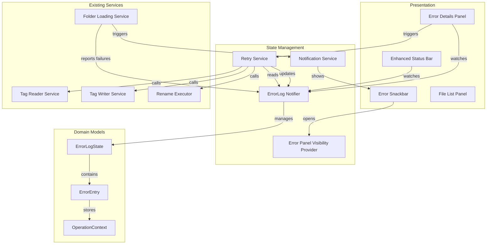

# Design Document: Error Handling & User Feedback

## Overview

This feature introduces structured error handling and user feedback for batch operations in Open Tag Rename. The design adds an error log state layer, a persistent bottom panel for error details, snackbar notifications with actionable buttons, retry capabilities, and corrupt file indicators in the file list.

The architecture follows the existing Riverpod state management pattern with a clear separation between the error state layer (pure logic, testable) and the presentation layer (widgets consuming providers).

### Key Design Decisions

1. **Dedicated error log notifier** — A `StateNotifier<ErrorLogState>` manages the bounded error collection. This keeps error state independent of file list state and enables the log to persist across batch operations within a folder session.

2. **Operation context for retry** — Each `ErrorEntry` stores an `OperationContext` sealed class that captures the exact parameters needed to replay the operation. This avoids re-deriving parameters at retry time.

3. **Vertical ResizableSplitter for bottom panel** — The existing `ResizableSplitter` handles left/right splits. A new `VerticalResizableSplitter` variant handles top/bottom splits for the error panel, following the same drag-handle pattern.

4. **Snackbar abstraction** — Rather than calling `ScaffoldMessenger` directly in multiple places, a `NotificationService` provider centralizes snackbar display logic with error/success variants.

5. **AudioFile error flag** — The existing `AudioFile` model gains an optional `readError` field. Files with read errors are included in the file list with empty tags but retain their path/filename for rename operations.

## Architecture



### Data Flow

1. A batch operation (read/write/rename) completes with failures
2. The calling code passes failures to `ErrorLogNotifier.addEntries()`
3. `ErrorLogNotifier` appends entries (evicting oldest if at capacity)
4. `NotificationService` shows a snackbar with failure count and "View Details" action
5. Status bar reactively updates error count from `ErrorLogNotifier`
6. User clicks "View Details" or status bar count → `errorPanelVisibleProvider` toggled
7. Error panel renders entries from `ErrorLogNotifier`
8. User clicks retry → `RetryService` replays operation using stored `OperationContext`
9. On success: entry removed from log. On failure: entry updated with new message/timestamp.

## Components and Interfaces

### ErrorLogNotifier

Manages the bounded error log collection.

```dart
/// Manages the session error log with a bounded capacity of 500 entries.
class ErrorLogNotifier extends StateNotifier<ErrorLogState> {
  ErrorLogNotifier() : super(const ErrorLogState());

  /// Adds one or more error entries, evicting oldest if at capacity.
  void addEntries(List<ErrorEntry> entries);

  /// Removes a specific entry (e.g., after successful retry).
  void removeEntry(String entryId);

  /// Updates an existing entry (e.g., after failed retry).
  void updateEntry(String entryId, {required String newMessage, required DateTime newTimestamp});

  /// Clears all entries (called on folder change).
  void clear();
}
```

### ErrorLogState

```dart
/// Immutable state of the error log.
class ErrorLogState {
  const ErrorLogState({this.entries = const []});

  final List<ErrorEntry> entries;

  int get count => entries.length;
  bool get isEmpty => entries.isEmpty;
  bool get isNotEmpty => entries.isNotEmpty;
}
```

### ErrorEntry

```dart
/// A single error record in the session log.
class ErrorEntry {
  const ErrorEntry({
    required this.id,
    required this.filePath,
    required this.fileName,
    required this.operationType,
    required this.errorMessage,
    required this.timestamp,
    required this.operationContext,
  });

  /// Unique identifier for this entry (UUID).
  final String id;

  /// Full path to the file that failed.
  final String filePath;

  /// Filename only (for display).
  final String fileName;

  /// The type of operation that failed.
  final OperationType operationType;

  /// Human-readable error message.
  final String errorMessage;

  /// When the error occurred (or was last retried).
  final DateTime timestamp;

  /// Context needed to retry this operation.
  final OperationContext operationContext;
}

/// The type of batch operation that produced the error.
enum OperationType { read, write, rename }
```

### OperationContext

Sealed class capturing the parameters needed to replay a failed operation.

```dart
/// Captures the exact parameters needed to retry a failed operation.
sealed class OperationContext {
  const OperationContext();
}

/// Context for retrying a failed tag read.
class ReadOperationContext extends OperationContext {
  const ReadOperationContext({required this.filePath});
  final String filePath;
}

/// Context for retrying a failed tag write.
class WriteOperationContext extends OperationContext {
  const WriteOperationContext({
    required this.filePath,
    required this.tags,
  });
  final String filePath;
  final Map<String, String> tags;
}

/// Context for retrying a failed file rename.
class RenameOperationContext extends OperationContext {
  const RenameOperationContext({
    required this.filePath,
    required this.targetPath,
  });
  final String filePath;
  final String targetPath;
}
```

### RetryService

Replays failed operations using stored context.

```dart
/// Replays failed operations from the error log.
class RetryService {
  RetryService({
    required this.errorLogNotifier,
    required this.tagReader,
    required this.tagWriter,
    required this.fileListNotifier,
  });

  /// Retries all failed operations in the error log.
  /// Returns the count of successful retries.
  Future<int> retryAll();

  /// Retries a single failed operation by entry ID.
  /// Returns true if the retry succeeded.
  Future<bool> retrySingle(String entryId);
}
```

### NotificationService

Centralizes snackbar display logic.

```dart
/// Provides snackbar notifications for batch operation results.
class NotificationService {
  NotificationService(this._scaffoldKey);

  /// Shows an error snackbar with failure count and "View Details" action.
  /// The snackbar persists until dismissed or action is tapped.
  void showBatchError({
    required int failureCount,
    required int successCount,
    required VoidCallback onViewDetails,
  });

  /// Shows a success snackbar that auto-hides after 3 seconds.
  void showBatchSuccess({required int successCount});
}
```

### VerticalResizableSplitter

A vertical variant of the existing `ResizableSplitter` for the bottom panel.

```dart
/// A draggable horizontal splitter between top and bottom child widgets.
///
/// The bottom child has a configurable height controlled by dragging the
/// splitter handle. Mirrors the existing ResizableSplitter pattern.
class VerticalResizableSplitter extends StatefulWidget {
  const VerticalResizableSplitter({
    super.key,
    required this.topChild,
    required this.bottomChild,
    required this.bottomHeight,
    this.minBottomHeight = 120.0,
    this.maxBottomHeightFraction = 0.5,
    required this.onHeightChanged,
    this.onDragEnd,
  });

  final Widget topChild;
  final Widget bottomChild;
  final double bottomHeight;
  final double minBottomHeight;
  final double maxBottomHeightFraction;
  final ValueChanged<double> onHeightChanged;
  final VoidCallback? onDragEnd;
}
```

### ErrorPanel

The bottom panel widget displaying error entries.

```dart
/// Bottom panel displaying the session error log.
class ErrorPanel extends ConsumerWidget {
  const ErrorPanel({super.key});

  /// Renders a scrollable list of ErrorEntry rows.
  /// Uses ListView.builder for virtualization.
  /// Shows empty state message when log is empty.
  /// Includes "Retry All Failed" button in the header.
}
```

### AudioFile Extension

The existing `AudioFile` model gains an optional error field:

```dart
/// Extended AudioFile with optional read error information.
/// Added to the existing AudioFile.copyWith pattern.
class AudioFile extends Equatable {
  // ... existing fields ...

  /// Error message from tag reading, if the file failed to load tags.
  /// When non-null, the file's tags map will be empty but the file
  /// remains in the list for filename-based operations.
  final String? readError;
}
```

## Data Models

### Provider Definitions

```dart
/// The error log notifier provider.
final errorLogProvider = StateNotifierProvider<ErrorLogNotifier, ErrorLogState>(
  (ref) => ErrorLogNotifier(),
);

/// Whether the error panel is currently visible.
final errorPanelVisibleProvider = StateProvider<bool>((ref) => false);

/// Derived provider: current error count for the status bar.
final errorCountProvider = Provider<int>((ref) {
  return ref.watch(errorLogProvider).count;
});

/// Whether a retry operation is currently in progress.
final isRetryingProvider = StateProvider<bool>((ref) => false);
```

### Notification Model

```dart
/// Describes a batch operation notification to display.
class BatchNotification {
  const BatchNotification({
    required this.level,
    required this.successCount,
    required this.failureCount,
  });

  final NotificationLevel level;
  final int successCount;
  final int failureCount;

  /// Error notifications persist until dismissed.
  /// Success notifications auto-hide after 3 seconds.
  Duration? get autoDismissDuration =>
      level == NotificationLevel.success ? const Duration(seconds: 3) : null;

  String get message => level == NotificationLevel.success
      ? '$successCount file(s) saved successfully'
      : '$failureCount file(s) failed, $successCount succeeded';
}

enum NotificationLevel { success, error }
```

### ErrorEntry Factory

```dart
/// Creates ErrorEntry instances from batch operation results.
class ErrorEntryFactory {
  /// Creates entries from TagWriteResult failures.
  static List<ErrorEntry> fromWriteResults(
    List<TagWriteResult> results,
    Map<String, Map<String, String>> originalTags,
  );

  /// Creates entries from RenameResult failures.
  static List<ErrorEntry> fromRenameResults(List<RenameResult> results);

  /// Creates entries from tag read failures during folder loading.
  static List<ErrorEntry> fromReadFailures(
    List<String> failedPaths,
    Map<String, String> errorMessages,
  );
}
```

## Error Handling

### Error Log Capacity

- The error log is capped at 500 entries. When full, the oldest entry is evicted before appending a new one (FIFO ring buffer behavior).
- This prevents unbounded memory growth in sessions with many failures.

### Retry Failures

- If a retry operation throws an unexpected exception (not a tag/rename exception), the error entry is updated with the exception message and the retry is considered failed.
- Network/filesystem errors during retry are caught per-entry; one entry's failure does not abort the retry of other entries.

### Folder Change Cleanup

- When `FolderLoadingService` loads a new folder, it calls `errorLogNotifier.clear()` before starting the load.
- The error panel visibility is not changed on folder load (user may want to keep it open).

### Corrupt File Handling

- Files that fail `readTags()` during batch loading are included in the file list with `readError` set and an empty `tags` map.
- These files can be selected and renamed using their `filename` field.
- Tag write operations on corrupt files will likely fail again; the error is captured normally.

## Correctness Properties

*A property is a characteristic or behavior that should hold true across all valid executions of a system — essentially, a formal statement about what the system should do. Properties serve as the bridge between human-readable specifications and machine-verifiable correctness guarantees.*

### Property 1: Batch notification correctness

*For any* batch operation result containing one or more failures, the generated `BatchNotification` SHALL have level `error`, a `failureCount` equal to the number of failed results, and a null `autoDismissDuration` (persistent). For any batch result with zero failures, the notification SHALL have level `success` and an `autoDismissDuration` of 3 seconds.

**Validates: Requirements 1.1, 1.2, 1.3**

### Property 2: ErrorEntry creation completeness

*For any* batch operation result containing failures, the `ErrorEntryFactory` SHALL produce exactly one `ErrorEntry` per failed result, and each entry SHALL have a non-empty `filePath`, a valid `operationType`, a non-empty `errorMessage`, a non-null `timestamp`, and a non-null `operationContext` that preserves the original operation parameters.

**Validates: Requirements 2.1**

### Property 3: Error log bounded buffer invariant

*For any* sequence of `addEntries` calls to the `ErrorLogNotifier`, the resulting `ErrorLogState.entries` list SHALL never exceed 500 elements, SHALL maintain insertion order (newest last), and SHALL contain all entries from the most recent additions up to the capacity limit with oldest entries evicted first.

**Validates: Requirements 2.2, 2.3, 2.5**

### Property 4: Retry parameter preservation

*For any* `ErrorEntry` in the error log, when the retry operation is invoked, the service SHALL call the corresponding operation (read/write/rename) with parameters identical to those stored in the entry's `OperationContext`.

**Validates: Requirements 4.1**

### Property 5: Successful retry removes entry

*For any* `ErrorEntry` that is retried and the operation succeeds, the `ErrorLogNotifier` SHALL remove that entry from the log, and the log's count SHALL decrease by one.

**Validates: Requirements 4.3**

### Property 6: Failed retry updates entry in-place

*For any* `ErrorEntry` that is retried and the operation fails again, the `ErrorLogNotifier` SHALL update that entry's `errorMessage` and `timestamp` to the new values without changing the entry's `id` or `operationContext`, and without adding a duplicate entry.

**Validates: Requirements 4.4**

### Property 7: Corrupt file inclusion with error flag

*For any* file path that fails tag reading during batch loading, the resulting file list SHALL contain an `AudioFile` with that path, an empty `tags` map, a non-null `readError` field containing the error message, and a valid `filename` field derived from the path.

**Validates: Requirements 5.1**

### Property 8: Error count reflects log size

*For any* state of the `ErrorLogNotifier`, the `errorCountProvider` SHALL return a value equal to `ErrorLogState.entries.length`.

**Validates: Requirements 6.1, 6.4**

## Testing Strategy

### Property-Based Tests (using `package:fast_check`)

Property-based tests validate the 8 correctness properties defined above. Each test runs a minimum of 100 iterations with randomly generated inputs.

**Test configuration:**
- Library: `package:fast_check` (as specified in project style guide)
- Minimum iterations: 100 per property
- Tag format: `// Feature: error-handling-feedback, Property N: <property text>`

**Generators needed:**
- `batchResultGen`: Generates random lists of `TagWriteResult` / `RenameResult` with varying success/failure ratios
- `errorEntryGen`: Generates random `ErrorEntry` instances with valid fields
- `operationContextGen`: Generates random `OperationContext` variants (read/write/rename)
- `errorSequenceGen`: Generates sequences of add/remove operations on the error log

**Property test files:**
- `test/features/error_handling/data/notification_model_test.dart` — Property 1
- `test/features/error_handling/data/error_entry_factory_test.dart` — Property 2
- `test/features/error_handling/data/error_log_notifier_test.dart` — Properties 3, 5, 6, 8
- `test/features/error_handling/data/retry_service_test.dart` — Property 4
- `test/features/error_handling/data/corrupt_file_test.dart` — Property 7

### Unit Tests (example-based)

- **ErrorLogNotifier**: Clear on folder change, empty initial state, single add/remove
- **NotificationService**: Error snackbar shows "View Details" action, success snackbar auto-hides
- **RetryService**: Single retry success/failure, retry all with mixed results
- **ErrorEntryFactory**: Specific TagWriteResult/RenameResult conversions, edge cases (empty batch, all-success batch)
- **AudioFile readError**: CopyWith preserves readError, null readError for successful reads

### Widget Tests

- **EnhancedStatusBar**: Error count badge appears/disappears, click toggles panel
- **ErrorPanel**: Renders entry rows with all fields, empty state message, retry button disabled during retry
- **Error indicator**: Red icon in file list for corrupt files, tooltip on hover
- **Snackbar**: "View Details" button opens error panel, dismiss removes snackbar

### Integration Tests

- **End-to-end flow**: Load folder with corrupt files → errors appear in log → status bar shows count → open panel → retry → entry removed on success
- **Folder change**: Errors from previous folder are cleared when new folder loads
