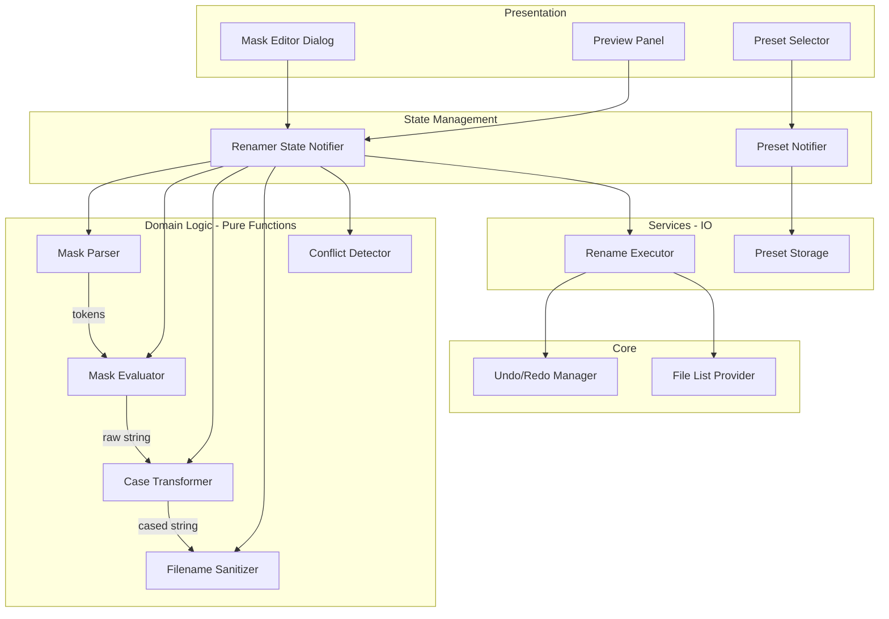

# Design Document: File Renaming via Mask

## Overview

This feature enhances the existing rename subsystem in Open Tag Editor to support a full mask-based file renaming engine. Users define a mask pattern containing tag variable placeholders (e.g., `%artist`, `%track`, `%title`) and literal text. The engine resolves each variable against an audio file's metadata, applies optional case transformations, and produces a new filename or full path. The system provides live preview, conflict detection, preset management, safety validations, and undo support.

The design replaces the current `RenamePattern.apply()` approach with a proper two-phase architecture: **parse** the mask into a structured token list, then **evaluate** the tokens against file metadata. This separation enables round-trip fidelity, better error reporting, and extensibility (e.g., the `%ignore` token, delimiter collapsing).

### Key Design Decisions

1. **Token-based parsing over regex replacement** — The current `RenamePattern` uses simple string replacement. The new design parses the mask into a list of typed tokens (literal, variable, separator) enabling proper handling of `%ignore`, delimiter collapsing, and round-trip parsing.

2. **Pure-function core with IO shell** — Mask parsing, token evaluation, case transformation, and filename sanitization are pure functions testable without filesystem access. Only the final rename execution touches the filesystem.

3. **Extend existing undo system** — A new `RenameCommand` implements `UndoableCommand` and integrates with the existing `UndoRedoManager`.

4. **Riverpod state management** — Follows the project's existing pattern of `StateNotifierProvider` for mutable state and `Provider` for services.

5. **Backward compatibility** — The existing `RenamePattern` model and `RenameService` are replaced by the new implementation. The existing `rename_dialog.dart` is rewritten to use the new mask editor UI.

## Architecture



### Data Flow

1. User types/selects a mask pattern → `MaskParser` tokenizes it
2. Tokens + `AudioFile.tags` → `MaskEvaluator` resolves variables, collapses delimiters
3. Resolved string → `CaseTransformer` applies selected case option
4. Transformed string → `FilenameSanitizer` removes illegal characters
5. Sanitized paths → `ConflictDetector` identifies duplicates
6. Preview displayed → User confirms → `RenameExecutor` performs filesystem operations
7. `RenameCommand` registered with `UndoRedoManager`

## Components and Interfaces

### MaskParser

Parses a mask string into a list of `MaskToken` objects.

```dart
/// Parses mask pattern strings into structured token lists.
class MaskParser {
  /// Parses [pattern] into a list of tokens.
  /// Throws [MaskParseException] if the pattern contains invalid syntax.
  List<MaskToken> parse(String pattern);

  /// Converts a token list back to a mask string (for round-trip).
  String format(List<MaskToken> tokens);
}
```

### MaskEvaluator

Resolves a parsed token list against an audio file's tag map.

```dart
/// Evaluates parsed mask tokens against audio file metadata.
class MaskEvaluator {
  /// Resolves all tokens using [tags] and returns the resulting path string.
  /// Handles %track/%disc slash extraction, %year date extraction,
  /// %comment truncation, delimiter collapsing, and %ignore removal.
  String evaluate(List<MaskToken> tokens, AudioFile file);
}
```

### CaseTransformer

Applies text case transformations to resolved strings.

```dart
/// Applies case transformations to resolved tag values.
class CaseTransformer {
  /// Transforms [value] according to [option].
  /// If [replaceUnderscores] is true, underscores become spaces first.
  String transform(
    String value, {
    required CaseOption option,
    bool replaceUnderscores = false,
  });
}

enum CaseOption { none, lowercase, uppercase, capitalizeFirst, sentenceCase }
```

### FilenameSanitizer

Validates and sanitizes resolved filenames for the target OS.

```dart
/// Sanitizes filenames for the current operating system.
class FilenameSanitizer {
  /// Sanitizes [filename] by removing/replacing invalid characters.
  /// Returns a [SanitizeResult] with the cleaned name and any warnings.
  SanitizeResult sanitize(String filename);

  /// Validates a complete resolved path against OS constraints.
  /// Returns a list of validation errors (empty if valid).
  List<ValidationError> validate(String fullPath);
}
```

### ConflictDetector

Identifies files that would resolve to the same target path.

```dart
/// Detects conflicts in a batch of rename previews.
class ConflictDetector {
  /// Given a map of originalPath → targetPath, returns sets of paths
  /// that conflict (multiple sources mapping to the same target).
  Map<String, List<String>> detectConflicts(Map<String, String> previews);

  /// Checks if a target path already exists on the filesystem.
  Future<Set<String>> detectExistingConflicts(Set<String> targetPaths);
}
```

### RenameExecutor

Performs the actual filesystem rename operations.

```dart
/// Executes rename operations on the filesystem.
class RenameExecutor {
  /// Performs a dry-run validation without modifying files.
  Future<List<RenameValidationResult>> dryRun(List<RenamePlan> plans);

  /// Executes the rename batch with the given conflict resolution strategy.
  Future<List<RenameResult>> execute(
    List<RenamePlan> plans, {
    required ConflictStrategy strategy,
  });
}

enum ConflictStrategy { skip, overwrite, autoIncrement }
```

### RenamerStateNotifier

Manages the complete state of the rename dialog.

```dart
/// Manages rename dialog state including pattern, options, and previews.
class RenamerStateNotifier extends StateNotifier<RenamerState> {
  /// Updates the mask pattern and regenerates previews.
  void setPattern(String pattern);

  /// Updates the case transformation option.
  void setCaseOption(CaseOption option);

  /// Toggles the "replace underscores" option.
  void setReplaceUnderscores(bool value);

  /// Sets the conflict resolution strategy.
  void setConflictStrategy(ConflictStrategy strategy);

  /// Executes the rename operation.
  Future<RenameExecutionResult> executeRename();
}
```

### PresetNotifier

Manages saved mask presets.

```dart
/// Manages mask preset persistence and selection.
class PresetNotifier extends StateNotifier<List<MaskPreset>> {
  /// Saves a new preset with the given name and pattern.
  Future<void> save(String name, String pattern);

  /// Deletes a user-created preset by name.
  Future<void> delete(String name);

  /// Returns true if the preset is a built-in default (cannot be deleted).
  bool isBuiltIn(String name);
}
```

### RenameCommand

Undoable command for batch rename operations.

```dart
/// Undoable command that reverses a batch rename operation.
class RenameCommand implements UndoableCommand {
  RenameCommand({
    required this.renames, // Map<originalPath, newPath>
    required this.fileListNotifier,
  });

  @override
  String get description;

  @override
  void execute(); // Move files to new paths

  @override
  void undo(); // Move files back to original paths
}
```

## Data Models

### MaskToken

```dart
/// A single token in a parsed mask pattern.
sealed class MaskToken {
  const MaskToken();
}

/// A literal text segment (e.g., " - ", "/").
class LiteralToken extends MaskToken {
  const LiteralToken(this.text);
  final String text;
}

/// A tag variable placeholder (e.g., %artist, %track).
class VariableToken extends MaskToken {
  const VariableToken(this.variable);
  final TagVariable variable;
}

/// Represents the %ignore placeholder.
class IgnoreToken extends MaskToken {
  const IgnoreToken();
}
```

### TagVariable

```dart
/// Supported tag variables for mask patterns.
enum TagVariable {
  artist('artist', 'Artist'),
  title('title', 'Title'),
  album('album', 'Album'),
  year('year', 'Year'),
  genre('genre', 'Genre'),
  track('track', 'Track Number'),
  totalTracks('totalTracks', 'Total Tracks'),
  disc('disc', 'Disc Number'),
  totalDiscs('totalDiscs', 'Total Discs'),
  albumArtist('albumartist', 'Album Artist'),
  comment('comment', 'Comment'),
  bpm('bpm', 'BPM'),
  composer('composer', 'Composer'),
  conductor('conductor', 'Conductor'),
  filename('filename', 'Original Filename'),
  ext('ext', 'File Extension');

  const TagVariable(this.maskName, this.displayName);

  /// The name as it appears in the mask (without %).
  final String maskName;

  /// Human-readable display name.
  final String displayName;
}
```

### RenamerState

```dart
/// Complete state of the rename dialog.
class RenamerState {
  const RenamerState({
    this.pattern = '',
    this.tokens = const [],
    this.parseError,
    this.caseOption = CaseOption.none,
    this.replaceUnderscores = false,
    this.conflictStrategy = ConflictStrategy.skip,
    this.previews = const [],
    this.conflicts = const {},
    this.isExecuting = false,
    this.executionResult,
  });

  final String pattern;
  final List<MaskToken> tokens;
  final String? parseError;
  final CaseOption caseOption;
  final bool replaceUnderscores;
  final ConflictStrategy conflictStrategy;
  final List<RenamePreview> previews;
  final Map<String, List<String>> conflicts; // targetPath → [sourcePaths]
  final bool isExecuting;
  final RenameExecutionResult? executionResult;
}
```

### RenamePreview

```dart
/// Preview of a single file rename.
class RenamePreview {
  const RenamePreview({
    required this.originalPath,
    required this.originalFilename,
    required this.newPath,
    required this.newFilename,
    required this.status,
  });

  final String originalPath;
  final String originalFilename;
  final String newPath;
  final String newFilename;
  final RenamePreviewStatus status;
}

enum RenamePreviewStatus { ok, conflict, error, unchanged }
```

### RenamePlan

```dart
/// A validated plan for a single file rename.
class RenamePlan {
  const RenamePlan({
    required this.sourcePath,
    required this.targetPath,
    required this.audioFile,
  });

  final String sourcePath;
  final String targetPath;
  final AudioFile audioFile;
}
```

### MaskPreset

```dart
/// A saved mask preset.
class MaskPreset {
  const MaskPreset({
    required this.name,
    required this.pattern,
    this.isBuiltIn = false,
  });

  final String name;
  final String pattern;
  final bool isBuiltIn;
}
```

### RenameExecutionResult

```dart
/// Summary of a completed rename batch.
class RenameExecutionResult {
  const RenameExecutionResult({
    required this.renamedCount,
    required this.skippedCount,
    required this.errorCount,
    this.errors = const [],
  });

  final int renamedCount;
  final int skippedCount;
  final int errorCount;
  final List<RenameError> errors;
}
```

## Correctness Properties

*A property is a characteristic or behavior that should hold true across all valid executions of a system — essentially, a formal statement about what the system should do. Properties serve as the bridge between human-readable specifications and machine-verifiable correctness guarantees.*

### Property 1: Mask parsing round-trip

*For any* valid mask pattern string, parsing it into tokens and then formatting those tokens back into a string and parsing again SHALL produce an equivalent token list to the first parse.

**Validates: Requirements 1.18**

### Property 2: Tag variable substitution correctness

*For any* audio file with a non-empty tag map and any mask containing tag variable placeholders, evaluating the mask SHALL produce a string where each variable is replaced by the corresponding tag value (after variable-specific formatting rules are applied), with no unreplaced `%variable` tokens remaining in the output.

**Validates: Requirements 1.1, 1.2, 1.14, 1.15**

### Property 3: Track and disc number formatting

*For any* track or disc tag value: if the value contains a slash (e.g., "N/M"), resolution SHALL extract the portion before the slash (and zero-pad to 2 digits for track); if the value is a plain number, resolution SHALL zero-pad to at least 2 digits (track only); if the value contains non-numeric content without a slash, resolution SHALL pass it through unchanged.

**Validates: Requirements 1.3, 1.4, 1.5, 1.6, 1.7**

### Property 4: Total tracks and total discs extraction

*For any* track or disc tag value, the `%totalTracks` and `%totalDiscs` variables SHALL resolve to the portion after the slash if a slash is present, or to an empty string if no slash is present.

**Validates: Requirements 1.8, 1.9**

### Property 5: Year extraction

*For any* year tag value, if the value matches an ISO date format (YYYY-MM-DD), resolution SHALL extract only the four-digit year portion; otherwise, the value SHALL pass through unchanged.

**Validates: Requirements 1.8b, 1.9b**

### Property 6: Comment truncation

*For any* comment tag value, the resolved output length SHALL be at most 64 characters, and if the input is 64 characters or fewer, the output SHALL equal the input (after trimming).

**Validates: Requirements 1.11**

### Property 7: Whitespace trimming

*For any* resolved tag value, the output SHALL contain no leading or trailing whitespace characters, regardless of the whitespace present in the original tag value.

**Validates: Requirements 1.12**

### Property 8: Delimiter collapsing on empty variables

*For any* mask pattern where one or more tag variables resolve to empty strings, the evaluated output SHALL not contain orphaned delimiters — specifically, no double separators (e.g., " - - "), no leading separators, and no trailing separators.

**Validates: Requirements 1.13**

### Property 9: Ignore token removal

*For any* mask pattern containing one or more `%ignore` tokens, the evaluated output SHALL not contain the ignored segment, and any literal delimiters adjacent to the ignored segment SHALL be collapsed so that surrounding tokens join cleanly.

**Validates: Requirements 1.17**

### Property 10: Case transformation correctness

*For any* input string and any selected CaseOption: "lowercase" SHALL produce `input.toLowerCase()`; "uppercase" SHALL produce `input.toUpperCase()`; "capitalize first letter" SHALL produce a string where each word starts with an uppercase letter; "sentence case" SHALL capitalize only the first character; "none" SHALL return the input unchanged. When "replace underscores" is enabled, all underscores SHALL become spaces before case transformation is applied.

**Validates: Requirements 4.1, 4.2, 4.3, 4.4, 4.5, 4.6**

### Property 11: Conflict detection completeness

*For any* set of rename previews where two or more source files map to the same target path, the conflict detector SHALL identify all such duplicates — the set of detected conflicts SHALL equal the set of actual duplicates.

**Validates: Requirements 3.2**

### Property 12: Filename sanitization idempotence

*For any* input string, sanitizing it once and sanitizing it again SHALL produce the same result: `sanitize(sanitize(x)) == sanitize(x)`. Additionally, the output of sanitize SHALL contain no characters that are invalid on the current operating system.

**Validates: Requirements 8.4**

### Property 13: Invalid filename and path validation

*For any* resolved filename containing characters illegal on the target filesystem, or any resolved path exceeding the OS maximum path length, the validator SHALL return at least one error. Conversely, for any filename composed only of legal characters with length within bounds, the validator SHALL return no errors.

**Validates: Requirements 8.1, 8.3, 8.5**

### Property 14: Reserved OS name rejection

*For any* filename that matches a reserved operating system name (e.g., CON, PRN, NUL, AUX, COM1-9, LPT1-9 on Windows), regardless of extension or case, the validator SHALL reject it.

**Validates: Requirements 8.6**

### Property 15: Auto-increment uniqueness

*For any* set of conflicting target filenames, the auto-increment strategy SHALL produce a set of unique filenames where no two files share the same target path, and each incremented name differs from the original only by a numeric suffix.

**Validates: Requirements 2.6**

### Property 16: Directory path interpretation

*For any* mask containing directory separator characters, the evaluated result SHALL correctly split into a directory portion (everything before the last separator) and a filename portion (everything after the last separator).

**Validates: Requirements 2.1**

## Error Handling

### Parse Errors

- **Invalid variable name**: If a `%` is followed by an unrecognized variable name, `MaskParser` throws `MaskParseException` with the position and unrecognized token. The UI displays the error inline below the pattern input.
- **Unclosed variable**: A `%` at end of pattern without a matching variable name is treated as a literal `%` character (lenient parsing).

### Evaluation Errors

- **Missing tag value**: If a tag variable has no corresponding entry in the file's tag map, it resolves to an empty string (not an error). Delimiter collapsing handles the cosmetic impact.
- **Empty result**: If the entire evaluated filename is empty or all-whitespace after sanitization, the preview marks the file with `RenamePreviewStatus.error` and the file is excluded from execution.

### Filesystem Errors

- **Permission denied**: Caught per-file during batch execution. The file is marked as failed in results, execution continues with remaining files.
- **Path too long**: Detected during dry-run validation. Files with paths exceeding OS limits are excluded from execution and reported.
- **Target exists (no strategy selected)**: Detected during dry-run. Reported as conflict in preview.
- **Directory creation failure**: If `Directory.create(recursive: true)` fails, the entire batch for that target directory is aborted and reported.
- **Cross-device move**: If source and target are on different filesystems, `File.rename()` may fail. The executor falls back to copy-then-delete with appropriate error handling.

### Undo Errors

- **File moved externally**: If a file was moved or deleted outside the application between rename and undo, the undo operation for that specific file fails gracefully (logged, reported to user) while other files in the batch are still reverted.
- **Target occupied**: If the original path is now occupied by a different file, undo for that file is skipped with a warning.

## Testing Strategy

### Property-Based Tests (using `package:fast_check`)

Property-based tests validate the 16 correctness properties defined above. Each test runs a minimum of 100 iterations with randomly generated inputs.

**Test configuration:**
- Library: `package:fast_check` (as specified in project style guide)
- Minimum iterations: 100 per property
- Tag format: `// Feature: file-renaming-via-mask, Property N: <property text>`

**Generators needed:**
- `maskPatternGen`: Generates random valid mask patterns (combinations of literals and variables)
- `audioFileGen`: Generates `AudioFile` instances with random tag maps
- `tagValueGen`: Generates random tag values including edge cases (whitespace, slashes, dates, long strings, unicode)
- `filenameGen`: Generates random filenames including invalid characters, reserved names, and boundary lengths
- `caseOptionGen`: Generates random `CaseOption` values

**Property test files:**
- `test/features/renamer/data/mask_parser_test.dart` — Properties 1, 2
- `test/features/renamer/data/mask_evaluator_test.dart` — Properties 3, 4, 5, 6, 7, 8, 9, 16
- `test/features/renamer/data/case_transformer_test.dart` — Property 10
- `test/features/renamer/data/filename_sanitizer_test.dart` — Properties 12, 13, 14
- `test/features/renamer/data/conflict_detector_test.dart` — Properties 11, 15

### Unit Tests (example-based)

Unit tests cover specific examples, edge cases, and integration points:

- **MaskParser**: Specific patterns from presets, edge cases (empty pattern, pattern with only literals, consecutive variables)
- **MaskEvaluator**: Concrete examples from requirements (e.g., "01/12" → "01", "2023-05-14" → "2023")
- **CaseTransformer**: Specific strings with mixed case, unicode, empty strings
- **FilenameSanitizer**: Platform-specific illegal characters, reserved names with extensions
- **ConflictDetector**: Empty input, single file, all-conflicting batch
- **RenameCommand**: Undo/redo cycle with mock filesystem
- **PresetNotifier**: Save/load/delete cycle, built-in preset protection

### Integration Tests

- **RenameExecutor**: End-to-end rename with temp directory, verifying file moves, directory creation, conflict strategies
- **Undo round-trip**: Rename then undo, verify files return to original locations
- **Performance**: 500-file batch preview under 1 second, 500-file rename under 10 seconds

### Widget Tests

- **Mask editor dialog**: Variable insertion at cursor, preset selection, pattern field update
- **Preview panel**: Correct display of previews, conflict highlighting, error indicators
- **Progress indicator**: Appears during execution, summary shown after completion

