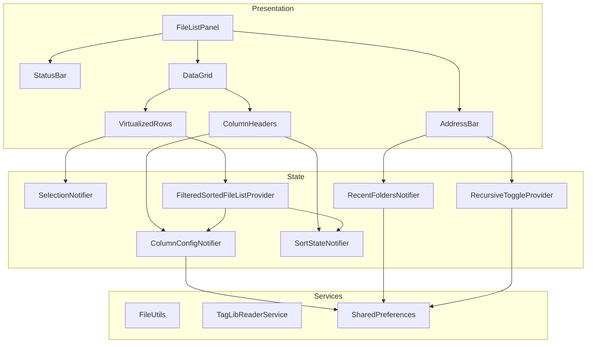

# Design Document: Folder Loading & File Display

## Overview

This design refactors the existing `FileListPanel` from a basic 3-column list into a full-featured data grid with sortable columns, column show/hide and reorder, tag indicator icons, desktop-style multi-select (Ctrl+click, Shift+click), an address bar with recent folders, a recursive loading toggle with threshold guard, an enhanced status bar, and a "show selected only" filter. The architecture leverages Riverpod for state management, `shared_preferences` for persistence, and Flutter's built-in virtualized list for performance.

## Architecture

The feature follows the existing layered architecture:

```
┌─────────────────────────────────────────────────────────────────┐
│                    Presentation Layer                             │
│  FileListPanel → DataGridWidget → ColumnHeaders + VirtualRows    │
│  AddressBar, StatusBar, RecursiveToggle                          │
├─────────────────────────────────────────────────────────────────┤
│                    State Layer (Riverpod)                         │
│  ColumnConfigNotifier, SortStateNotifier, SelectionNotifier      │
│  RecentFoldersNotifier, RecursiveToggleProvider                  │
│  LoadedFolderPathProvider, FilteredSortedFileListProvider         │
├─────────────────────────────────────────────────────────────────┤
│                    Data / Service Layer                           │
│  FileUtils (folder scanning), TagLibReaderService (tag reading)  │
│  SharedPreferences (persistence)                                 │
├─────────────────────────────────────────────────────────────────┤
│                    Model Layer                                    │
│  AudioFile (extended with tagFormat), ColumnDefinition, SortState │
└─────────────────────────────────────────────────────────────────┘
```



## Components and Interfaces

### 1. AudioFile Model Extension

The existing `AudioFile` model needs a `tagFormat` field to support the tag indicator tooltip.

```dart
class AudioFile extends Equatable {
  // ... existing fields ...
  final TagFormat? tagFormat; // NEW: detected tag format for tooltip
}
```

### 2. ColumnDefinition Model

```dart
/// Defines a column in the data grid.
class ColumnDefinition {
  const ColumnDefinition({
    required this.id,
    required this.label,
    required this.defaultWidth,
    this.isFixed = false,
    this.valueExtractor,
  });

  /// Unique identifier (matches tag field key or special key like 'filename').
  final String id;

  /// Display label for the column header.
  final String label;

  /// Default width in logical pixels.
  final double defaultWidth;

  /// If true, column cannot be hidden or reordered (Tag Indicator, Filename).
  final bool isFixed;

  /// Function to extract display value from an AudioFile.
  final String Function(AudioFile)? valueExtractor;
}
```

Default columns (in order):
- `tagIndicator` (fixed, width: 32)
- `filename` (fixed, width: 200)
- `title` (width: 150)
- `artist` (width: 150)
- `album` (width: 150)
- `year` (width: 60)
- `genre` (width: 100)
- `trackNumber` (width: 60)
- `discNumber` (width: 60)
- `bitrate` (width: 70)
- `duration` (width: 70)
- `albumArtist` (width: 150)
- `comment` (width: 150)
- `bpm` (width: 50)
- `composer` (width: 150)
- `conductor` (width: 150)
- `relativePath` (width: 200)

### 3. SortState Model

```dart
/// Represents the current sort configuration.
class SortState {
  const SortState({this.columnId, this.direction});

  /// The column being sorted, or null for original load order.
  final String? columnId;

  /// Sort direction: ascending, descending, or null (unsorted).
  final SortDirection? direction;
}

enum SortDirection { ascending, descending }
```

Three-click cycle: unsorted → ascending → descending → unsorted.

### 4. ColumnConfigNotifier (StateNotifier)

Manages column visibility and ordering. Persists to `shared_preferences` as a JSON string.

```dart
class ColumnConfigNotifier extends StateNotifier<ColumnConfig> {
  ColumnConfigNotifier(this._prefs) : super(_loadFromPrefs(prefs));

  void toggleVisibility(String columnId);
  void reorderColumn(int oldIndex, int newIndex);
  void resetToDefaults();
}
```

Persistence key: `column_config_v1`

### 5. SortStateNotifier (StateNotifier)

```dart
class SortStateNotifier extends StateNotifier<SortState> {
  SortStateNotifier() : super(const SortState());

  void toggleSort(String columnId);
}
```

### 6. SelectionNotifier (StateNotifier)

Replaces the simple `StateProvider<Set<String>>` with a notifier that supports Shift+click range selection.

```dart
class SelectionNotifier extends StateNotifier<SelectionState> {
  SelectionNotifier() : super(const SelectionState());

  /// Single click: select only this file.
  void select(String path);

  /// Ctrl+click: toggle this file in selection.
  void toggleSelect(String path);

  /// Shift+click: range select from anchor to target.
  void rangeSelect(String path, List<String> orderedPaths);

  /// Ctrl+A: select all visible files.
  void selectAll(List<String> paths);

  /// Clear selection.
  void clear();
}

class SelectionState {
  final Set<String> selectedPaths;
  final String? anchorPath; // last single-clicked path for Shift+click range
}
```

### 7. RecentFoldersNotifier (StateNotifier)

```dart
class RecentFoldersNotifier extends StateNotifier<List<String>> {
  RecentFoldersNotifier(this._prefs) : super(_loadFromPrefs(prefs));

  /// Adds a folder path to the front of the list (max 10).
  void addFolder(String path);

  /// Removes a folder from the list.
  void removeFolder(String path);
}
```

Persistence key: `recent_folders_v1`

### 8. RecursiveToggleProvider

```dart
final recursiveLoadingProvider = StateNotifierProvider<RecursiveLoadingNotifier, bool>((ref) {
  return RecursiveLoadingNotifier(ref.read(sharedPreferencesProvider));
});
```

Persistence key: `recursive_loading_enabled`

### 9. FilteredSortedFileListProvider

A computed provider that chains: file list → text filter → "show selected only" filter → sort.

```dart
final filteredSortedFileListProvider = Provider<List<AudioFile>>((ref) {
  var files = ref.watch(fileListProvider);

  // Apply text filter
  final filter = ref.watch(fileFilterProvider).toLowerCase();
  if (filter.isNotEmpty) {
    files = files.where((f) => _matchesFilter(f, filter, visibleColumns)).toList();
  }

  // Apply "show selected only" filter
  final showSelectedOnly = ref.watch(showSelectedOnlyProvider);
  if (showSelectedOnly) {
    final selected = ref.watch(selectedFilePathsProvider);
    files = files.where((f) => selected.contains(f.path)).toList();
  }

  // Apply sort
  final sortState = ref.watch(sortStateProvider);
  if (sortState.columnId != null && sortState.direction != null) {
    files = _sortFiles(files, sortState);
  }

  return files;
});
```

### 10. LoadedFolderPathProvider

```dart
final loadedFolderPathProvider = StateProvider<String?>((ref) => null);
```

Updated when a folder is loaded via picker, drag-and-drop, or recent folders menu.

### 11. Presentation Widgets

#### AddressBar Widget
- Displays `loadedFolderPathProvider` value or placeholder text.
- Contains a dropdown button for `RecentFoldersNotifier`.
- Contains the `RecursiveToggle` checkbox/switch.

#### DataGrid Widget (replaces current ListView)
- Custom widget using `ListView.builder` with fixed `itemExtent` (virtualized).
- `ColumnHeaders` row: clickable for sort, draggable for reorder, right-click for show/hide context menu.
- Each row renders cells based on visible column config.

#### StatusBar Widget (enhanced)
- Total files count, selected files count, total duration, selected duration, total file size, modified count.
- Duration formatted as "Xh Ym" (e.g., "2h 34m").
- File size formatted with appropriate units (KB/MB/GB).

### 12. Duration and Size Formatting Utilities

```dart
/// Formats duration in seconds to display string.
String formatDuration(double? seconds) {
  if (seconds == null || seconds <= 0) return '';
  final totalSeconds = seconds.round();
  final h = totalSeconds ~/ 3600;
  final m = (totalSeconds % 3600) ~/ 60;
  final s = totalSeconds % 60;
  if (h > 0) return '$h:${m.toString().padLeft(2, '0')}:${s.toString().padLeft(2, '0')}';
  return '${m.toString().padLeft(2, '0')}:${s.toString().padLeft(2, '0')}';
}

/// Formats duration for status bar aggregate display.
String formatTotalDuration(double totalSeconds) {
  final h = totalSeconds ~/ 3600;
  final m = ((totalSeconds % 3600) ~/ 60);
  if (h > 0) return '${h.round()}h ${m.round()}m';
  return '${m.round()}m';
}

/// Formats file size in bytes to human-readable string.
String formatFileSize(int bytes) {
  if (bytes < 1024) return '$bytes B';
  if (bytes < 1024 * 1024) return '${(bytes / 1024).toStringAsFixed(1)} KB';
  if (bytes < 1024 * 1024 * 1024) return '${(bytes / (1024 * 1024)).toStringAsFixed(1)} MB';
  return '${(bytes / (1024 * 1024 * 1024)).toStringAsFixed(2)} GB';
}
```

### 13. Sorting Logic

```dart
List<AudioFile> sortFiles(List<AudioFile> files, SortState state) {
  final sorted = List<AudioFile>.from(files);
  final comparator = _getComparator(state.columnId!);
  sorted.sort(comparator);
  if (state.direction == SortDirection.descending) {
    return sorted.reversed.toList();
  }
  return sorted;
}
```

Numeric columns (trackNumber, discNumber, bitrate, duration, year, bpm, fileSize) use `num.tryParse` for comparison. String columns use case-insensitive `compareTo`.

### 14. Threshold Guard Dialog

When recursive loading detects more than 500 files (configurable), show a dialog:
- Message: "Found X audio files in subfolders. Loading this many files may take a moment."
- Actions: "Load All" (proceeds), "Top-Level Only" (loads non-recursively), "Cancel".

## Data Models

### Extended AudioFile

```dart
class AudioFile extends Equatable {
  const AudioFile({
    required this.path,
    required this.filename,
    required this.extension,
    required this.fileSize,
    this.tags = const {},
    this.albumArt,
    this.duration,
    this.bitrate,
    this.sampleRate,
    this.channels,
    this.isModified = false,
    this.tagFormat,        // NEW
  });

  final TagFormat? tagFormat;
  // ... rest unchanged
}
```

### ColumnConfig

```dart
class ColumnConfig {
  const ColumnConfig({
    required this.visibleColumnIds,
    required this.columnOrder,
  });

  /// Ordered list of visible column IDs.
  final List<String> visibleColumnIds;

  /// Full ordered list of all column IDs (visible + hidden).
  final List<String> columnOrder;
}
```

### SelectionState

```dart
class SelectionState {
  const SelectionState({
    this.selectedPaths = const {},
    this.anchorPath,
  });

  final Set<String> selectedPaths;
  final String? anchorPath;
}
```

### Persistence Schema (SharedPreferences)

| Key | Type | Description |
|-----|------|-------------|
| `column_config_v1` | String (JSON) | `{"visible": [...], "order": [...]}` |
| `recent_folders_v1` | String (JSON) | `["path1", "path2", ...]` |
| `recursive_loading_enabled` | bool | Recursive toggle state |


## Correctness Properties

*A property is a characteristic or behavior that should hold true across all valid executions of a system — essentially, a formal statement about what the system should do. Properties serve as the bridge between human-readable specifications and machine-verifiable correctness guarantees.*

### Property 1: Tag indicator state reflects tag presence

*For any* AudioFile, the tag indicator state SHALL be "filled" if and only if the file's tags map contains at least one non-empty value, and "unfilled" otherwise.

**Validates: Requirements 1.2, 1.3**

### Property 2: Duration formatting follows time format rules

*For any* non-negative duration value in seconds, the formatted string SHALL match "mm:ss" when the duration is less than 3600 seconds, and "h:mm:ss" when the duration is 3600 seconds or more, where minutes and seconds are zero-padded to two digits.

**Validates: Requirements 2.2**

### Property 3: Relative path computation strips root prefix

*For any* file path that is a descendant of a root folder path, computing the relative path SHALL produce a string that, when joined with the root folder path, reconstructs the original file path.

**Validates: Requirements 2.4**

### Property 4: Missing tag values produce empty strings

*For any* AudioFile and any column that maps to a tag field, if that tag field key is absent from the file's tags map, the value extractor SHALL return an empty string.

**Validates: Requirements 2.5**

### Property 5: Sort produces correctly ordered output

*For any* list of AudioFiles and any valid sort column, sorting in ascending order SHALL produce a list where each element is less than or equal to the next element according to the column's comparator (numeric for track/disc/bitrate/duration/year/bpm, case-insensitive string otherwise). Sorting in descending order SHALL produce the reverse.

**Validates: Requirements 3.1, 3.2, 3.5, 3.6**

### Property 6: Sort state three-click cycle

*For any* column, toggling sort on that column three consecutive times SHALL transition through ascending → descending → unsorted (null), returning to the original unsorted state.

**Validates: Requirements 3.3**

### Property 7: Column visibility toggle round-trip

*For any* non-fixed column that is currently visible, hiding it and then showing it SHALL restore it to its original position in the column order, producing an equivalent visible column list.

**Validates: Requirements 4.2, 4.3**

### Property 8: Fixed columns invariant

*For any* sequence of column visibility toggle and reorder operations, the Tag Indicator column SHALL always remain visible and at position 0, and the Filename column SHALL always remain visible.

**Validates: Requirements 4.5, 5.3**

### Property 9: Column reorder moves to target position

*For any* valid reorder operation (moving a non-fixed column from index A to index B), the column at index A SHALL appear at index B in the resulting order, and all other columns SHALL maintain their relative order.

**Validates: Requirements 5.1**

### Property 10: Single click replaces selection

*For any* selection state and any file path, calling select(path) SHALL result in a selection state containing exactly that one path.

**Validates: Requirements 6.1**

### Property 11: Ctrl+click toggles only the target file

*For any* selection state and any file path, calling toggleSelect(path) SHALL change only that path's membership in the selection set — all other paths' membership SHALL remain unchanged.

**Validates: Requirements 6.2**

### Property 12: Shift+click selects contiguous range

*For any* ordered list of file paths, an anchor path at index I, and a target path at index J, calling rangeSelect SHALL result in a selection containing exactly the paths from index min(I,J) to max(I,J) inclusive.

**Validates: Requirements 6.3**

### Property 13: Total duration equals sum of individual durations

*For any* list of AudioFiles with duration values, the computed total duration SHALL equal the sum of all individual non-null duration values in the list.

**Validates: Requirements 7.3, 7.4**

### Property 14: File size formatting produces correct units

*For any* non-negative integer byte count, the formatted file size string SHALL represent the same quantity when parsed back — specifically, the numeric portion multiplied by the unit factor (1 for B, 1024 for KB, 1048576 for MB, 1073741824 for GB) SHALL approximate the original byte count within rounding tolerance.

**Validates: Requirements 7.5**

### Property 15: Common parent directory computation

*For any* non-empty set of file paths that share a common ancestor directory, the computed common parent directory SHALL be a prefix of every path in the set, and no longer common prefix SHALL exist.

**Validates: Requirements 8.4**

### Property 16: Recent folders bounded FIFO

*For any* sequence of N folder additions (N > 10), the recent folders list SHALL contain at most 10 entries, the most recently added folder SHALL be first, and the entries SHALL be the 10 most recently added unique paths in reverse chronological order.

**Validates: Requirements 9.1, 9.2, 9.3**

### Property 17: Show-selected-only filter passes exactly selected files

*For any* list of AudioFiles and any selection set, when the "show selected only" toggle is active, the filtered output SHALL contain exactly those files whose paths are in the selection set, preserving their relative order.

**Validates: Requirements 11.2, 11.3**

## Error Handling

### File Loading Errors

| Error Condition | Handling Strategy |
|----------------|-------------------|
| Folder does not exist | Display error in status bar, no files loaded |
| Permission denied on folder | Display error in status bar, skip inaccessible paths |
| Individual file read failure | Include file in list with empty tags, show error indicator icon in tag indicator column |
| Folder picker cancelled | No action, maintain current state |
| Drag-and-drop of unsupported files | Silently ignore non-audio files, load any valid audio files |

### State Errors

| Error Condition | Handling Strategy |
|----------------|-------------------|
| SharedPreferences read failure | Fall back to default column config / empty recent folders |
| Corrupted persisted JSON | Log warning, reset to defaults |
| Column config references unknown column ID | Ignore unknown IDs, use defaults for missing columns |

### Performance Guards

| Condition | Handling |
|-----------|----------|
| Recursive scan finds >500 files | Show threshold guard dialog before loading |
| User declines threshold guard | Load top-level only |
| Tag reading is slow | Show progress in status bar, keep UI responsive via async batch processing |

## Testing Strategy

### Property-Based Tests (using `dart_check` or `glados` package)

Each correctness property above will be implemented as a property-based test with minimum 100 iterations. The tests will use generators to produce random `AudioFile` instances, column configurations, selection states, and file path sets.

**Library choice:** `glados` (Dart property-based testing library, well-maintained, supports shrinking).

**Test tag format:** Each test will include a comment:
```dart
// Feature: folder-loading-file-display, Property N: <property text>
```

**Property test targets (pure logic, no UI):**
- `formatDuration()` — Property 2
- `computeRelativePath()` — Property 3
- `extractColumnValue()` — Properties 4, 1
- `sortFiles()` — Property 5
- `SortStateNotifier.toggleSort()` — Property 6
- `ColumnConfigNotifier.toggleVisibility()` / `reorderColumn()` — Properties 7, 8, 9
- `SelectionNotifier.select/toggleSelect/rangeSelect` — Properties 10, 11, 12
- `computeTotalDuration()` — Property 13
- `formatFileSize()` — Property 14
- `computeCommonParentDirectory()` — Property 15
- `RecentFoldersNotifier.addFolder()` — Property 16
- `filteredSortedFileListProvider` logic — Property 17

### Unit Tests (example-based)

- Tag format to display string mapping (all enum values)
- Default column definitions contain all 17 columns
- Bitrate formatting appends "kbps"
- Threshold guard triggers at exactly 501 files
- Address bar shows placeholder when no folder loaded
- Fixed row height is set on ListView.builder

### Widget Tests

- FileListPanel renders column headers
- Column context menu appears on right-click
- Selected rows have distinct background color
- Sort arrow icon appears on active sort column
- Address bar displays loaded folder path
- Recent folders dropdown is accessible
- Recursive toggle is present and functional
- Show-selected-only toggle filters display
- Drag overlay appears during drag-and-drop

### Integration Tests

- Loading a folder populates the file list and updates address bar
- SharedPreferences persistence round-trip for column config
- SharedPreferences persistence round-trip for recent folders
- Recursive toggle state persists across notifier recreation
- Selecting a recent folder triggers file loading

### Performance Tests

- Loading 500 files completes initial display within 3 seconds
- Scrolling through 500-file list maintains smooth frame rate (manual verification)
