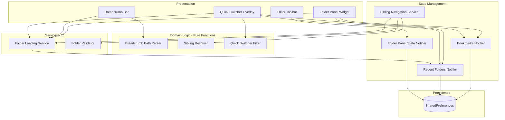

# Design Document: Folder Selection UX

## Overview

This feature introduces a multi-faceted folder navigation system to Open Tag Editor, replacing the current single-path address bar with richer navigation primitives. The design adds a collapsible Folder Panel (bookmarks + recent history), breadcrumb-based path navigation, a keyboard-driven Quick Switcher overlay, and sibling folder navigation — all integrated with the existing `FolderLoadingService` and `UnsavedChangesGuard`.

### Key Design Decisions

1. **Folder Panel as a left-side splitter** — Uses the existing `ResizableSplitter` pattern (mirrored) to add a collapsible left panel. The panel width is fixed at 250px max (not user-resizable) to keep it lightweight and avoid competing with the tag editor panel's resizable splitter.

2. **Separate BookmarksNotifier from RecentFoldersNotifier** — Bookmarks have different semantics (user-curated, reorderable, max 50) vs recent folders (auto-populated, MRU-ordered, max 20). Keeping them as separate StateNotifiers with independent persistence avoids coupling.

3. **BreadcrumbBar replaces AddressBar display mode** — Rather than a separate widget, the existing `AddressBar` is refactored to show breadcrumb segments by default and switch to a text field on double-click/shortcut. This preserves the existing `onFolderSelected` callback contract.

4. **Pure-function sibling resolution** — The logic to find next/previous sibling folders is a pure function (`resolveSibling`) that takes a sorted list of directory names and a current name, returning the adjacent entry. Filesystem listing is done separately, keeping the core logic testable.

5. **Quick Switcher as a modal overlay** — Follows the command-palette pattern (like VS Code's Ctrl+P). Renders as an `OverlayEntry` positioned at the top-center of the window, filtering bookmarks + recent folders by substring match.

6. **Reuse FolderLoadingService for all navigation** — Every folder-loading action (panel click, breadcrumb click, sibling nav, quick switcher) funnels through the existing `FolderLoadingService.loadFolder()` which handles threshold guards, recursive toggle, and state updates.

## Architecture



### Data Flow

1. **Folder Panel click** → `UnsavedChangesGuard.check()` → `FolderValidator.validate(path)` → `FolderLoadingService.loadFolder()`
2. **Breadcrumb segment click** → `BreadcrumbParser.pathAtIndex(segments, i)` → guard → validate → load
3. **Quick Switcher** → user types → `QuickSwitcherFilter.filter(entries, query)` → user selects → guard → validate → load
4. **Sibling navigation** → `SiblingResolver.resolve(siblings, current, direction)` → guard → validate → load
5. **Bookmark add** → `BookmarksNotifier.addBookmark(path)` → deduplicate → persist
6. **Panel toggle** → `FolderPanelStateNotifier.toggle()` → persist visibility

## Components and Interfaces

### BreadcrumbParser

Splits a folder path into navigable segments and reconstructs paths from segment indices.

```dart
/// Pure-function utilities for breadcrumb path manipulation.
class BreadcrumbParser {
  /// Splits [folderPath] into individual path segments.
  ///
  /// On Windows, the first segment is the drive letter (e.g., "C:").
  /// Returns an empty list for null or empty paths.
  List<String> splitSegments(String folderPath);

  /// Reconstructs the full path from segments [0..index] inclusive.
  ///
  /// Joins segments with the platform path separator.
  String pathAtIndex(List<String> segments, int index);
}
```

### QuickSwitcherFilter

Filters a combined list of folder entries by case-insensitive substring match.

```dart
/// Filters folder entries for the Quick Switcher overlay.
class QuickSwitcherFilter {
  /// Filters [entries] by case-insensitive substring match against [query].
  ///
  /// Returns entries where either the folder name or full path contains
  /// [query]. Returns all entries if [query] is empty.
  List<FolderEntry> filter(List<FolderEntry> entries, String query);
}
```

### SiblingResolver

Pure-function logic for resolving next/previous sibling folders.

```dart
/// Resolves sibling folder navigation without filesystem access.
class SiblingResolver {
  /// Given a sorted list of [siblingNames] (case-insensitive alphabetical)
  /// and the [currentName], returns the next or previous sibling name.
  ///
  /// Returns null if [currentName] is not found in the list, or if
  /// navigating in [direction] would go out of bounds.
  String? resolve({
    required List<String> siblingNames,
    required String currentName,
    required SiblingDirection direction,
  });

  /// Filters a list of directory names to exclude hidden folders
  /// (names starting with a dot) and sorts case-insensitively.
  List<String> filterAndSort(List<String> directoryNames);
}

enum SiblingDirection { next, previous }
```

### FolderValidator

Validates that a folder path is accessible before attempting to load.

```dart
/// Validates folder paths before loading.
class FolderValidator {
  /// Checks if [path] exists and is readable.
  ///
  /// Returns a [FolderValidationResult] indicating success or the
  /// specific failure reason.
  Future<FolderValidationResult> validate(String path);
}

enum FolderValidationError { notFound, notADirectory, permissionDenied }

class FolderValidationResult {
  const FolderValidationResult.ok() : error = null;
  const FolderValidationResult.failed(this.error);
  final FolderValidationError? error;
  bool get isValid => error == null;
}
```

### BookmarksNotifier

Manages the user's bookmarked folder list with persistence.

```dart
/// Manages bookmarked folders with persistence via SharedPreferences.
class BookmarksNotifier extends StateNotifier<List<BookmarkEntry>> {
  static const maxBookmarks = 50;

  /// Loads bookmarks from SharedPreferences.
  Future<void> loadFromPrefs();

  /// Adds a folder path to the end of the bookmarks list.
  ///
  /// No-op if [path] already exists in bookmarks or list is at capacity.
  void addBookmark(String path);

  /// Removes a bookmark by path.
  void removeBookmark(String path);

  /// Reorders a bookmark from [oldIndex] to [newIndex].
  void reorder(int oldIndex, int newIndex);
}
```

### FolderPanelStateNotifier

Manages the folder panel's visibility state with persistence.

```dart
/// Manages folder panel visibility with SharedPreferences persistence.
class FolderPanelStateNotifier extends StateNotifier<bool> {
  FolderPanelStateNotifier() : super(false);

  /// Loads persisted visibility state. Defaults to false (collapsed).
  Future<void> loadFromPrefs();

  /// Toggles visibility and persists the new state.
  void toggle();

  /// Sets visibility explicitly and persists.
  void setVisible(bool visible);
}
```

### RecentFoldersNotifier (Enhanced)

The existing `RecentFoldersNotifier` is extended to support 20 entries and removal.

```dart
/// Enhanced recent folders notifier with 20-entry cap and removal.
///
/// Extends the existing RecentFoldersNotifier pattern.
class RecentFoldersNotifier extends StateNotifier<List<String>> {
  static const maxEntries = 20; // Increased from 10

  /// Adds a folder path to the front of the list (MRU order).
  /// Deduplicates and caps at [maxEntries].
  void addFolder(String path);

  /// Removes a specific folder from the history.
  void removeFolder(String path);

  /// Loads from SharedPreferences.
  Future<void> loadFromPrefs();
}
```

### SiblingNavigationService

Orchestrates sibling folder navigation with filesystem access and guards.

```dart
/// Orchestrates sibling folder navigation.
class SiblingNavigationService {
  SiblingNavigationService(this._ref);

  /// Navigates to the next or previous sibling folder.
  ///
  /// Shows unsaved-changes guard if needed. Updates status message
  /// if at boundary or on error.
  Future<void> navigate(
    BuildContext context,
    SiblingDirection direction,
  );
}
```

### FolderPanel Widget

```dart
/// Collapsible left panel showing bookmarks and recent folders.
class FolderPanel extends ConsumerWidget {
  const FolderPanel({super.key, required this.onFolderSelected});

  /// Called when the user clicks a folder entry to load it.
  final void Function(String path) onFolderSelected;
}
```

### BreadcrumbBar Widget

```dart
/// Breadcrumb-style address bar with clickable path segments.
///
/// Replaces the text-only display in AddressBar. Supports:
/// - Clickable segments for ancestor navigation
/// - Double-click to switch to editable text field
/// - Overflow collapse for long paths
class BreadcrumbBar extends ConsumerStatefulWidget {
  const BreadcrumbBar({super.key, this.onFolderSelected});

  final void Function(String path)? onFolderSelected;
}
```

### QuickSwitcherOverlay Widget

```dart
/// Keyboard-driven folder search overlay (Ctrl+G).
class QuickSwitcherOverlay extends ConsumerStatefulWidget {
  const QuickSwitcherOverlay({super.key, required this.onFolderSelected});

  final void Function(String path) onFolderSelected;
}
```

## Data Models

### BookmarkEntry

```dart
/// A user-pinned folder bookmark.
class BookmarkEntry extends Equatable {
  const BookmarkEntry({
    required this.path,
    required this.name,
  });

  /// Full folder path on disk.
  final String path;

  /// Display name (last segment of path).
  final String name;

  /// Creates a BookmarkEntry from a full path, extracting the folder name.
  factory BookmarkEntry.fromPath(String path);

  /// Serializes to JSON-compatible map.
  Map<String, dynamic> toJson();

  /// Deserializes from JSON map.
  factory BookmarkEntry.fromJson(Map<String, dynamic> json);

  @override
  List<Object?> get props => [path];
}
```

### FolderEntry

```dart
/// A folder entry displayed in the Quick Switcher or Folder Panel.
///
/// Unifies bookmarks and recent folders for filtering/display.
class FolderEntry extends Equatable {
  const FolderEntry({
    required this.path,
    required this.name,
    required this.source,
  });

  /// Full folder path.
  final String path;

  /// Display name (folder name extracted from path).
  final String name;

  /// Whether this entry comes from bookmarks or recent history.
  final FolderEntrySource source;

  @override
  List<Object?> get props => [path, source];
}

enum FolderEntrySource { bookmark, recent }
```

### FolderPanelState

```dart
/// Represents the folder panel's UI state.
///
/// The panel visibility is managed by [FolderPanelStateNotifier].
/// Bookmark and recent folder data come from their respective notifiers.
/// This is a convenience grouping for the panel widget.
class FolderPanelDisplayState {
  const FolderPanelDisplayState({
    required this.isVisible,
    required this.bookmarks,
    required this.recentFolders,
  });

  final bool isVisible;
  final List<BookmarkEntry> bookmarks;
  final List<String> recentFolders;
}
```

## Correctness Properties

*A property is a characteristic or behavior that should hold true across all valid executions of a system — essentially, a formal statement about what the system should do. Properties serve as the bridge between human-readable specifications and machine-verifiable correctness guarantees.*

### Property 1: Folder panel visibility persistence round-trip

*For any* boolean visibility state (true or false), persisting it to SharedPreferences and then loading it back SHALL produce the same boolean value.

**Validates: Requirements 1.4**

### Property 2: Bookmark add is append-only and idempotent

*For any* bookmark list and any folder path: if the path is not already in the list and the list has fewer than 50 entries, adding it SHALL append it to the end of the list; if the path is already in the list, adding it SHALL leave the list unchanged (idempotent).

**Validates: Requirements 2.2, 2.3**

### Property 3: Bookmark remove

*For any* bookmark list containing a given path, removing that path SHALL result in a list that does not contain the path and has exactly one fewer element. Removing a path not in the list SHALL leave the list unchanged.

**Validates: Requirements 2.5**

### Property 4: Bookmark persistence round-trip preserving order

*For any* list of BookmarkEntry objects, serializing to JSON and deserializing back SHALL produce an equivalent list with the same entries in the same order.

**Validates: Requirements 2.6, 2.8**

### Property 5: Bookmark reorder preserves elements

*For any* bookmark list and any valid reorder operation (moving item from index `i` to index `j`), the resulting list SHALL contain exactly the same set of elements as the original, with only the order changed according to the move.

**Validates: Requirements 2.7**

### Property 6: Bookmark maximum capacity

*For any* bookmark list that has reached 50 entries, attempting to add a new bookmark SHALL not increase the list size beyond 50.

**Validates: Requirements 2.10**

### Property 7: Breadcrumb path splitting and segment navigation

*For any* valid folder path, splitting it into breadcrumb segments and then reconstructing the path from all segments (via `pathAtIndex(segments, segments.length - 1)`) SHALL produce a path equivalent to the original. Additionally, for any valid segment index `i`, `pathAtIndex(segments, i)` SHALL be a proper prefix of the original path (or equal when `i` is the last index).

**Validates: Requirements 4.1, 4.2**

### Property 8: Quick Switcher filter correctness

*For any* list of folder entries and any non-empty query string, every entry in the filtered results SHALL contain the query as a case-insensitive substring (in either the name or path), and every entry excluded from results SHALL NOT contain the query as a case-insensitive substring in either field.

**Validates: Requirements 5.2**

### Property 9: Sibling folder resolution with hidden folder exclusion

*For any* list of directory names and a current folder name present in the filtered list: filtering SHALL exclude all names starting with a dot; the filtered list SHALL be sorted case-insensitively; resolving "next" SHALL return the entry immediately after the current name in sorted order (or null if last); resolving "previous" SHALL return the entry immediately before (or null if first).

**Validates: Requirements 6.1, 6.2, 6.8**

### Property 10: Recent folders bounded MRU list

*For any* sequence of `addFolder` operations, the recent folders list SHALL never exceed 20 entries, the most recently added folder SHALL always be first, and duplicate additions SHALL move the existing entry to the front rather than creating a duplicate.

**Validates: Requirements 7.2**

### Property 11: Recent folders remove

*For any* recent folders list containing a given path, removing that path SHALL result in a list that does not contain the path and has exactly one fewer element.

**Validates: Requirements 7.4**

## Error Handling

### Folder Validation Errors

- **Path does not exist**: `FolderValidator` returns `FolderValidationError.notFound`. The Folder Panel displays an inline error icon on the entry. No folder load is attempted.
- **Path is not a directory**: Returns `FolderValidationError.notADirectory`. Same inline error treatment.
- **Permission denied**: Returns `FolderValidationError.permissionDenied`. Inline error icon with tooltip explaining the issue.

### Breadcrumb Navigation Errors

- **Ancestor directory deleted**: If a user clicks a breadcrumb segment pointing to a directory that no longer exists, `FolderValidator` catches this before loading. The status bar displays "Path unavailable" and the current folder/file list remain unchanged.
- **Path too long (overflow)**: When the breadcrumb path exceeds available width, leading segments collapse into an overflow dropdown. No error — graceful degradation.

### Sibling Navigation Errors

- **No folder loaded**: `SiblingNavigationService` checks `loadedFolderPathProvider` — if null, the shortcut is a no-op (no error displayed).
- **At boundary**: When the current folder is first/last in sorted siblings, the status bar shows "No previous/next sibling folder" for 3 seconds.
- **Parent directory inaccessible**: If listing the parent directory fails (permission denied, deleted), the status bar shows "Cannot access parent directory" and navigation is aborted.
- **Target sibling inaccessible**: If the resolved sibling exists but cannot be read, the status bar shows "Cannot access folder: {name}" and the current folder remains loaded.

### Quick Switcher Errors

- **No matches**: Displays "No matching folders" placeholder text in the results area. Not an error state — expected UX.
- **Selected folder invalid**: If the user selects a folder that no longer exists, the Quick Switcher closes and `FolderValidator` reports the error via the standard inline error path.

### Bookmark Persistence Errors

- **SharedPreferences write failure**: Best-effort persistence (matches existing `RecentFoldersNotifier` pattern). In-memory state remains correct; persistence is retried on next mutation.
- **Corrupt persisted data**: On load, if JSON parsing fails, the bookmark list initializes empty (same pattern as existing recent folders).

### Folder Panel State

- **Panel visibility persistence failure**: Same best-effort pattern. Defaults to collapsed on next launch if persistence fails.

## Testing Strategy

### Property-Based Tests (using `package:fast_check`)

Property-based tests validate the 11 correctness properties defined above. Each test runs a minimum of 100 iterations with randomly generated inputs.

**Test configuration:**
- Library: `package:fast_check`
- Minimum iterations: 100 per property
- Tag format: `// Feature: folder-selection-ux, Property N: <property text>`

**Generators needed:**
- `folderPathGen`: Generates random valid folder paths (Windows-style with drive letters, varying depth 1–8 segments, valid characters)
- `bookmarkListGen`: Generates lists of `BookmarkEntry` (0–50 entries, unique paths)
- `recentFoldersListGen`: Generates lists of folder path strings (0–20 entries)
- `directoryNameListGen`: Generates lists of directory names including hidden (dot-prefixed) and normal names
- `queryStringGen`: Generates random query strings (substrings of generated paths, empty strings, non-matching strings)
- `siblingDirectionGen`: Generates `SiblingDirection.next` or `SiblingDirection.previous`
- `reorderIndicesGen`: Generates valid (oldIndex, newIndex) pairs for a given list length

**Property test files:**
- `test/features/folder_panel/data/bookmarks_notifier_test.dart` — Properties 2, 3, 4, 5, 6
- `test/features/folder_panel/data/folder_panel_state_test.dart` — Property 1
- `test/features/folder_panel/data/breadcrumb_parser_test.dart` — Property 7
- `test/features/folder_panel/data/quick_switcher_filter_test.dart` — Property 8
- `test/features/folder_panel/data/sibling_resolver_test.dart` — Property 9
- `test/features/folder_panel/data/recent_folders_notifier_test.dart` — Properties 10, 11

### Unit Tests (example-based)

- **BreadcrumbParser**: Specific paths (root drive, single segment, UNC paths, trailing separators)
- **SiblingResolver**: Empty list, single entry, current not found, all hidden folders
- **QuickSwitcherFilter**: Empty query returns all, query matching name only, query matching path only, unicode paths
- **BookmarksNotifier**: Add at capacity (50), remove non-existent, reorder first-to-last
- **FolderValidator**: Mock filesystem — existing dir, missing dir, file instead of dir, permission error
- **BookmarkEntry.fromPath**: Various path formats, trailing slashes, drive roots

### Widget Tests

- **FolderPanel**: Renders bookmarks and recent sections, context menu appears on right-click, click triggers `onFolderSelected`
- **BreadcrumbBar**: Segments render correctly, click navigates, double-click enters edit mode, overflow collapses segments, Enter/Escape exits edit mode
- **QuickSwitcherOverlay**: Opens on Ctrl+G, filters on keystroke, arrow keys navigate, Enter selects, Escape dismisses
- **Folder Panel Toggle**: Toolbar button toggles panel visibility

### Integration Tests

- **End-to-end folder loading**: Click bookmark → unsaved guard → folder loads → recent folders updated
- **Sibling navigation cycle**: Load folder → Alt+Right → verify next sibling loaded → Alt+Left → verify original loaded
- **Persistence round-trip**: Add bookmarks → restart (reload from prefs) → verify bookmarks intact
