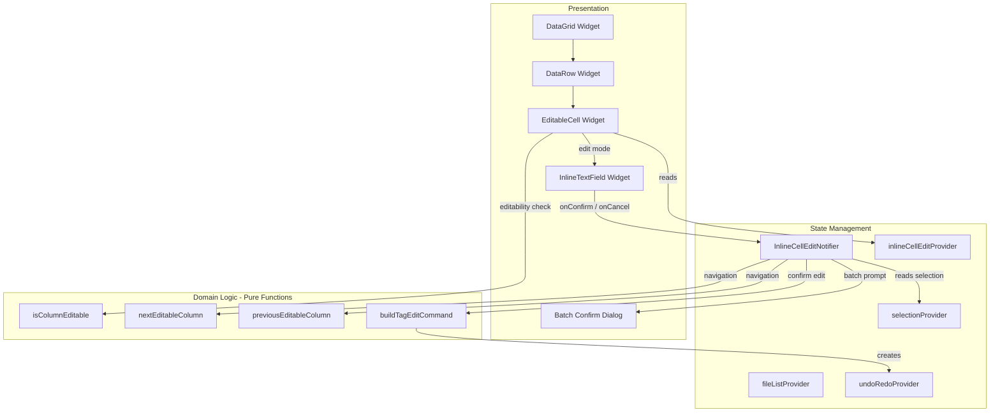

# Design Document: Inline Cell Editing

## Overview

This feature adds direct inline editing of tag values within the DataGrid, enabling a spreadsheet-like editing experience. Users can double-click, press F2, or start typing to enter edit mode on any editable cell. The design introduces a cell-level focus/edit state layer on top of the existing row selection, a navigation system that skips read-only columns, batch editing with confirmation, and full integration with the existing `UndoRedoManager` and `TagEditCommand` infrastructure.

### Key Design Decisions

1. **Separate edit state provider over widget-local state** — The inline edit state (which cell is focused, which is being edited, the current text value) lives in a Riverpod provider rather than widget-local `State`. This allows the undo system, keyboard shortcuts, and batch logic to interact with edit state without widget tree coupling.

2. **Cell coordinate model (row index + column ID)** — A `CellCoordinate` value object identifies cells by row index in the filtered/sorted list and column ID. This decouples cell identity from file path (which doesn't change) and column position (which can change with reordering).

3. **Editable column classification as a pure function** — A `isColumnEditable(String columnId)` function determines editability based on a static set of read-only IDs. This is trivially testable and keeps the logic out of the widget layer.

4. **Navigation as a pure function** — `nextEditableColumn` and `previousEditableColumn` are pure functions that take the current column ID and the visible column list, returning the next/previous editable column (with row wrapping). These are the core testable units.

5. **Reuse existing TagEditCommand** — Inline edits (single and batch) create `TagEditCommand` instances identical to those from the side panel editor. No new command types needed.

6. **Confirmation dialog only for multi-selection** — The batch confirmation prompt only appears when `selection.count > 1` and the user confirms via Enter or focus loss. Ctrl+Enter bypasses the prompt for power users.

## Architecture



### Data Flow

1. **Enter edit mode (double-click)**: User double-clicks cell → `EditableCell` checks `isColumnEditable` → if editable, calls `InlineCellEditNotifier.enterEditMode(coordinate, prePopulate: true)` → state updates → `InlineTextField` renders with pre-populated value
2. **Enter edit mode (F2)**: User presses F2 → `DataGrid` key handler checks focused cell → calls `enterEditMode(coordinate, prePopulate: true, selectAll: true)`
3. **Enter edit mode (typing)**: User types character → key handler calls `enterEditMode(coordinate, initialCharacter: char)`
4. **Confirm edit**: User presses Enter → `InlineCellEditNotifier.confirmEdit()` → compares new value to original → if changed, builds `TagEditCommand` → if multi-selection, shows batch dialog or applies directly (Ctrl+Enter) → executes command via `UndoRedoManager` → exits edit mode → navigates to next row
5. **Cancel edit**: User presses Escape → `InlineCellEditNotifier.cancelEdit()` → state resets to no active edit → cell re-renders with original value
6. **Tab navigation**: User presses Tab → `confirmEdit()` → `nextEditableColumn()` computes target → `enterEditMode(target)` on new cell
7. **Batch edit**: Confirm triggers → selection count > 1 → dialog shown (or skipped with Ctrl+Enter) → `TagEditCommand` created with all selected file paths → single undo entry

## Components and Interfaces

### CellCoordinate (value object)

```dart
/// Identifies a single cell in the DataGrid by row index and column ID.
class CellCoordinate {
  const CellCoordinate({
    required this.rowIndex,
    required this.columnId,
  });

  /// Index into the filtered/sorted file list.
  final int rowIndex;

  /// Column identifier (e.g., 'title', 'artist').
  final String columnId;

  @override
  bool operator ==(Object other) =>
      other is CellCoordinate &&
      other.rowIndex == rowIndex &&
      other.columnId == columnId;

  @override
  int get hashCode => Object.hash(rowIndex, columnId);
}
```

### InlineCellEditState (state model)

```dart
/// Represents the current inline editing state of the DataGrid.
class InlineCellEditState {
  const InlineCellEditState({
    this.focusedCell,
    this.editingCell,
    this.originalValue,
    this.currentValue,
  });

  /// The cell that currently has keyboard focus (highlight shown).
  final CellCoordinate? focusedCell;

  /// The cell currently in edit mode (text field shown). Null if not editing.
  final CellCoordinate? editingCell;

  /// The original tag value when edit mode was entered.
  final String? originalValue;

  /// The current text field value (tracks user input).
  final String? currentValue;

  /// Whether a cell is actively being edited.
  bool get isEditing => editingCell != null;

  InlineCellEditState copyWith({
    CellCoordinate? focusedCell,
    CellCoordinate? editingCell,
    String? originalValue,
    String? currentValue,
    bool clearEditing = false,
  }) {
    return InlineCellEditState(
      focusedCell: focusedCell ?? this.focusedCell,
      editingCell: clearEditing ? null : (editingCell ?? this.editingCell),
      originalValue: clearEditing ? null : (originalValue ?? this.originalValue),
      currentValue: clearEditing ? null : (currentValue ?? this.currentValue),
    );
  }
}
```

### InlineCellEditNotifier (state notifier)

```dart
/// Manages the inline cell editing lifecycle.
class InlineCellEditNotifier extends StateNotifier<InlineCellEditState> {
  InlineCellEditNotifier({
    required this.ref,
  }) : super(const InlineCellEditState());

  final Ref ref;

  /// Enters edit mode on the given cell.
  ///
  /// [prePopulate] fills the text field with the current tag value.
  /// [selectAll] selects all text (used for F2 entry).
  /// [initialCharacter] starts with just that character (typing entry).
  void enterEditMode(
    CellCoordinate cell, {
    bool prePopulate = false,
    bool selectAll = false,
    String? initialCharacter,
  });

  /// Confirms the current edit and applies the value.
  ///
  /// Returns the batch mode chosen (for navigation decisions).
  /// [batchMode] forces batch application without prompt (Ctrl+Enter).
  Future<void> confirmEdit({bool batchMode = false});

  /// Cancels the current edit, restoring the original value.
  void cancelEdit();

  /// Updates the current text value as the user types.
  void updateValue(String value);

  /// Moves focus to the given cell (without entering edit mode).
  void moveFocus(CellCoordinate cell);

  /// Navigates to the next editable cell (Tab).
  void navigateNext();

  /// Navigates to the previous editable cell (Shift+Tab).
  void navigatePrevious();

  /// Navigates to the same column in the next row (Enter after confirm).
  void navigateDown();
}

/// Provider for inline cell edit state.
final inlineCellEditProvider =
    StateNotifierProvider<InlineCellEditNotifier, InlineCellEditState>((ref) {
  return InlineCellEditNotifier(ref: ref);
});
```

### isColumnEditable (pure function)

```dart
/// Set of column IDs that are read-only and cannot be edited inline.
const readOnlyColumnIds = {
  'tagIndicator',
  'filename',
  'bitrate',
  'duration',
  'relativePath',
};

/// Returns whether the given column supports inline editing.
bool isColumnEditable(String columnId) {
  return !readOnlyColumnIds.contains(columnId);
}
```

### nextEditableColumn / previousEditableColumn (pure functions)

```dart
/// Returns the next editable column coordinate after [current].
///
/// Skips read-only columns. Wraps to the first editable column of the
/// next row when at the end of the current row.
/// Returns null if there are no editable columns or no next row.
CellCoordinate? nextEditableColumn(
  CellCoordinate current,
  List<String> visibleColumnIds,
  int totalRows,
) {
  final editableIds =
      visibleColumnIds.where(isColumnEditable).toList();
  if (editableIds.isEmpty) return null;

  final currentIndex = editableIds.indexOf(current.columnId);
  if (currentIndex < editableIds.length - 1) {
    // Next column in same row
    return CellCoordinate(
      rowIndex: current.rowIndex,
      columnId: editableIds[currentIndex + 1],
    );
  }
  // Wrap to next row
  if (current.rowIndex < totalRows - 1) {
    return CellCoordinate(
      rowIndex: current.rowIndex + 1,
      columnId: editableIds.first,
    );
  }
  return null; // At last cell of last row
}

/// Returns the previous editable column coordinate before [current].
///
/// Skips read-only columns. Wraps to the last editable column of the
/// previous row when at the start of the current row.
/// Returns null if there are no editable columns or no previous row.
CellCoordinate? previousEditableColumn(
  CellCoordinate current,
  List<String> visibleColumnIds,
  int totalRows,
) {
  final editableIds =
      visibleColumnIds.where(isColumnEditable).toList();
  if (editableIds.isEmpty) return null;

  final currentIndex = editableIds.indexOf(current.columnId);
  if (currentIndex > 0) {
    // Previous column in same row
    return CellCoordinate(
      rowIndex: current.rowIndex,
      columnId: editableIds[currentIndex - 1],
    );
  }
  // Wrap to previous row
  if (current.rowIndex > 0) {
    return CellCoordinate(
      rowIndex: current.rowIndex - 1,
      columnId: editableIds.last,
    );
  }
  return null; // At first cell of first row
}
```

### buildTagEditCommand (pure function)

```dart
/// Builds a TagEditCommand for an inline edit.
///
/// Returns null if the new value equals the original (no-op).
TagEditCommand? buildTagEditCommand({
  required FileListNotifier fileListNotifier,
  required List<String> filePaths,
  required String columnId,
  required String newValue,
  required List<AudioFile> allFiles,
}) {
  // Gather previous values for all affected files
  final previousValues = <String, String?>{};
  for (final file in allFiles) {
    if (filePaths.contains(file.path)) {
      previousValues[file.path] = file.tags[columnId];
    }
  }

  // Check if this is a no-op for single file edits
  if (filePaths.length == 1) {
    final prev = previousValues[filePaths.first];
    if ((prev ?? '') == newValue) return null;
  }

  return TagEditCommand(
    fileListNotifier: fileListNotifier,
    filePaths: filePaths,
    fieldName: columnId,
    newValue: newValue,
    previousValues: previousValues,
  );
}
```

### EditableCell (widget)

```dart
/// A cell widget that supports inline editing.
///
/// Renders either a static text display or an InlineTextField depending
/// on whether this cell is the active edit cell.
class EditableCell extends ConsumerWidget {
  const EditableCell({
    super.key,
    required this.coordinate,
    required this.value,
    required this.width,
    required this.isEditable,
  });

  final CellCoordinate coordinate;
  final String value;
  final double width;
  final bool isEditable;
}
```

### InlineTextField (widget)

```dart
/// The text input field displayed inside a cell during edit mode.
///
/// Matches the font size and padding of the static cell text.
/// Handles Enter, Escape, Tab, Shift+Tab, and Ctrl+Enter key events.
class InlineTextField extends ConsumerStatefulWidget {
  const InlineTextField({
    super.key,
    required this.initialValue,
    required this.selectAll,
    required this.width,
  });

  final String initialValue;
  final bool selectAll;
  final double width;
}
```

### BatchConfirmDialog

```dart
/// Dialog asking whether to apply an edit to all selected files.
///
/// Returns [BatchConfirmResult.yes], [BatchConfirmResult.no],
/// or [BatchConfirmResult.cancel].
enum BatchConfirmResult { yes, no, cancel }

Future<BatchConfirmResult> showBatchConfirmDialog(
  BuildContext context,
  int selectedCount,
);
```

## Data Models

### InlineCellEditState

| Field | Type | Description |
|-------|------|-------------|
| `focusedCell` | `CellCoordinate?` | Cell with keyboard focus (visual highlight) |
| `editingCell` | `CellCoordinate?` | Cell in active edit mode (text field shown) |
| `originalValue` | `String?` | Tag value when edit mode was entered |
| `currentValue` | `String?` | Current text field content |

### CellCoordinate

| Field | Type | Description |
|-------|------|-------------|
| `rowIndex` | `int` | Index into filtered/sorted file list |
| `columnId` | `String` | Column identifier (e.g., `'title'`) |

### Read-Only Column IDs (constant set)

```dart
const readOnlyColumnIds = {'tagIndicator', 'filename', 'bitrate', 'duration', 'relativePath'};
```

### Interaction with Existing Models

- **AudioFile**: The `tags` map is read to get current values and the `isModified` flag drives the modified indicator.
- **TagEditCommand**: Created with `filePaths`, `fieldName` (= columnId), `newValue`, and `previousValues` gathered from the current file list.
- **SelectionState**: `selectedPaths` determines which files are affected by batch edits. `count` determines whether to show the batch confirmation dialog.
- **ColumnConfig**: `visibleColumnIds` provides the ordered list of visible columns for navigation. `widthOverrides` (from column-resize) provides effective widths for cell sizing.

## Correctness Properties

*A property is a characteristic or behavior that should hold true across all valid executions of a system — essentially, a formal statement about what the system should do. Properties serve as the bridge between human-readable specifications and machine-verifiable correctness guarantees.*

### Property 1: Column editability classification

*For any* column ID in the set `{'tagIndicator', 'filename', 'bitrate', 'duration', 'relativePath'}`, `isColumnEditable` SHALL return `false`. *For any* column ID not in that set (e.g., `'title'`, `'artist'`, `'album'`, `'year'`, `'genre'`, etc.), `isColumnEditable` SHALL return `true`.

**Validates: Requirements 2.2, 2.4, 9.1, 9.2**

### Property 2: Edit mode initialization preserves current value

*For any* AudioFile and any editable column ID, entering edit mode with `prePopulate: true` SHALL produce an edit state where `originalValue` equals the file's current tag value for that column (or empty string if the tag is absent).

**Validates: Requirements 1.1**

### Property 3: Character-initiated edit mode contains only the typed character

*For any* printable character and any editable column, entering edit mode with `initialCharacter` SHALL produce an edit state where `currentValue` equals exactly that single character and `originalValue` equals the file's current tag value.

**Validates: Requirements 2.3**

### Property 4: Confirm edit applies new value to file tags

*For any* AudioFile, any editable column ID, and any non-empty new value that differs from the original, confirming the edit SHALL result in the file's tag map containing the new value for that column ID.

**Validates: Requirements 3.1**

### Property 5: Cancel edit restores original value (no state change)

*For any* edit state with an original value and any modified current value, cancelling the edit SHALL result in the file's tag map being unchanged from before edit mode was entered.

**Validates: Requirements 3.2**

### Property 6: Unchanged value produces no undo command

*For any* AudioFile and any editable column, if the confirmed value equals the original value (including both being empty), `buildTagEditCommand` SHALL return `null` (no command created).

**Validates: Requirements 3.4**

### Property 7: Tab/Shift+Tab navigation always lands on an editable column

*For any* list of visible column IDs (containing at least one editable column), any current cell coordinate, and any direction (forward/backward), the navigation function SHALL return a `CellCoordinate` whose `columnId` satisfies `isColumnEditable(columnId) == true`, or `null` if at the boundary (last row for forward, first row for backward).

**Validates: Requirements 4.1, 4.2, 4.4, 4.5**

### Property 8: Batch edit applies value to all selected files

*For any* set of selected file paths (size > 1), any editable column ID, and any new value, applying a batch edit SHALL result in every selected file's tag map containing the new value for that column.

**Validates: Requirements 5.2, 5.5**

### Property 9: Single-file edit command contains exactly one file path

*For any* single-cell inline edit confirmation (non-batch), the resulting `TagEditCommand` SHALL have `filePaths.length == 1` and `filePaths.first` equal to the edited file's path.

**Validates: Requirements 6.1**

### Property 10: Batch edit command contains all affected file paths

*For any* batch inline edit confirmation across N selected files, the resulting `TagEditCommand` SHALL have `filePaths.length == N` and `filePaths` SHALL contain exactly the set of selected file paths.

**Validates: Requirements 6.2**

## Error Handling

### Edit Mode Entry Errors

- **Read-only column**: If `enterEditMode` is called with a column ID where `isColumnEditable` returns false, the method returns immediately with no state change. The UI layer prevents this via cursor feedback, but the notifier guards defensively.
- **Invalid row index**: If the row index is out of bounds for the current filtered file list, `enterEditMode` returns with no state change.
- **Already editing**: If edit mode is already active on a different cell, the current edit is confirmed (same as focus-loss behavior) before entering the new cell.

### Edit Confirmation Errors

- **File not found**: If the file at the given row index no longer exists in the file list (e.g., removed during editing), the edit is silently discarded.
- **Empty new value**: An empty string is a valid edit — it removes the tag field. This is not an error.

### Navigation Errors

- **No editable columns visible**: If all visible columns are read-only (unlikely but possible with custom column config), navigation functions return `null` and no navigation occurs.
- **At grid boundary**: `nextEditableColumn` returns `null` at the last editable cell of the last row. `previousEditableColumn` returns `null` at the first editable cell of the first row. The notifier stays on the current cell.

### Batch Edit Errors

- **Selection changed during edit**: The batch edit uses the selection state at confirmation time, not at edit-mode-entry time. If the user changes selection while editing, the batch applies to the current selection.
- **Dialog dismissed**: If the batch confirmation dialog is dismissed (e.g., by pressing Escape on the dialog itself), it is treated as Cancel — the edit is discarded.

### Undo/Redo Errors

- **Undo stack overflow**: Handled by existing `UndoRedoManager` which trims at 100 entries. No additional handling needed.

## Testing Strategy

### Property-Based Tests (using `package:fast_check`)

Property-based tests validate the 10 correctness properties defined above. Each test runs a minimum of 100 iterations with randomly generated inputs.

**Test configuration:**
- Library: `package:fast_check`
- Minimum iterations: 100 per property
- Tag format: `// Feature: inline-cell-editing, Property N: <property text>`

**Generators needed:**
- `columnIdGen`: Generates random column IDs from `defaultColumns`
- `editableColumnIdGen`: Generates random column IDs where `isColumnEditable` is true
- `readOnlyColumnIdGen`: Generates random column IDs from `readOnlyColumnIds`
- `tagValueGen`: Generates random non-empty strings suitable for tag values (alphanumeric + common characters, 1-200 chars)
- `audioFileGen`: Generates random `AudioFile` instances with random tag maps
- `visibleColumnsGen`: Generates random subsets of column IDs (always including at least one editable column)
- `cellCoordinateGen`: Generates random `CellCoordinate` with valid row index and column ID
- `selectedPathsGen`: Generates random sets of file paths (1-50 paths)
- `printableCharGen`: Generates random single printable characters

**Property test file:**
- `test/features/tag_editor/inline_cell_editing/inline_edit_properties_test.dart`

### Unit Tests (example-based)

- **isColumnEditable**: Verify each known read-only column returns false, each known editable column returns true
- **nextEditableColumn**: Specific cases — middle of row, end of row (wrap), last row (null), single editable column
- **previousEditableColumn**: Specific cases — middle of row, start of row (wrap), first row (null)
- **buildTagEditCommand**: Verify null return for unchanged value, correct previousValues map, correct filePaths for single and batch
- **InlineCellEditNotifier.enterEditMode**: Verify state transitions for double-click, F2, and character entry
- **InlineCellEditNotifier.confirmEdit**: Verify command creation and state cleanup
- **InlineCellEditNotifier.cancelEdit**: Verify state reset without command creation

### Widget Tests

- **EditableCell**: Verify text field appears in edit mode, static text in view mode
- **InlineTextField**: Verify Enter confirms, Escape cancels, Tab navigates, Ctrl+Enter batch-applies
- **Edit mode border**: Verify distinct visual border on active edit cell
- **Read-only cursor**: Verify not-allowed cursor on read-only column hover
- **Modified indicator**: Verify colored triangle appears when `isModified` is true
- **Batch confirmation dialog**: Verify dialog appears with correct count, Yes/No/Cancel behavior
- **Font consistency**: Verify text field uses same font size (12px) and padding as static cell

### Integration Tests

- **Full edit cycle**: Enter edit mode → type value → confirm → verify file updated → undo → verify restored
- **Batch edit cycle**: Select multiple files → edit cell → confirm batch → verify all files updated → undo → verify all restored
- **Navigation flow**: Tab through multiple cells, verify each enters edit mode on an editable column
- **Side panel suppression**: Verify double-click during edit mode does not open side panel
