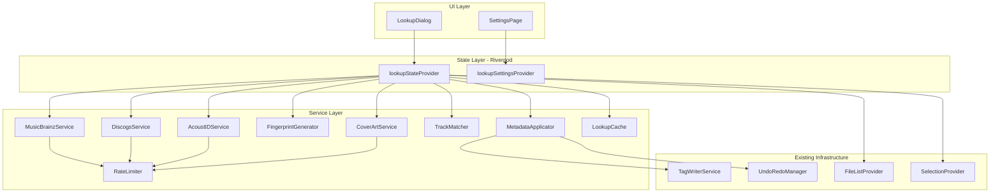

# Design Document: Online Metadata Lookup

## Overview

This feature adds online metadata lookup capabilities to the tag editor, allowing users to search MusicBrainz and Discogs for album/track metadata, identify unknown files via audio fingerprinting (AcoustID/Chromaprint), preview and selectively apply retrieved metadata to selected files, and embed cover art from the Cover Art Archive.

The design builds on the existing `MusicBrainzService`, extends it with rate limiting and caching, and introduces new services for Discogs, AcoustID, cover art, fingerprint generation, and track matching. A modal Lookup Dialog orchestrates the user workflow. All metadata application goes through the existing `TagWriterService` and `UndoRedoManager`.

### Key Design Decisions

1. **Service-layer abstraction**: Each external API gets its own service class with a shared `SearchResult` model, enabling unified display in the dialog.
2. **Rate limiter as middleware**: A generic `RateLimiter` wraps HTTP clients rather than being embedded in each service, keeping services testable and rate logic reusable.
3. **In-memory session cache**: Simple `Map`-based cache keyed by query/release ID, discarded on app restart. No persistence needed.
4. **Process-based fingerprinting**: `fpcalc` is invoked as a subprocess via `dart:io Process`, keeping the app free of native Chromaprint bindings.
5. **Existing undo infrastructure**: Metadata apply creates a `BatchTagEditCommand` (already exists) registered with `UndoRedoManager`.

## Architecture



### Component Responsibilities

| Component | Responsibility |
|-----------|---------------|
| `LookupDialog` | Modal UI for search, results, track matching, preview, apply |
| `LookupStateNotifier` | Orchestrates lookup workflow state (search, results, matching, apply) |
| `MusicBrainzService` | Queries MusicBrainz API for releases and recordings |
| `DiscogsService` | Queries Discogs API for releases |
| `AcoustIDService` | Submits fingerprints to AcoustID, returns recording IDs |
| `FingerprintGenerator` | Invokes `fpcalc` binary to generate Chromaprint fingerprints |
| `CoverArtService` | Fetches front cover from Cover Art Archive |
| `TrackMatcher` | Maps album tracks to selected files by order or duration |
| `MetadataApplicator` | Writes selected fields to files via TagWriterService, registers undo |
| `RateLimiter` | Queues HTTP requests per-service to respect rate limits |
| `LookupCache` | In-memory cache for search results and track listings |
| `LookupSettingsNotifier` | Persists lookup preferences via shared_preferences |

## Components and Interfaces

### RateLimiter

```dart
/// Generic rate limiter that wraps an http.Client.
/// Queues requests to enforce per-service rate limits.
class RateLimiter {
  RateLimiter({
    required this.maxRequests,
    required this.perDuration,
    required http.Client innerClient,
  });

  final int maxRequests;
  final Duration perDuration;

  /// Sends a request, waiting if necessary to respect rate limits.
  /// Automatically retries on HTTP 429 using Retry-After header.
  Future<http.Response> send(http.Request request);

  /// Number of requests currently queued.
  int get queueLength;

  /// Stream that emits queue length changes for UI binding.
  Stream<int> get queueLengthStream;

  void dispose();
}
```

### DiscogsService

```dart
/// Service for searching releases on Discogs.
class DiscogsService {
  DiscogsService({
    required http.Client client,
    required String personalAccessToken,
  });

  /// Searches for releases matching the query.
  Future<List<DiscogsRelease>> searchReleases({
    String? artist,
    String? album,
    int? year,
    int page = 1,
    int perPage = 25,
  });

  /// Fetches full track listing for a release.
  Future<List<DiscogsTrack>> getReleaseTracks(int releaseId);

  void dispose();
}
```

### AcoustIDService

```dart
/// Service for identifying audio files via AcoustID.
class AcoustIDService {
  AcoustIDService({
    required http.Client client,
    required String apiKey,
  });

  /// Looks up a fingerprint and returns matching recording IDs
  /// sorted by confidence score (highest first).
  Future<List<AcoustIDResult>> lookup({
    required String fingerprint,
    required int durationSeconds,
  });

  void dispose();
}
```

### FingerprintGenerator

```dart
/// Generates Chromaprint audio fingerprints by invoking fpcalc.
class FingerprintGenerator {
  FingerprintGenerator({required String fpcalcPath});

  /// Generates a fingerprint for the given audio file.
  /// Throws FingerprintException on timeout or process failure.
  Future<FingerprintResult> generate(String filePath);

  /// Generates fingerprints for multiple files sequentially,
  /// reporting progress via the callback.
  Future<List<FingerprintResult>> generateBatch(
    List<String> filePaths, {
    void Function(int completed, int total)? onProgress,
  });
}

class FingerprintResult {
  final String filePath;
  final String fingerprint;
  final int durationSeconds;
}
```

### CoverArtService

```dart
/// Fetches album artwork from the Cover Art Archive.
class CoverArtService {
  CoverArtService({required http.Client client});

  /// Fetches the front cover image for a MusicBrainz release.
  /// Returns null if no artwork is available.
  Future<CoverArtResult?> getFrontCover(String mbReleaseId);
}

class CoverArtResult {
  final Uint8List imageBytes;
  final String mimeType;
}
```

### TrackMatcher

```dart
/// Matches album tracks to selected audio files.
class TrackMatcher {
  /// Attempts to match tracks to files.
  /// Strategy: if file count == track count, match by order.
  /// Otherwise, match by duration similarity (±3 seconds tolerance).
  /// Returns a list of TrackFileMatch entries.
  List<TrackFileMatch> autoMatch({
    required List<TrackInfo> tracks,
    required List<AudioFile> files,
  });
}

class TrackFileMatch {
  final TrackInfo track;
  final AudioFile? file; // null if unmatched
  final MatchConfidence confidence;
}

enum MatchConfidence { exact, duration, unmatched }
```

### MetadataApplicator

```dart
/// Applies retrieved metadata to audio files via TagWriterService.
class MetadataApplicator {
  MetadataApplicator({
    required TagWriterService tagWriter,
    required UndoRedoManager undoManager,
    required FileListNotifier fileListNotifier,
  });

  /// Applies selected fields from matched tracks to files.
  /// Returns results indicating success/failure per file.
  /// Registers a single BatchTagEditCommand for undo.
  Future<ApplyResult> apply({
    required List<TrackFileMatch> matches,
    required Set<String> selectedFields,
    required CoverArtResult? coverArt,
    required bool applyCoverArt,
  });
}

class ApplyResult {
  final int successCount;
  final int failureCount;
  final List<ApplyFileResult> fileResults;
}

class ApplyFileResult {
  final String path;
  final bool success;
  final String? error;
}
```

### LookupCache

```dart
/// In-memory session cache for lookup results.
class LookupCache {
  /// Stores search results keyed by normalized query string.
  void cacheSearchResults(String cacheKey, List<SearchResult> results);

  /// Retrieves cached search results, or null if not cached.
  List<SearchResult>? getSearchResults(String cacheKey);

  /// Stores a track listing keyed by release ID.
  void cacheTrackListing(String releaseId, List<TrackInfo> tracks);

  /// Retrieves cached track listing, or null if not cached.
  List<TrackInfo>? getTrackListing(String releaseId);

  /// Clears all cached data.
  void clear();
}
```

### Unified Search Result Model

```dart
/// Unified search result from any source.
class SearchResult {
  final String id;
  final String title;
  final String? artist;
  final String? year;
  final String? country;
  final int? trackCount;
  final SearchSource source;
}

enum SearchSource { musicBrainz, discogs }

/// Unified track info from any source.
class TrackInfo {
  final String title;
  final int position;
  final int discNumber;
  final int? durationMs;
  final String? artist; // track artist if different from album artist
}
```

### LookupStateNotifier (Riverpod)

```dart
/// Manages the full lookup workflow state.
class LookupStateNotifier extends StateNotifier<LookupState> {
  /// Performs a search across selected sources.
  Future<void> search({
    required String? artist,
    required String? album,
    String? year,
    required Set<SearchSource> sources,
  });

  /// Selects a result and fetches its track listing.
  Future<void> selectResult(SearchResult result);

  /// Triggers fingerprint identification for selected files.
  Future<void> identifyFiles(List<AudioFile> files);

  /// Updates the track-to-file matching (e.g., after manual reorder).
  void updateMatching(List<TrackFileMatch> matches);

  /// Applies metadata to matched files.
  Future<ApplyResult> applyMetadata({
    required Set<String> selectedFields,
    required bool applyCoverArt,
  });

  /// Cancels any in-progress operation.
  void cancel();
}
```

## Data Models

### LookupState

```dart
/// Immutable state for the lookup workflow.
class LookupState {
  const LookupState({
    this.status = LookupStatus.idle,
    this.searchResults = const [],
    this.selectedResult,
    this.trackListing = const [],
    this.matches = const [],
    this.coverArt,
    this.coverArtLoading = false,
    this.error,
    this.fingerprintProgress,
    this.queueLength = 0,
  });

  final LookupStatus status;
  final List<SearchResult> searchResults;
  final SearchResult? selectedResult;
  final List<TrackInfo> trackListing;
  final List<TrackFileMatch> matches;
  final CoverArtResult? coverArt;
  final bool coverArtLoading;
  final String? error;
  final FingerprintProgress? fingerprintProgress;
  final int queueLength;
}

enum LookupStatus {
  idle,
  searching,
  loadingTracks,
  fingerprinting,
  applying,
  complete,
  error,
}

class FingerprintProgress {
  final int completed;
  final int total;
}
```

### LookupSettings

```dart
/// Persisted settings for online lookup.
class LookupSettings {
  const LookupSettings({
    this.discogsToken = '',
    this.acoustIdApiKey = '',
    this.fpcalcPath = '',
    this.defaultSource = SearchSource.musicBrainz,
    this.autoFetchCoverArt = true,
  });

  final String discogsToken;
  final String acoustIdApiKey;
  final String fpcalcPath;
  final SearchSource defaultSource;
  final bool autoFetchCoverArt;
}
```

### Discogs Models

```dart
class DiscogsRelease {
  final int id;
  final String title;
  final String? artist;
  final String? year;
  final String? country;
  final int? trackCount;
}

class DiscogsTrack {
  final String title;
  final int position;
  final String? duration; // "M:SS" format from Discogs
  final String? artist;
}
```

### AcoustID Models

```dart
class AcoustIDResult {
  final String recordingId; // MusicBrainz recording ID
  final double confidence; // 0.0 to 1.0
  final String? title;
  final String? artist;
}
```


## Correctness Properties

*A property is a characteristic or behavior that should hold true across all valid executions of a system—essentially, a formal statement about what the system should do. Properties serve as the bridge between human-readable specifications and machine-verifiable correctness guarantees.*

### Property 1: Pre-fill extraction returns first file's tags

*For any* non-empty list of AudioFiles, the pre-fill extraction function SHALL return the artist and album tag values from the first file in the list (or empty string if the tag is absent).

**Validates: Requirements 1.1, 1.2**

### Property 2: Search query construction includes all provided parameters

*For any* combination of non-empty artist, album, and year strings, the MusicBrainz query construction SHALL produce a query string containing all provided parameters correctly formatted as Lucene query terms.

**Validates: Requirements 1.3**

### Property 3: Multi-source merge preserves all results with source indicators

*For any* two lists of SearchResults from MusicBrainz and Discogs respectively, merging them SHALL produce a list whose length equals the sum of both input lengths, and every item SHALL retain its original source indicator.

**Validates: Requirements 2.3**

### Property 4: Highest-confidence recording selection

*For any* non-empty list of AcoustIDResults with varying confidence scores, the identification logic SHALL select the recording ID with the highest confidence value for metadata fetching.

**Validates: Requirements 3.3**

### Property 5: Track grouping by disc number

*For any* list of TrackInfo items with multiple disc numbers, grouping by disc number SHALL produce groups where every track in a group has the same disc number, no track is omitted, and groups are ordered by disc number ascending.

**Validates: Requirements 4.3**

### Property 6: Order-based matching when counts are equal

*For any* list of N tracks and N files (where N > 0), the TrackMatcher SHALL match track at position i to file at index i, producing N matches all with `exact` confidence.

**Validates: Requirements 5.1**

### Property 7: Duration-based matching respects tolerance

*For any* track and file pair, if the absolute difference between the track's duration and the file's duration is within 3000 milliseconds, the TrackMatcher's duration strategy SHALL match them. If the difference exceeds 3000 milliseconds, they SHALL NOT be matched by duration alone.

**Validates: Requirements 5.2**

### Property 8: Unmatched entries on count mismatch

*For any* list of M tracks and N files where M ≠ N, the TrackMatcher result SHALL contain exactly |M - N| entries with `unmatched` confidence (either unmatched tracks or unmatched files).

**Validates: Requirements 5.5**

### Property 9: Preview generation shows correct field values

*For any* set of TrackFileMatches and any subset of selected fields, the preview generation SHALL produce entries containing exactly the selected fields, where each entry's "current" value equals the file's existing tag and "new" value equals the track's metadata for that field.

**Validates: Requirements 7.2**

### Property 10: Only selected fields are written

*For any* non-empty subset of metadata fields and any TrackFileMatch, the MetadataApplicator SHALL pass to TagWriterService.writeTags a map containing only keys corresponding to the selected fields and no others.

**Validates: Requirements 7.3**

### Property 11: Apply summary accuracy

*For any* list of ApplyFileResults, the ApplyResult summary's successCount SHALL equal the number of results where success is true, and failureCount SHALL equal the number where success is false.

**Validates: Requirements 7.6**

### Property 12: Rate limiter enforces configured intervals

*For any* RateLimiter configured with maxRequests=N per duration=D, when N+1 requests are submitted simultaneously, the (N+1)th request SHALL not be sent until at least D time has elapsed since the first request.

**Validates: Requirements 8.1, 8.2**

### Property 13: Rate limiter respects Retry-After on 429

*For any* HTTP 429 response with a Retry-After header value of S seconds, the RateLimiter SHALL wait at least S seconds before retrying the request.

**Validates: Requirements 8.4**

### Property 14: Cache round-trip

*For any* cache key and associated data (search results or track listings), storing data in the LookupCache and then retrieving it by the same key SHALL return data equal to what was stored.

**Validates: Requirements 9.1, 9.3**

### Property 15: Cache hit avoids redundant API calls

*For any* query whose results are already cached, submitting that query again SHALL return the cached results without invoking any HTTP request to the external service.

**Validates: Requirements 9.2**

### Property 16: Settings persistence round-trip

*For any* valid LookupSettings instance, persisting it via shared_preferences and then loading it back SHALL produce a LookupSettings equal to the original.

**Validates: Requirements 10.6**

## Error Handling

### Network Errors

| Scenario | Handling |
|----------|----------|
| Connection timeout | Set `LookupStatus.error` with descriptive message, offer retry button |
| DNS resolution failure | Same as timeout — display error, allow retry |
| HTTP 4xx (client error) | Display specific error message (e.g., "Invalid API key" for 401) |
| HTTP 429 (rate limited) | RateLimiter handles automatically — pause and retry after Retry-After |
| HTTP 5xx (server error) | Display "Service temporarily unavailable", allow retry |

### Fingerprint Errors

| Scenario | Handling |
|----------|----------|
| `fpcalc` binary not found | Throw `FingerprintException` with guidance to configure path in Settings |
| `fpcalc` process timeout (>10s) | Kill process, report timeout error for that file, continue batch |
| `fpcalc` non-zero exit code | Report error for that file, continue batch |
| No AcoustID matches | Mark file as "unidentified" in results, do not block other files |

### Metadata Apply Errors

| Scenario | Handling |
|----------|----------|
| TagWriterService throws for a file | Record failure in ApplyFileResult, continue with remaining files |
| All files fail | Display error summary, no undo command registered |
| Partial failure | Register undo only for successful writes, display mixed summary |

### Cancellation

- All async operations check a `CancellationToken` (or use Dart's `CancelableOperation`)
- Closing the dialog during an operation triggers cancellation
- Cancelled operations clean up gracefully — no partial state left in providers

## Testing Strategy

### Property-Based Testing

This feature is well-suited for property-based testing due to its pure logic components (matching, merging, caching, rate limiting, query construction).

**Library**: `package:fast_check` (Dart property-based testing library)

**Configuration**:
- Minimum 100 iterations per property test
- Each test tagged with: `Feature: online-metadata-lookup, Property {N}: {title}`

**Properties to implement** (from Correctness Properties section):
- Properties 1–16 as defined above
- Focus on pure functions: TrackMatcher, LookupCache, RateLimiter timing, query construction, merge logic, preview generation, field filtering

### Unit Tests (Example-Based)

| Component | Test Focus |
|-----------|-----------|
| `MusicBrainzService` | JSON parsing of release/track responses, error status handling |
| `DiscogsService` | JSON parsing, token header inclusion, pagination params |
| `AcoustIDService` | Request body construction, response parsing, confidence sorting |
| `CoverArtService` | URL construction, image byte handling, 404 → null |
| `FingerprintGenerator` | Process invocation args, stdout parsing, timeout handling |
| `MetadataApplicator` | Undo command registration, partial failure handling |
| `LookupStateNotifier` | State transitions through the workflow |
| `LookupSettingsNotifier` | Load/save from shared_preferences |

### Integration Tests

| Scenario | Approach |
|----------|----------|
| Full search → select → match → apply workflow | Widget test with mocked services |
| Fingerprint → identify → display results | Widget test with mocked fpcalc and HTTP |
| Settings save and reload | Integration test with real shared_preferences |

### Test Doubles

- **HTTP Client**: Mock `http.Client` for all service tests (no real network calls in unit/property tests)
- **Process**: Mock `Process.run` for fingerprint generator tests
- **TagWriterService**: Mock for MetadataApplicator tests
- **Clock**: Fake clock (`package:clock`) for rate limiter timing tests
- **SharedPreferences**: Use `SharedPreferences.setMockInitialValues` for settings tests
