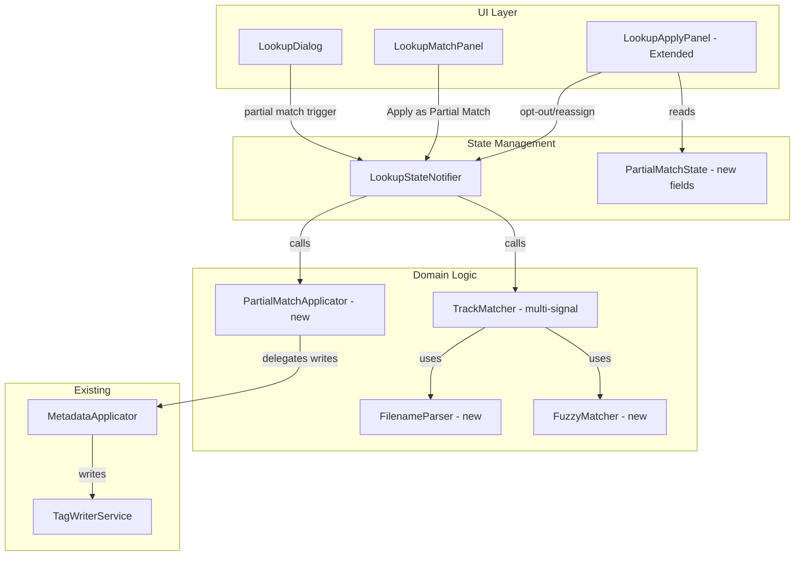

# Design Document: Partial Album Match

## Overview

This feature extends the existing online metadata lookup workflow to handle the common scenario where a matched album has fewer tracks than the user's local files (e.g. standard edition vs. deluxe edition). The core change replaces the current duration-only matching with a multi-signal `TrackMatcher` that combines filename track numbers, fuzzy title similarity, and duration proximity into a composite score. A new `PartialMatchApplicator` separates album-level metadata (applied to all files) from track-level metadata (applied only to matched files). The apply panel is extended to show all selected files, provide per-file opt-out, display confidence indicators, and clearly distinguish matched from unmatched files.

### Key Design Decisions

1. **Multi-signal scoring with Hungarian algorithm** — Rather than greedy matching, the matcher uses a cost matrix approach (Hungarian algorithm) to find the globally optimal assignment that maximises total Match_Score. This avoids local optima where a greedy first-match steals a better candidate from a later track.

2. **Weighted signal combination** — Filename track number match is the strongest signal (weight 0.5), fuzzy title similarity is secondary (weight 0.3), and duration proximity is tertiary (weight 0.2). This reflects real-world reliability: track numbers in filenames are almost always correct, titles are usually close but may have variations, and durations can differ between editions.

3. **Short-title penalty** — Titles of 3 characters or fewer have their fuzzy match weight halved to prevent false positives on generic names like "Intro", "End", or "III".

4. **Album vs Track metadata separation** — The applicator distinguishes between fields that describe the album (applied to all non-opted-out files) and fields that describe a specific track (applied only to matched files). This ensures unmatched bonus tracks get consistent album info without incorrect track titles.

5. **File-count denominator for track numbers** — In partial match mode, the track number denominator uses the total selected file count (e.g. "3/16") rather than the album's track count (e.g. "3/11"), reflecting the user's actual collection size.

6. **Confidence tiers from score thresholds** — Match confidence is derived from the composite score: high (≥0.7), medium (≥0.4), low (<0.4). This gives users actionable information about match quality.

## Architecture



### Data Flow

1. **Partial match activation**: User selects an album result with fewer tracks than selected files → `LookupMatchPanel` shows "Apply as Partial Match" button → user clicks → `LookupStateNotifier.matchFilesPartial()` is called.

2. **Multi-signal matching**: `TrackMatcher.autoMatch()` is enhanced to use `FilenameParser` and `FuzzyMatcher` alongside duration. It builds a score matrix and finds the optimal assignment. Returns `List<TrackFileMatch>` with composite confidence scores.

3. **Apply panel display**: The extended `LookupApplyPanel` receives all selected files (not just matched ones). Matched files show full metadata preview with confidence indicators. Unmatched files show album-only metadata preview with "Album info only" badge.

4. **Per-file opt-out**: User toggles checkboxes to exclude files. The opt-out set is maintained in `LookupStateNotifier` state.

5. **Metadata application**: `PartialMatchApplicator.apply()` iterates all non-opted-out files. For each file: writes album metadata always, writes track metadata only if the file has a track assignment. Track numbers use file-count denominator.

## Components and Interfaces

### FilenameParser (new — pure function)

```dart
/// Extracts matching signals from audio filenames.
class FilenameParser {
  FilenameParser._();

  /// Extracts a leading track number from a filename.
  ///
  /// Parses digits before the first non-digit separator (space, underscore,
  /// hyphen, dot). Returns null if no leading digits found.
  /// Examples: "01_Take_Me_Away.mp3" → 1, "Take Me Away.mp3" → null
  static int? extractTrackNumber(String filename);

  /// Extracts a title from a filename by removing extension, leading track
  /// number prefix, and normalising separators to spaces.
  ///
  /// Steps:
  /// 1. Remove file extension
  /// 2. Remove leading digits + separator
  /// 3. Replace underscores, hyphens, dots with spaces
  /// 4. Trim whitespace
  /// Example: "01_Take_Me_Away.mp3" → "Take Me Away"
  static String extractTitle(String filename);
}
```

### FuzzyMatcher (new — pure function)

```dart
/// Computes fuzzy string similarity for title matching.
class FuzzyMatcher {
  FuzzyMatcher._();

  /// Computes a normalised similarity score between two strings.
  ///
  /// Uses Levenshtein distance normalised by the longer string's length.
  /// Returns a value in [0.0, 1.0] where 1.0 is an exact match.
  /// Comparison is case-insensitive.
  static double similarity(String a, String b);
}
```

### TrackMatcher (extended)

```dart
/// Matches album tracks to selected audio files using multi-signal scoring.
class TrackMatcher {
  TrackMatcher._();

  /// Signal weights for composite score calculation.
  static const double trackNumberWeight = 0.5;
  static const double titleWeight = 0.3;
  static const double durationWeight = 0.2;

  /// Minimum similarity threshold below which title signal is ignored.
  static const double minTitleSimilarity = 0.4;

  /// Short title length threshold for weight reduction.
  static const int shortTitleLength = 3;

  /// Duration tolerance in milliseconds (3 seconds).
  static const int durationToleranceMs = 3000;

  /// Attempts to auto-match tracks to files using multi-signal scoring.
  ///
  /// If file count equals track count, uses order-based matching (existing).
  /// Otherwise, builds a score matrix and finds optimal assignment.
  static List<TrackFileMatch> autoMatch({
    required List<TrackInfo> tracks,
    required List<AudioFile> files,
  });

  /// Computes the composite match score for a single file-track pair.
  ///
  /// Returns a score in [0.0, 1.0].
  static double computeScore({
    required AudioFile file,
    required TrackInfo track,
  });
}
```

### PartialMatchApplicator (new)

```dart
/// Applies metadata from a partial album match, distinguishing album-level
/// from track-level fields.
class PartialMatchApplicator {
  PartialMatchApplicator({
    required TagWriterService tagWriter,
    required FileListNotifier fileListNotifier,
  });

  /// Album-level field names.
  static const Set<String> albumFields = {
    'album', 'albumArtist', 'year', 'genre',
  };

  /// Track-level field names.
  static const Set<String> trackFields = {
    'title', 'artist', 'discNumber',
  };

  /// Applies metadata to files based on partial match results.
  ///
  /// - Album metadata is written to all non-opted-out files.
  /// - Track metadata is written only to files with a track assignment.
  /// - Track number uses [totalFileCount] as denominator.
  /// - Files in [optedOutPaths] are skipped entirely.
  Future<ApplyResult> apply({
    required List<TrackFileMatch> matches,
    required List<AudioFile> allFiles,
    required Set<String> selectedFields,
    required Set<String> optedOutPaths,
    required int totalFileCount,
    CoverArtResult? coverArt,
    bool applyCoverArt = false,
    String? albumTitle,
    String? albumArtist,
    String? year,
  });
}
```

### LookupApplyPanel (extended)

The existing `LookupApplyPanel` is extended with:
- Display of all selected files (matched + unmatched)
- Per-file opt-out checkboxes (default: checked/opted-in)
- Confidence indicators per matched file row
- "Album info only" badge on unmatched rows
- Visual differentiation (reduced opacity for unmatched rows)
- Matched files grouped before unmatched files
- Summary line: "{matched} of {total} files matched to tracks • {unmatched} files will receive album info only"
- Track reassignment/clear action per matched file

### LookupMatchPanel (extended)

When `trackListing.length < selectedFiles.length`, the match button changes to "Apply as Partial Match" and triggers the partial match workflow.

### LookupState (extended)

```dart
/// Additional fields on LookupState for partial match workflow.
/// - isPartialMatch: true when album tracks < selected files
/// - optedOutPaths: set of file paths the user has excluded
/// - allSelectedFiles: full list of selected files (for unmatched display)
```

## Data Models

### TrackFileMatch (extended)

```dart
/// A proposed mapping between an album track and a local audio file.
class TrackFileMatch {
  const TrackFileMatch({
    required this.track,
    this.file,
    required this.confidence,
    this.score,
  });

  final TrackInfo track;
  final AudioFile? file;
  final MatchConfidence confidence;

  /// The composite match score in [0.0, 1.0], null for order-based matches.
  final double? score;
}
```

### MatchConfidence (extended)

```dart
/// Confidence level of a track-to-file match.
enum MatchConfidence {
  /// Matched by track number order (file count == track count).
  exact,

  /// High confidence multi-signal match (score ≥ 0.7).
  high,

  /// Medium confidence multi-signal match (score ≥ 0.4).
  medium,

  /// Low confidence multi-signal match (score < 0.4).
  low,

  /// Matched by duration similarity only (legacy, ±3 seconds).
  duration,

  /// No match found.
  unmatched,
}
```

### PartialMatchFileEntry (new — UI model)

```dart
/// Represents a file row in the partial match apply panel.
class PartialMatchFileEntry {
  const PartialMatchFileEntry({
    required this.file,
    this.matchedTrack,
    this.confidence,
    this.score,
    this.isOptedOut = false,
  });

  /// The local audio file.
  final AudioFile file;

  /// The matched track, or null if unmatched.
  final TrackInfo? matchedTrack;

  /// Match confidence level.
  final MatchConfidence? confidence;

  /// Composite match score.
  final double? score;

  /// Whether the user has opted this file out of metadata application.
  final bool isOptedOut;

  /// Whether this file has a track assignment.
  bool get isMatched => matchedTrack != null;
}
```

### Signal Scores (internal to TrackMatcher)

| Signal | Range | Description |
|--------|-------|-------------|
| Track number | 0.0 or 1.0 | 1.0 if filename track number equals track position, else 0.0 |
| Title similarity | 0.0–1.0 | Normalised Levenshtein similarity (case-insensitive) |
| Duration proximity | 0.0–1.0 | `1.0 - (abs_diff_ms / tolerance_ms)`, clamped to [0, 1] |

### Composite Score Formula

```
score = (trackNumberWeight × trackNumberSignal)
      + (effectiveTitleWeight × titleSignal)
      + (durationWeight × durationSignal)
```

Where `effectiveTitleWeight` = `titleWeight × 0.5` if track title length ≤ 3, else `titleWeight`.

If `titleSignal < minTitleSimilarity`, it is treated as 0.0 (absent).


## Correctness Properties

*A property is a characteristic or behavior that should hold true across all valid executions of a system — essentially, a formal statement about what the system should do. Properties serve as the bridge between human-readable specifications and machine-verifiable correctness guarantees.*

### Property 1: Track number extraction

*For any* filename string that begins with one or more digit characters followed by a non-digit separator (space, underscore, hyphen, or dot), `FilenameParser.extractTrackNumber` SHALL return the integer value of those leading digits. *For any* filename string that does not begin with a digit character, it SHALL return null.

**Validates: Requirements 1.1, 1.6**

### Property 2: Filename normalisation preserves words

*For any* filename string, `FilenameParser.extractTitle` SHALL produce a result that contains no file extension, no leading digit prefix, and no underscore, hyphen, or dot characters — only spaces as word separators. Furthermore, the set of alphabetic word tokens in the output SHALL be a subset of the alphabetic word tokens derivable from the original filename (no invented content).

**Validates: Requirements 2.1**

### Property 3: Fuzzy similarity is case-insensitive

*For any* two non-empty strings `a` and `b`, `FuzzyMatcher.similarity(a, b)` SHALL equal `FuzzyMatcher.similarity(a.toUpperCase(), b.toLowerCase())`.

**Validates: Requirements 2.2**

### Property 4: Title signal attenuation

*For any* track title of length ≤ 3 characters, the effective title weight used in composite score computation SHALL be half the normal title weight. *For any* file-track pair where the fuzzy similarity score is below `minTitleSimilarity` (0.4), the title signal contribution to the composite score SHALL be zero.

**Validates: Requirements 2.3, 2.4**

### Property 5: Score validity and weighted composition

*For any* file-track pair, `TrackMatcher.computeScore` SHALL return a value in [0.0, 1.0]. The returned score SHALL equal `(trackNumberWeight × trackNumberSignal) + (effectiveTitleWeight × titleSignal) + (durationWeight × durationSignal)` where each individual signal is in [0.0, 1.0].

**Validates: Requirements 1.2, 1.3, 1.4**

### Property 6: Optimal assignment maximises total score

*For any* set of tracks and files where tracks.length ≤ files.length, the assignment produced by `TrackMatcher.autoMatch` SHALL have a total composite score greater than or equal to every other valid assignment (where each file is assigned to at most one track and each track to at most one file).

**Validates: Requirements 1.5, 1.7, 1.8**

### Property 7: Album metadata applied to exactly non-opted-out files

*For any* set of selected files, any set of track-file matches, and any set of opted-out file paths: after `PartialMatchApplicator.apply`, album-level metadata (album title, album artist, year, cover art) SHALL have been written to every file whose path is NOT in the opted-out set, and SHALL NOT have been written to any file whose path IS in the opted-out set — regardless of whether the file has a track assignment.

**Validates: Requirements 3.1, 3.3, 3.4, 5.2**

### Property 8: Track metadata applied only to matched non-opted-out files

*For any* set of selected files, any set of track-file matches, and any set of opted-out file paths: after `PartialMatchApplicator.apply`, track-level metadata (title, track artist, disc number) SHALL have been written only to files that (a) have a track assignment AND (b) are not opted out. Files without a track assignment SHALL have their track-level metadata unchanged.

**Validates: Requirements 4.1, 4.3**

### Property 9: Track number formatting

*For any* partial match application with N total selected files and a matched file assigned to track position P: the written track number SHALL be formatted as "P/N". *For any* unmatched file, the track number field SHALL remain unchanged.

**Validates: Requirements 9.1, 9.2, 10.1, 10.2**

### Property 10: Summary count reflects opt-out state

*For any* set of M matched files, U unmatched files, and O opted-out files (where O ⊆ M ∪ U): the displayed summary count SHALL equal (M + U - O), representing the number of files that will receive metadata changes.

**Validates: Requirements 5.4, 8.1**

### Property 11: Display ordering invariant

*For any* list of `PartialMatchFileEntry` items displayed in the apply panel, all entries where `isMatched == true` SHALL appear before all entries where `isMatched == false`.

**Validates: Requirements 7.3**

## Error Handling

### Matching Errors

- **No leading digits in any filename**: All track number signals are 0. The matcher falls back to title and duration signals. If all signals are weak, matches will have low confidence — the UI highlights these for user review.
- **No duration data on tracks**: Duration signal is 0 for those tracks. The matcher relies on track number and title signals only.
- **All signals absent** (no track numbers, no title similarity, no duration): The matcher produces unmatched results. The user sees all files as "Album info only" and can manually assign tracks.

### Application Errors

- **Tag write failure on individual file**: The applicator catches per-file exceptions, records the failure in `ApplyResult.fileResults`, and continues with remaining files. The UI shows "X file(s) updated, Y failed".
- **Cover art write failure**: Treated the same as tag write failure — recorded per-file, does not abort the batch.
- **Empty selected fields**: If no fields are selected and cover art is not selected, the apply operation is a no-op. The UI should disable the Apply button when nothing is selected.

### Edge Cases

- **Single file selected with multi-track album**: Only one file can be matched. The remaining album tracks are unassigned (not shown in the panel since we display files, not tracks).
- **All files opted out**: Apply is a no-op. The summary shows "Applying to 0 of N files".
- **Duplicate filenames**: `FilenameParser` operates on the filename string only. If two files have identical filenames (from different directories), they get identical signals but the optimiser still assigns each to at most one track.
- **Zero-length album (no tracks)**: Should not reach partial match flow — guarded by the condition `trackCount < fileCount` which requires at least 1 track.

## Testing Strategy

### Property-Based Tests (using `package:fast_check`)

Property-based tests validate the 11 correctness properties defined above. Each test runs a minimum of 100 iterations with randomly generated inputs.

**Test configuration:**
- Library: `package:fast_check` (project standard)
- Minimum iterations: 100 per property
- Tag format: `// Feature: partial-album-match, Property N: <property text>`

**Generators needed:**
- `filenameWithTrackNumberGen`: Generates filenames like "01_Title.mp3", "12 Song Name.flac" with known track number and title
- `filenameWithoutTrackNumberGen`: Generates filenames without leading digits like "Song Name.mp3"
- `audioFileGen`: Generates `AudioFile` instances with random filenames, durations, and tags
- `trackInfoGen`: Generates `TrackInfo` instances with random titles, positions, durations
- `smallTrackListGen`: Generates lists of 1–5 `TrackInfo` for optimality verification
- `smallFileListGen`: Generates lists of 2–8 `AudioFile` (more than tracks) for partial match scenarios
- `optedOutPathsGen`: Generates random subsets of file paths from a file list
- `selectedFieldsGen`: Generates random subsets of field names
- `matchResultGen`: Generates `List<TrackFileMatch>` with mixed matched/unmatched entries

**Property test files:**
- `test/features/online_lookup/data/filename_parser_property_test.dart` (Properties 1, 2)
- `test/features/online_lookup/data/fuzzy_matcher_property_test.dart` (Property 3)
- `test/features/online_lookup/data/track_matcher_property_test.dart` (Properties 4, 5, 6)
- `test/features/online_lookup/data/partial_match_applicator_property_test.dart` (Properties 7, 8, 9, 10)
- `test/features/online_lookup/presentation/partial_apply_panel_property_test.dart` (Property 11)

### Unit Tests (example-based)

**FilenameParser:**
- "01_Take_Me_Away.mp3" → trackNumber: 1, title: "Take Me Away"
- "12 - Song Name.flac" → trackNumber: 12, title: "Song Name"
- "Song Without Number.mp3" → trackNumber: null, title: "Song Without Number"
- "1.mp3" → trackNumber: 1, title: ""
- "001_a.mp3" → trackNumber: 1, title: "a"

**FuzzyMatcher:**
- Identical strings → 1.0
- Completely different strings → close to 0.0
- "Take Me Away" vs "Take_Me_Away" (after normalisation) → 1.0
- Empty string vs non-empty → 0.0

**TrackMatcher (partial match scenarios):**
- 11 tracks, 16 files: verify 11 files matched, 5 unmatched
- All files have correct track numbers in filenames: verify all matched with high confidence
- Files with no track numbers but matching titles: verify title-based matching works
- Files with conflicting signals: verify composite score wins

**PartialMatchApplicator:**
- Verify album fields written to unmatched files
- Verify track fields NOT written to unmatched files
- Verify opted-out files receive nothing
- Verify track number format "3/16" in partial mode vs "3/11" in full mode

### Widget Tests

- **LookupMatchPanel**: "Apply as Partial Match" button appears when trackCount < fileCount
- **LookupApplyPanel (partial mode)**:
  - All files displayed (matched + unmatched)
  - Checkboxes present and default to checked
  - Confidence indicators on matched rows
  - "Album info only" badge on unmatched rows
  - Unmatched rows have reduced opacity
  - Matched rows grouped before unmatched
  - Summary text shows correct counts
  - Opt-out updates summary count
  - Reassign/clear actions available on matched rows

### Integration Tests

- **Full partial match workflow**: Select 16 files → search → select 11-track album → "Apply as Partial Match" → verify panel shows all 16 files → opt out 2 files → apply → verify 9 files get album+track metadata, 5 files get album-only metadata, 2 files unchanged
- **Confidence-based review**: Verify low-confidence matches are highlighted and user can reassign them before applying
