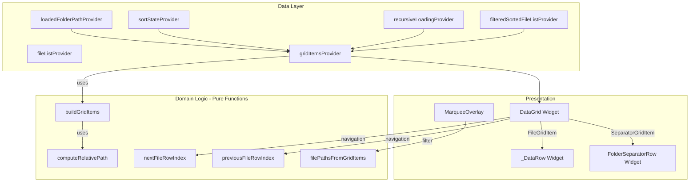

# Design Document: Recursive Folder Separators

## Overview

This feature introduces non-interactive folder separator rows into the DataGrid when recursive loading is enabled. Separators visually group files by their containing subfolder, displaying the relative path from the root folder with " / " delimiters. The implementation adds a new data layer that transforms the flat file list into a mixed list of file rows and separator rows, with the separator logic being a pure function that can be tested independently of the UI.

### Key Design Decisions

1. **Sealed union type for grid items over marker objects in the file list** — A `GridItem` sealed class with `FileGridItem` and `SeparatorGridItem` subtypes represents the mixed list. This keeps the `AudioFile` model unchanged and makes exhaustive pattern matching possible in the widget layer.

2. **Pure function for grid item computation over stateful notifier** — The transformation from `List<AudioFile>` → `List<GridItem>` is a pure function (`buildGridItems`) that takes the file list, root folder path, recursive flag, and sort state as inputs. This makes the core logic trivially testable without widget or provider dependencies.

3. **Derived provider over manual state management** — A `gridItemsProvider` computes the grid items reactively from existing providers (filtered/sorted file list, recursive loading, sort state, loaded folder path). No manual synchronisation needed.

4. **Navigation helper as a pure function** — A `nextFileRowIndex` / `previousFileRowIndex` function takes the grid items list and current index, returning the next/previous index that is a `FileGridItem`. This is reused by arrow keys, Shift+arrow, Tab, and marquee filtering.

5. **Same row height for separators** — Separators use the same `itemExtent` as file rows (28px). This avoids mixed-height virtualization complexity and keeps `ListView.builder` with fixed extent for optimal scroll performance.

## Architecture



### Data Flow

1. **File loading**: Files are loaded into `fileListProvider` as before. No changes to loading logic.
2. **Filtering/sorting**: `filteredSortedFileListProvider` applies text filter, selection filter, and sort as before.
3. **Grid item computation**: `gridItemsProvider` watches the filtered/sorted list, recursive flag, sort state, and root folder. When sort is active or recursive is disabled, it returns `FileGridItem` wrappers only (no separators). Otherwise, it groups files by parent directory, sorts groups alphabetically (root first), sorts files within groups by filename, and inserts `SeparatorGridItem` before each group.
4. **Rendering**: `DataGrid` iterates `gridItemsProvider` output. Pattern-matches each item to render either `_DataRow` or `FolderSeparatorRow`.
5. **Selection**: Selection operations extract file paths from grid items using `filePathsFromGridItems`, ensuring separators are never in the selectable set.
6. **Navigation**: Arrow key and Tab handlers use `nextFileRowIndex` / `previousFileRowIndex` to skip separator indices.

## Components and Interfaces

### GridItem (sealed class)

```dart
/// Represents a single row in the DataGrid — either a file or a folder separator.
sealed class GridItem {
  const GridItem();
}

/// A file row in the grid.
class FileGridItem extends GridItem {
  const FileGridItem({required this.file, required this.fileIndex});

  /// The audio file for this row.
  final AudioFile file;

  /// Index into the original filtered file list (for cell coordinate mapping).
  final int fileIndex;
}

/// A folder separator row in the grid.
class SeparatorGridItem extends GridItem {
  const SeparatorGridItem({required this.relativePath});

  /// The formatted relative path to display (using " / " delimiters).
  final String relativePath;
}
```

### buildGridItems (pure function)

```dart
/// Builds the mixed list of grid items from a filtered/sorted file list.
///
/// When [isRecursive] is false or [isSorted] is true, returns only
/// [FileGridItem] wrappers with no separators.
///
/// When separators are shown, files are grouped by parent directory,
/// groups are ordered alphabetically by relative path (root first),
/// and files within each group are ordered by filename (case-insensitive).
List<GridItem> buildGridItems({
  required List<AudioFile> files,
  required String? rootFolder,
  required bool isRecursive,
  required bool isSorted,
});
```

### computeRelativePath (pure function)

```dart
/// Computes the display path for a folder separator.
///
/// Returns the path of [folderPath] relative to [rootFolder], with
/// platform path separators replaced by " / " (space-slash-space).
///
/// If [folderPath] equals [rootFolder], returns just the final segment
/// of [rootFolder] (the folder's own name).
String computeRelativePath(String folderPath, String rootFolder);
```

### Navigation helpers (pure functions)

```dart
/// Returns the index of the next [FileGridItem] after [currentIndex],
/// or null if there is no file row after the current position.
int? nextFileRowIndex(List<GridItem> items, int currentIndex);

/// Returns the index of the previous [FileGridItem] before [currentIndex],
/// or null if there is no file row before the current position.
int? previousFileRowIndex(List<GridItem> items, int currentIndex);

/// Extracts an ordered list of file paths from grid items,
/// excluding all separator items.
List<String> filePathsFromGridItems(List<GridItem> items);
```

### gridItemsProvider (Riverpod provider)

```dart
/// Provides the computed list of grid items for the DataGrid.
///
/// Reactively recomputes when the file list, recursive state,
/// sort state, or root folder changes.
final gridItemsProvider = Provider<List<GridItem>>((ref) {
  final files = ref.watch(filteredSortedFileListProvider);
  final isRecursive = ref.watch(recursiveLoadingProvider);
  final sortState = ref.watch(sortStateProvider);
  final rootFolder = ref.watch(loadedFolderPathProvider);

  return buildGridItems(
    files: files,
    rootFolder: rootFolder,
    isRecursive: isRecursive,
    isSorted: sortState.isSorted,
  );
});
```

### FolderSeparatorRow (widget)

```dart
/// A non-interactive row displaying a folder path as a group header.
///
/// Spans the full grid width, uses a distinct background colour,
/// displays a folder icon + relative path in bold, and ignores
/// all pointer interactions.
class FolderSeparatorRow extends StatelessWidget {
  const FolderSeparatorRow({super.key, required this.relativePath});

  final String relativePath;

  @override
  Widget build(BuildContext context) {
    final colorScheme = Theme.of(context).colorScheme;

    return IgnorePointer(
      child: Container(
        height: DataGrid.rowHeight,
        decoration: BoxDecoration(
          color: colorScheme.surfaceContainerHighest.withValues(alpha: 0.6),
          border: Border(
            bottom: BorderSide(
              color: colorScheme.outlineVariant.withValues(alpha: 0.3),
            ),
          ),
        ),
        padding: const EdgeInsets.symmetric(horizontal: 8),
        child: Row(
          children: [
            Icon(
              Icons.folder,
              size: 14,
              color: colorScheme.onSurfaceVariant,
            ),
            const SizedBox(width: 8),
            Expanded(
              child: Text(
                relativePath,
                style: TextStyle(
                  fontSize: 12,
                  fontWeight: FontWeight.bold,
                  color: colorScheme.onSurfaceVariant,
                ),
                overflow: TextOverflow.ellipsis,
              ),
            ),
          ],
        ),
      ),
    );
  }
}
```

## Data Models

### GridItem hierarchy

| Type | Fields | Description |
|------|--------|-------------|
| `FileGridItem` | `file: AudioFile`, `fileIndex: int` | Wraps an audio file with its index in the filtered list |
| `SeparatorGridItem` | `relativePath: String` | Holds the formatted display path for the separator |

### Interaction with Existing Models

- **AudioFile**: Unchanged. The `path` field is used to derive the parent directory for grouping.
- **SelectionState**: Unchanged. Selection operations receive `filePathsFromGridItems()` output instead of raw file list paths.
- **SortState**: Read-only. When `isSorted` is true, `buildGridItems` suppresses separators.
- **filteredSortedFileListProvider**: Unchanged. Its output feeds into `gridItemsProvider`.
- **InlineCellEditState**: The `CellCoordinate.rowIndex` maps to the `fileIndex` field on `FileGridItem`, not the grid item index. This preserves compatibility with the existing inline editing system.

### File Organisation

```
lib/features/tag_editor/
├── data/
│   ├── models/
│   │   └── grid_item.dart              # GridItem sealed class
│   └── providers/
│       └── grid_items_provider.dart     # gridItemsProvider + buildGridItems
├── presentation/
│   ├── helpers/
│   │   └── grid_navigation.dart        # nextFileRowIndex, previousFileRowIndex, filePathsFromGridItems
│   └── widgets/
│       └── data_grid/
│           ├── data_grid.dart           # Updated to use gridItemsProvider
│           └── folder_separator_row.dart # FolderSeparatorRow widget
└── ...
```

## Correctness Properties

*A property is a characteristic or behavior that should hold true across all valid executions of a system — essentially, a formal statement about what the system should do. Properties serve as the bridge between human-readable specifications and machine-verifiable correctness guarantees.*

### Property 1: Separator insertion correctness

*For any* list of audio files with various parent directories and a valid root folder, `buildGridItems` (with recursive enabled and no sort) SHALL insert exactly one `SeparatorGridItem` before each contiguous group of files sharing the same parent directory, and SHALL NOT insert separators for directories that contain no files directly.

**Validates: Requirements 1.1, 1.5**

### Property 2: Relative path formatting round-trip

*For any* valid root folder path and any subfolder path that is a descendant of the root folder, `computeRelativePath` SHALL produce a string where splitting on " / " and re-joining with the platform separator (prepended to the root folder) reconstructs the original subfolder path. When the subfolder equals the root folder, the result SHALL be the final path segment of the root folder.

**Validates: Requirements 1.2, 1.3**

### Property 3: Sort suppresses all separators

*For any* list of audio files and any active sort state (where `isSorted` is true), `buildGridItems` SHALL return a list containing zero `SeparatorGridItem` instances, regardless of recursive loading state or active filters.

**Validates: Requirements 1.4, 4.3, 5.5**

### Property 4: Selection excludes separators

*For any* list of grid items produced by `buildGridItems`, `filePathsFromGridItems` SHALL return only paths from `FileGridItem` entries, and the resulting list SHALL never contain entries corresponding to `SeparatorGridItem` rows.

**Validates: Requirements 2.2, 2.5**

### Property 5: Navigation always lands on a file row

*For any* list of grid items containing at least one `FileGridItem`, and any valid starting index, `nextFileRowIndex` SHALL return an index pointing to a `FileGridItem` (or null if no file row exists after the current position). The same holds for `previousFileRowIndex` in the reverse direction.

**Validates: Requirements 2.3, 2.6**

### Property 6: Default ordering — folders alphabetical, root first

*For any* list of audio files spanning multiple directories, when `buildGridItems` produces separators (recursive enabled, no sort), the `SeparatorGridItem` entries SHALL appear in case-insensitive alphabetical order of their `relativePath`, with the exception that the root folder separator (if present) always appears first. Within each group, `FileGridItem` entries SHALL be ordered by filename case-insensitively.

**Validates: Requirements 4.1, 4.2**

### Property 7: Separator visibility tracks visible files

*For any* list of audio files, any text filter, and any selection filter, `buildGridItems` (applied to the filtered file list) SHALL produce a `SeparatorGridItem` for a directory if and only if at least one file in that directory is present in the filtered list.

**Validates: Requirements 5.1, 5.2, 5.3, 5.4**

### Property 8: Total grid item count invariant

*For any* output of `buildGridItems`, the total number of items SHALL equal the number of `FileGridItem` entries plus the number of `SeparatorGridItem` entries, and the number of `FileGridItem` entries SHALL equal the length of the input file list.

**Validates: Requirements 6.2**

## Error Handling

### Edge Cases in Grid Item Computation

- **Null root folder**: If `rootFolder` is null (no folder loaded), `buildGridItems` returns `FileGridItem` wrappers only with no separators. This handles the case where files are loaded via drag-and-drop without a clear root.
- **Empty file list**: Returns an empty list. No separators are generated.
- **Single file**: Produces one separator followed by one file item.
- **All files in root**: Produces one separator (showing root folder name) followed by all files.
- **Platform path separators**: `computeRelativePath` normalises both `\` (Windows) and `/` (Unix) before computing the relative path, ensuring cross-platform correctness.

### Navigation Edge Cases

- **Grid with only separators**: Impossible by design (separators are only inserted when files exist), but `nextFileRowIndex` / `previousFileRowIndex` return null defensively.
- **Current index is a separator**: Navigation functions search forward/backward from the given index, so starting on a separator still finds the nearest file row.
- **Current index out of bounds**: Returns null.

### Scroll Preservation

- When separators are added/removed (due to sort toggle or filter change), the `DataGrid` uses `ScrollController` to compute which file was at the top of the viewport before the change and scrolls to maintain that file's visibility after the change. If the file is no longer visible (filtered out), the scroll offset is clamped to valid bounds.

### Selection During Transitions

- When sort is toggled on (separators removed), the selection set is unchanged — it still contains valid file paths. The `orderedPaths` list passed to selection operations is updated to the new flat order.
- When sort is cleared (separators restored), the same applies — selection paths remain valid, only the display order changes.

## Testing Strategy

### Property-Based Tests (using `package:fast_check`)

Property-based tests validate the 8 correctness properties defined above. Each test runs a minimum of 100 iterations with randomly generated inputs.

**Test configuration:**
- Library: `package:fast_check`
- Minimum iterations: 100 per property
- Tag format: `// Feature: recursive-folder-separators, Property N: <property text>`

**Generators needed:**
- `audioFileGen`: Generates random `AudioFile` instances with random paths under a generated root folder structure (1-5 levels deep, 1-10 files per directory)
- `rootFolderGen`: Generates random root folder paths (platform-appropriate)
- `fileListGen`: Generates lists of 1-50 `AudioFile` instances distributed across 1-10 subdirectories
- `gridItemsGen`: Generates output of `buildGridItems` for testing navigation functions
- `filterStringGen`: Generates random filter strings (substrings of generated filenames)

**Property test file:**
- `test/features/tag_editor/data/providers/grid_items_properties_test.dart`

### Unit Tests (example-based)

- **computeRelativePath**: Specific cases — single level deep, multiple levels, root folder itself, Windows paths, Unix paths, trailing separators
- **buildGridItems with recursive=false**: Verify zero separators
- **buildGridItems with sort active**: Verify zero separators
- **buildGridItems with empty list**: Verify empty output
- **buildGridItems ordering**: Specific multi-folder example verifying alphabetical order with root first
- **nextFileRowIndex / previousFileRowIndex**: Specific cases — adjacent file rows, multiple separators in a row, at boundaries

### Widget Tests

- **FolderSeparatorRow**: Verify folder icon present, 8px gap, bold text, ellipsis overflow, distinct background colour
- **IgnorePointer**: Verify separator does not respond to tap, double-tap, or right-click
- **DataGrid integration**: Verify separator rows appear between file groups in recursive mode
- **DataGrid with sort**: Verify no separator rows when sort is active
- **Marquee selection**: Verify separator rows excluded from marquee selection results
- **Arrow key navigation**: Verify focus skips separator rows
- **Tab navigation**: Verify inline edit Tab/Shift+Tab skips separator rows
- **Scroll preservation**: Verify scroll position maintained when toggling sort on/off

### Integration Tests

- **Full cycle**: Load folder recursively → verify separators appear → apply sort → verify separators gone → clear sort → verify separators restored
- **Filter cycle**: Load folder → apply text filter → verify only matching folders have separators → clear filter → verify all separators restored
- **Selection with separators**: Select files across multiple groups → verify selection count excludes separators → Ctrl+A → verify all files selected, no separators
