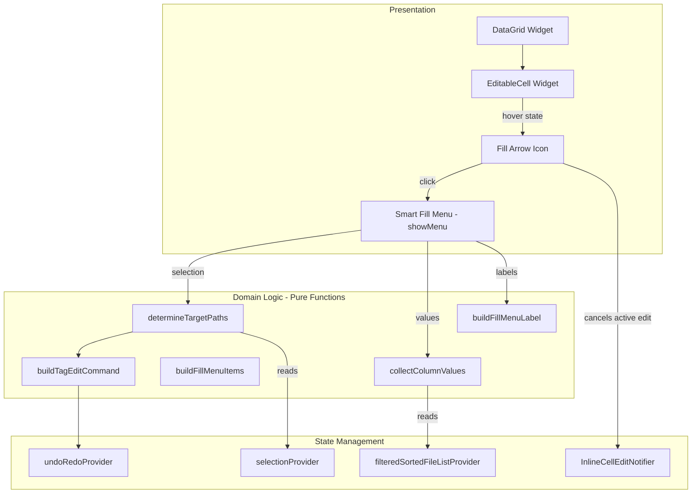

# Design Document: Smart Fill Menu

## Overview

Smart Fill Menu adds a context-aware dropdown to editable cells in the DataGrid that offers intelligent fill options based on the unique values present in that column across all loaded files. A small dropdown arrow appears on hover, and clicking it opens a popup menu listing distinct column values. The user can apply any value to all files or only to the current selection, with full undo/redo support via the existing `TagEditCommand` infrastructure.

### Key Design Decisions

1. **Fill arrow as part of EditableCell** — The fill arrow is rendered inside the existing `EditableCell` widget as a conditionally-visible icon button. This avoids adding a new widget layer and keeps the hover/edit state logic co-located.

2. **Pure function for value sourcing** — A `collectColumnValues` pure function extracts unique non-empty values from a list of `AudioFile` objects for a given column ID. This is trivially testable and reusable.

3. **Pure function for menu label generation** — A `buildFillMenuLabel` pure function determines the correct label wording ("Set all to…" vs "Set selected to…") based on selection count and total file count. Testable without widget context.

4. **Reuse existing `buildTagEditCommand`** — Fill actions create `TagEditCommand` instances via the same utility used by inline editing. No new command types needed.

5. **`showMenu<String>()` for the popup** — Consistent with the existing column header context menu pattern. The menu is anchored to the fill arrow's render box position.

6. **Value sourcing from `filteredSortedFileListProvider`** — All loaded files visible in the grid are used as the value source, ensuring the menu reflects what the user can see.

7. **Selection state captured at menu open time** — The selection snapshot is taken when the menu opens and does not update while the menu is visible, preventing confusing label changes.

## Architecture



### Data Flow

1. **Hover → Show arrow**: Pointer enters `EditableCell` → widget sets local hover state → fill arrow icon renders (right-aligned, 24×24 dp hit target). Arrow is hidden if cell is in edit mode or column is read-only.

2. **Click arrow → Open menu**: User clicks fill arrow → if a cell is in active edit mode, cancel it via `InlineCellEditNotifier.cancelEdit()` → capture selection snapshot → call `collectColumnValues` to get unique values → call `buildFillMenuItems` to create labeled `PopupMenuEntry` items → call `showMenu<String>()` anchored to the arrow position.

3. **Select menu item → Apply fill**: User picks a value → call `determineTargetPaths` with selection snapshot and total file list → call `buildTagEditCommand` with target paths, column ID, and chosen value → if command is non-null, execute via `UndoRedoManager` → menu closes.

4. **Dismiss menu → No action**: User clicks outside or presses Escape → `showMenu` future resolves to `null` → no action taken.

## Components and Interfaces

### collectColumnValues (pure function)

```dart
/// Collects unique non-empty tag values for a column across all files.
///
/// Returns values in the order they first appear in [files].
/// Excludes empty strings and whitespace-only strings.
/// Uses case-sensitive comparison for deduplication.
List<String> collectColumnValues({
  required List<AudioFile> files,
  required String columnId,
}) {
  final seen = <String>{};
  final result = <String>[];

  for (final file in files) {
    final value = file.tags[columnId] ?? '';
    final trimmed = value.trim();
    if (trimmed.isEmpty) continue;
    if (seen.add(value)) {
      result.add(value);
    }
  }

  return result;
}
```

### buildFillMenuLabel (pure function)

```dart
/// Builds the display label for a fill menu item.
///
/// Returns "Set all to {value}" when no subset is selected (zero selected
/// or all selected). Returns "Set selected to {value}" when a proper
/// subset is selected.
///
/// Truncates [value] to 40 characters with ellipsis if it exceeds that length.
/// For the blank option, pass [isBlank] = true.
String buildFillMenuLabel({
  required String value,
  required int selectedCount,
  required int totalCount,
  bool isBlank = false,
}) {
  final scope = _isAllScope(selectedCount, totalCount) ? 'all' : 'selected';
  final displayValue = isBlank ? 'blank' : _truncateValue(value);
  return 'Set $scope to $displayValue';
}

bool _isAllScope(int selectedCount, int totalCount) {
  return selectedCount == 0 || selectedCount == totalCount;
}

String _truncateValue(String value) {
  if (value.length <= 40) return value;
  return '${value.substring(0, 40)}…';
}
```

### determineTargetPaths (pure function)

```dart
/// Determines which file paths should be affected by a fill action.
///
/// Returns all file paths when no subset is selected (zero selected or
/// all selected). Returns only selected paths otherwise.
List<String> determineTargetPaths({
  required Set<String> selectedPaths,
  required List<AudioFile> allFiles,
}) {
  if (selectedPaths.isEmpty || selectedPaths.length == allFiles.length) {
    return allFiles.map((f) => f.path).toList();
  }
  return selectedPaths.toList();
}
```

### buildFillMenuItems (pure function)

```dart
/// Builds the list of PopupMenuEntry items for the smart fill menu.
///
/// Each value gets a labeled item. A final "blank" item is always appended.
/// If there are more than 20 items, the menu will be scrollable (handled
/// by Flutter's showMenu with constraints).
List<PopupMenuEntry<String>> buildFillMenuItems({
  required List<String> values,
  required int selectedCount,
  required int totalCount,
}) {
  final items = <PopupMenuEntry<String>>[];

  for (final value in values) {
    final label = buildFillMenuLabel(
      value: value,
      selectedCount: selectedCount,
      totalCount: totalCount,
    );
    items.add(PopupMenuItem<String>(
      value: value,
      child: Text(label),
    ));
  }

  // Blank option at the end
  final blankLabel = buildFillMenuLabel(
    value: '',
    selectedCount: selectedCount,
    totalCount: totalCount,
    isBlank: true,
  );
  items.add(PopupMenuItem<String>(
    value: '', // empty string = blank
    child: Text(blankLabel),
  ));

  return items;
}
```

### EditableCell (extended with fill arrow)

```dart
/// EditableCell is extended to include a fill arrow on hover.
///
/// The fill arrow appears when:
/// - The pointer is hovering over the cell
/// - The column is editable
/// - The cell is NOT in active edit mode
///
/// Clicking the fill arrow:
/// - Cancels any active inline edit
/// - Opens the smart fill menu anchored to the arrow
/// - Does NOT trigger inline edit mode
class EditableCell extends ConsumerStatefulWidget {
  const EditableCell({
    super.key,
    required this.coordinate,
    required this.value,
    required this.width,
    required this.isModified,
  });

  final CellCoordinate coordinate;
  final String value;
  final double width;
  final bool isModified;
}
```

### SmartFillMenu display logic (in EditableCell state)

```dart
/// Opens the smart fill menu anchored to the fill arrow.
///
/// Called when the user clicks the fill arrow icon.
Future<void> _openSmartFillMenu(BuildContext context, WidgetRef ref) async {
  // Cancel any active edit
  final editNotifier = ref.read(inlineCellEditProvider.notifier);
  if (ref.read(inlineCellEditProvider).isEditing) {
    editNotifier.cancelEdit();
  }

  // Capture state at menu-open time
  final files = ref.read(filteredSortedFileListProvider);
  final selection = ref.read(selectionProvider);
  final columnId = widget.coordinate.columnId;

  final values = collectColumnValues(files: files, columnId: columnId);
  final selectedCount = selection.selectedPaths.length;
  final totalCount = files.length;

  final items = buildFillMenuItems(
    values: values,
    selectedCount: selectedCount,
    totalCount: totalCount,
  );

  // Show menu anchored to the fill arrow
  final RenderBox box = context.findRenderObject() as RenderBox;
  final position = box.localToGlobal(Offset(box.size.width, 0));

  final chosen = await showMenu<String>(
    context: context,
    position: RelativeRect.fromLTRB(
      position.dx,
      position.dy,
      position.dx,
      position.dy,
    ),
    items: items,
    constraints: values.length > 20
        ? const BoxConstraints(maxHeight: 280) // ~10 items visible
        : null,
  );

  if (chosen == null) return; // Dismissed without selection

  // Apply the fill action
  final targetPaths = determineTargetPaths(
    selectedPaths: selection.selectedPaths,
    allFiles: files,
  );

  final fileListNotifier = ref.read(fileListProvider.notifier);
  final command = buildTagEditCommand(
    fileListNotifier: fileListNotifier,
    filePaths: targetPaths,
    columnId: columnId,
    newValue: chosen,
    allFiles: files,
  );

  if (command != null) {
    ref.read(undoRedoProvider.notifier).execute(command);
  }
}
```

## Data Models

### Value Sourcing

| Input | Type | Description |
|-------|------|-------------|
| `files` | `List<AudioFile>` | All files from `filteredSortedFileListProvider` |
| `columnId` | `String` | The column to collect values from |

| Output | Type | Description |
|--------|------|-------------|
| `values` | `List<String>` | Unique non-empty values in first-appearance order |

### Menu Label Parameters

| Field | Type | Description |
|-------|------|-------------|
| `value` | `String` | The tag value to display |
| `selectedCount` | `int` | Number of currently selected files |
| `totalCount` | `int` | Total number of loaded files |
| `isBlank` | `bool` | Whether this is the blank option |

### Target Path Determination

| Input | Type | Description |
|-------|------|-------------|
| `selectedPaths` | `Set<String>` | Currently selected file paths |
| `allFiles` | `List<AudioFile>` | All loaded files |

| Output | Type | Description |
|--------|------|-------------|
| `targetPaths` | `List<String>` | File paths to apply the fill action to |

### Interaction with Existing Models

- **AudioFile**: The `tags` map is read to collect column values. The fill action modifies tags via `TagEditCommand`.
- **TagEditCommand**: Created with target `filePaths`, `fieldName` (= columnId), `newValue`, and `previousValues` gathered from the file list. Identical to inline edit commands.
- **SelectionState**: `selectedPaths` determines scope (all vs selected). `selectedPaths.length` compared to total file count determines label wording.
- **InlineCellEditState**: Checked to hide the fill arrow during active editing. Active edits are cancelled before opening the menu.
- **UndoRedoManager**: Fill commands are executed through the same manager, appearing in the undo stack alongside inline edits.


## Correctness Properties

*A property is a characteristic or behavior that should hold true across all valid executions of a system—essentially, a formal statement about what the system should do. Properties serve as the bridge between human-readable specifications and machine-verifiable correctness guarantees.*

### Property 1: collectColumnValues returns unique non-empty values in first-appearance order

*For any* list of AudioFile objects and any column ID, `collectColumnValues` SHALL return a list where: (a) every element is a non-empty, non-whitespace-only string present in at least one file's tags for that column, (b) no two elements are equal (case-sensitive), (c) the order matches the first appearance of each value in the input file list, and (d) no value present in the input files (that is non-empty and non-whitespace) is missing from the output.

**Validates: Requirements 2.2, 2.4, 5.2, 5.3, 5.4**

### Property 2: buildFillMenuLabel scope determination

*For any* value string, selectedCount, and totalCount (where totalCount ≥ 1 and 0 ≤ selectedCount ≤ totalCount), `buildFillMenuLabel` SHALL produce a label containing "all" if and only if selectedCount equals 0 or selectedCount equals totalCount, and SHALL produce a label containing "selected" if and only if 0 < selectedCount < totalCount. When isBlank is true, the label SHALL end with "blank" regardless of the value parameter.

**Validates: Requirements 3.1, 3.2, 3.3, 3.4, 7.3, 7.4, 7.5**

### Property 3: buildFillMenuLabel truncation

*For any* value string, if the string length exceeds 40 characters then the displayed value portion of the label SHALL be exactly the first 40 characters followed by "…" (U+2026). If the string length is 40 or fewer characters, the displayed value SHALL be the original string unmodified.

**Validates: Requirements 3.6**

### Property 4: buildFillMenuItems blank-last invariant

*For any* list of column values (including empty lists), `buildFillMenuItems` SHALL produce a list of menu entries where the last entry always represents the blank option (value = empty string) and all preceding entries correspond one-to-one with the input values in the same order.

**Validates: Requirements 2.3, 2.5**

### Property 5: determineTargetPaths scope correctness

*For any* set of selected paths and list of all files (where selectedPaths is a subset of all file paths), `determineTargetPaths` SHALL return all file paths if selectedPaths is empty or if selectedPaths contains every file path; otherwise it SHALL return exactly the paths in selectedPaths.

**Validates: Requirements 4.1, 4.2, 7.2**

### Property 6: Fill action is no-op when no values differ

*For any* list of target files, column ID, and chosen value, if every target file already has that exact value for the given column, then no TagEditCommand SHALL be created. If at least one target file has a different value, exactly one TagEditCommand SHALL be created containing all affected files.

**Validates: Requirements 4.4, 4.5**

## Error Handling

### Empty File List

When no files are loaded in the Data Grid, the fill arrow still appears on hover (since the column is editable), but `collectColumnValues` returns an empty list. The menu displays only the blank option. Selecting the blank option with zero target files results in no `TagEditCommand` being created (no-op).

### Null or Missing Tag Values

`AudioFile.tags[columnId]` may return `null` for columns that have no value set. The `collectColumnValues` function treats `null` identically to an empty string — it is excluded from the value list. The fill action sets the tag to the chosen value regardless of whether the previous value was `null` or an explicit empty string.

### Concurrent State Changes

The selection state is captured at menu-open time. If files are added, removed, or re-sorted while the menu is open, the fill action still operates on the snapshot of paths captured at open time. If a captured path no longer exists when the `TagEditCommand` executes, the command's internal logic (which iterates over `filePaths` and looks them up in the file list notifier) simply skips missing paths without throwing.

### Menu Dismissed Without Selection

When `showMenu` resolves to `null` (user clicked outside or pressed Escape), no action is taken. No command is created, no state is modified.

### Column with Extremely Long Values

Values exceeding 40 characters are truncated in the label display only. The actual value passed to the fill action is always the full, untruncated string. This ensures data integrity even when display is abbreviated.

### Fill Arrow Click During Edit Mode

If the user clicks the fill arrow while a cell is in active edit mode, the edit is cancelled (unsaved changes discarded) before the menu opens. This prevents conflicting state between an active text field and the fill menu. The cancellation is synchronous — the menu does not open until the edit state is fully cleared.

## Testing Strategy

### Unit Tests (Example-Based)

Unit tests cover specific interactions and edge cases that don't benefit from randomised input:

- **Widget tests**: Fill arrow visibility on hover/leave, arrow hidden during edit mode, arrow hidden on read-only columns, click arrow does not trigger edit mode, menu opens on arrow click, menu closes on outside click/Escape.
- **Integration tests**: Fill action creates TagEditCommand registered with UndoRedoManager, Ctrl+Z undoes entire fill in one step, Ctrl+Y redoes, active edit cancelled before menu opens, grid cells update after fill.
- **Edge cases**: Empty file list shows only blank option, single file loaded with single row selected uses "Set all to" label, column with all blank values shows only blank option.

### Property-Based Tests

Property-based tests validate the pure functions that form the core logic of the smart fill menu. Each test runs a minimum of 100 iterations with randomised inputs.

**Library**: `dart_check` (Dart property-based testing library)

| Property | Function Under Test | Generator Strategy |
|----------|--------------------|--------------------|
| Property 1 | `collectColumnValues` | Random lists of AudioFile with varying tag maps (empty, whitespace, duplicates, case variants) |
| Property 2 | `buildFillMenuLabel` | Random strings + random (selectedCount, totalCount) pairs respecting 0 ≤ selected ≤ total |
| Property 3 | `buildFillMenuLabel` | Random strings of length 0–200 characters |
| Property 4 | `buildFillMenuItems` | Random value lists of length 0–60 |
| Property 5 | `determineTargetPaths` | Random file lists + random subsets of their paths (including empty and full) |
| Property 6 | `buildTagEditCommand` | Random file lists with tags set to either the chosen value or different values |

**Tagging format**: Each property test is annotated with:
```dart
// Feature: smart-fill-menu, Property {N}: {property text}
```

### Test Organisation

```
test/
  features/
    smart_fill_menu/
      collect_column_values_test.dart       # Property 1 + edge case examples
      build_fill_menu_label_test.dart       # Properties 2, 3 + edge case examples
      build_fill_menu_items_test.dart       # Property 4 + edge case examples
      determine_target_paths_test.dart      # Property 5 + edge case examples
      fill_action_command_test.dart         # Property 6 + integration examples
      smart_fill_menu_widget_test.dart      # Widget/interaction tests
```
