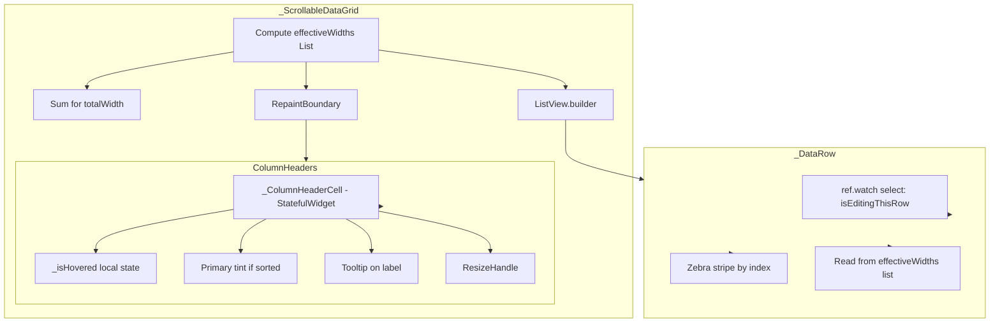

# Design Document: Table UX & Performance

## Overview

This feature improves the data grid's visual polish and rendering performance in a single pass. The visual changes add hover feedback, better sort indicators, tooltips, and zebra striping to column headers and rows. The performance changes eliminate redundant per-row width calculations, isolate the header from scroll-driven repaints, and prevent all rows from rebuilding when a single cell enters edit mode.

### Key Design Decisions

1. **Pre-computed width list over per-cell resolution** — Instead of each row calling `resolveEffectiveWidth` per column (O(rows × columns) calls), the `_ScrollableDataGrid` computes a `List<double>` once per build and passes it down. This is the single biggest perf win for large file lists.

2. **RepaintBoundary on header, not on each row** — Wrapping the header in a `RepaintBoundary` prevents it from repainting during vertical scroll. We don't wrap individual rows because `ListView.builder` already handles row-level compositing via its viewport.

3. **Riverpod `select` for edit state** — `_DataRow` currently watches the entire `inlineCellEditProvider`, causing all rows to rebuild when any cell enters/exits edit mode. Switching to `ref.watch(inlineCellEditProvider.select(...))` that returns a bool (is this row the editing row?) limits rebuilds to the affected row(s).

4. **Hover state via StatefulWidget, not provider** — Header hover is purely visual and local to each cell. Using a `StatefulWidget` with `MouseRegion.onEnter/onExit` avoids polluting global state and keeps rebuilds scoped to the hovered cell.

5. **Sort indicator tint as background decoration** — The sorted column gets a subtle primary-colour background tint. This is applied via `BoxDecoration.color` on the header cell container, which is already present. No new widgets needed.

6. **Zebra stripe via row index modulo** — Applied in `_DataRow.build` using the visual index passed from `ListView.builder`. Selection colour takes precedence via a simple ternary.

## Architecture



### Data Flow

1. **Width computation**: `_ScrollableDataGridState.build()` computes `effectiveWidths` (a `List<double>`) from `visibleColumns` + `widthOverrides`. This list is passed to `ColumnHeaders` and each `_DataRow`.
2. **Header render**: `ColumnHeaders` receives `effectiveWidths` and renders each `_ColumnHeaderCell` with the pre-computed width. Each cell is now a `StatefulWidget` that tracks hover state locally.
3. **Sort indicator**: `_ColumnHeaderCell` checks if its column matches `sortState.columnId`. If so, it applies a primary-tint background and renders a 14px coloured arrow icon.
4. **Hover feedback**: `MouseRegion.onEnter` sets `_isHovered = true`, triggering a local `setState`. The cell renders a subtle highlight overlay. `onExit` clears it.
5. **Tooltip**: The label `Text` is wrapped in `Tooltip(message: column.label)`. Only shown for sortable columns (not tagIndicator).
6. **Zebra stripe**: `_DataRow` receives its `rowIndex`. If `rowIndex.isEven` and the row is not selected, it applies a 0.03 opacity tint.
7. **Selective edit rebuild**: `_DataRow` uses `ref.watch(inlineCellEditProvider.select((s) => s.editingCell?.rowIndex == rowIndex || s.focusedCell?.rowIndex == rowIndex))` to only rebuild when its own row's edit/focus state changes.

## Components and Interfaces

### Updated _ScrollableDataGrid (changes only)

```dart
class _ScrollableDataGridState extends State<_ScrollableDataGrid> {
  // ... existing controllers ...

  /// Pre-computed effective widths for all visible columns.
  /// Recomputed in build() when visibleColumns or widthOverrides change.
  List<double> get _effectiveWidths => widget.visibleColumns
      .map((c) => resolveEffectiveWidth(
            c.id,
            widget.widthOverrides,
            widget.visibleColumns,
          ))
      .toList();

  double get _totalWidth => _effectiveWidths.fold(0.0, (sum, w) => sum + w);

  @override
  Widget build(BuildContext context) {
    final effectiveWidths = _effectiveWidths;
    final totalWidth = effectiveWidths.fold(0.0, (sum, w) => sum + w);

    return SingleChildScrollView(
      scrollDirection: Axis.horizontal,
      controller: _horizontalController,
      child: SizedBox(
        width: totalWidth,
        child: Column(
          children: [
            RepaintBoundary(
              child: ColumnHeaders(
                effectiveWidths: effectiveWidths,
                onAutoFit: _handleAutoFit,
              ),
            ),
            Expanded(
              child: MarqueeOverlay(
                // ... existing props ...
                child: ListView.builder(
                  // ... existing props ...
                  itemBuilder: (context, index) {
                    // ... pass effectiveWidths to _DataRow ...
                  },
                ),
              ),
            ),
          ],
        ),
      ),
    );
  }
}
```

### Updated ColumnHeaders (changes only)

```dart
class ColumnHeaders extends ConsumerWidget {
  const ColumnHeaders({
    super.key,
    required this.effectiveWidths,
    this.onAutoFit,
  });

  /// Pre-computed widths for each visible column, in order.
  final List<double> effectiveWidths;
  final void Function(String columnId)? onAutoFit;

  @override
  Widget build(BuildContext context, WidgetRef ref) {
    final config = ref.watch(columnConfigProvider);
    final sortState = ref.watch(sortStateProvider);

    final visibleColumns = config.visibleColumnIds
        .map((id) => defaultColumns.firstWhere((c) => c.id == id,
              orElse: () => defaultColumns.first))
        .toList();

    return Container(
      height: 32,
      decoration: BoxDecoration(/* ... existing ... */),
      child: Row(
        children: List.generate(visibleColumns.length, (i) {
          return _ColumnHeaderCell(
            column: visibleColumns[i],
            effectiveWidth: effectiveWidths[i],
            sortState: sortState,
            // ... existing callbacks ...
          );
        }),
      ),
    );
  }
}
```

### Updated _ColumnHeaderCell (now StatefulWidget)

```dart
class _ColumnHeaderCell extends StatefulWidget {
  const _ColumnHeaderCell({
    required this.column,
    required this.effectiveWidth,
    required this.sortState,
    required this.onSort,
    required this.onToggleVisibility,
    required this.onResize,
    required this.onResizeEnd,
    required this.onAutoFit,
    required this.onResetWidths,
    required this.allColumns,
    required this.visibleColumnIds,
  });

  // ... existing fields ...

  @override
  State<_ColumnHeaderCell> createState() => _ColumnHeaderCellState();
}

class _ColumnHeaderCellState extends State<_ColumnHeaderCell> {
  bool _isHovered = false;

  @override
  Widget build(BuildContext context) {
    final isSorted = widget.sortState.columnId == widget.column.id;
    final isResizable = widget.column.id != 'tagIndicator';
    final isSortable = widget.column.id != 'tagIndicator';

    // Determine background colour
    Color? backgroundColor;
    if (isSorted) {
      backgroundColor = Theme.of(context)
          .colorScheme
          .primary
          .withValues(alpha: 0.08);
    } else if (_isHovered && isSortable) {
      backgroundColor = Theme.of(context)
          .colorScheme
          .onSurface
          .withValues(alpha: 0.05);
    }

    return SizedBox(
      width: widget.effectiveWidth,
      child: Stack(
        children: [
          MouseRegion(
            onEnter: isSortable ? (_) => setState(() => _isHovered = true) : null,
            onExit: isSortable ? (_) => setState(() => _isHovered = false) : null,
            child: GestureDetector(
              onTap: isSortable ? widget.onSort : null,
              onSecondaryTapUp: (details) {
                _showContextMenu(context, details.globalPosition);
              },
              child: Container(
                decoration: BoxDecoration(color: backgroundColor),
                padding: const EdgeInsets.symmetric(horizontal: 4),
                child: Row(
                  children: [
                    Expanded(
                      child: isSortable
                          ? Tooltip(
                              message: widget.column.label,
                              child: Text(
                                widget.column.label,
                                style: const TextStyle(
                                  fontSize: 11,
                                  fontWeight: FontWeight.bold,
                                ),
                                overflow: TextOverflow.ellipsis,
                              ),
                            )
                          : Text(
                              widget.column.label,
                              style: const TextStyle(
                                fontSize: 11,
                                fontWeight: FontWeight.bold,
                              ),
                              overflow: TextOverflow.ellipsis,
                            ),
                    ),
                    if (isSorted)
                      Icon(
                        widget.sortState.direction == SortDirection.ascending
                            ? Icons.arrow_upward
                            : Icons.arrow_downward,
                        size: 14,
                        color: Theme.of(context).colorScheme.primary,
                      ),
                  ],
                ),
              ),
            ),
          ),
          if (isResizable)
            Positioned(
              right: 0,
              top: 0,
              bottom: 0,
              child: ResizeHandle(/* ... existing ... */),
            ),
        ],
      ),
    );
  }
}
```

### Updated _DataRow (selective rebuild + zebra stripe)

```dart
class _DataRow extends ConsumerWidget {
  const _DataRow({
    required this.file,
    required this.rowIndex,
    required this.isSelected,
    required this.visibleColumns,
    required this.effectiveWidths,
    required this.rootFolder,
    required this.onTap,
    required this.onDoubleTap,
  });

  // ... fields (effectiveWidths replaces widthOverrides) ...

  @override
  Widget build(BuildContext context, WidgetRef ref) {
    final colorScheme = Theme.of(context).colorScheme;

    // Selective rebuild: only rebuild when THIS row's edit/focus state changes
    final isEditRow = ref.watch(
      inlineCellEditProvider.select(
        (s) =>
            s.editingCell?.rowIndex == rowIndex ||
            s.focusedCell?.rowIndex == rowIndex,
      ),
    );

    // Zebra stripe
    Color? rowBackground;
    if (isSelected) {
      rowBackground = colorScheme.primaryContainer.withValues(alpha: 0.5);
    } else if (rowIndex.isEven) {
      rowBackground = colorScheme.onSurface.withValues(alpha: 0.03);
    }

    return InkWell(
      canRequestFocus: false,
      onTap: () { /* ... existing ... */ },
      onDoubleTap: isEditRow ? null : onDoubleTap,
      child: Container(
        decoration: BoxDecoration(
          color: rowBackground,
          border: Border(
            bottom: BorderSide(
              color: colorScheme.outlineVariant.withValues(alpha: 0.3),
            ),
          ),
        ),
        child: Row(
          children: List.generate(visibleColumns.length, (i) {
            final column = visibleColumns[i];
            final width = effectiveWidths[i];
            // ... existing cell rendering using width instead of resolveEffectiveWidth ...
          }),
        ),
      ),
    );
  }
}
```

## Data Models

No new data models are introduced. The changes modify existing widget interfaces:

| Change | From | To |
|--------|------|----|
| `_DataRow.widthOverrides` | `Map<String, double>` | `List<double> effectiveWidths` |
| `ColumnHeaders` constructor | no widths param | `required List<double> effectiveWidths` |
| `_ColumnHeaderCell` | `StatelessWidget` | `StatefulWidget` (for hover) |
| `_DataRow` edit state watch | `ref.watch(inlineCellEditProvider)` | `ref.watch(inlineCellEditProvider.select(...))` |

## Correctness Properties

### Property 1: Pre-computed widths match per-cell resolution

*For any* set of visible columns and width overrides, the pre-computed `effectiveWidths` list SHALL produce identical values to calling `resolveEffectiveWidth` individually for each column in order.

**Validates: Requirement 5**

### Property 2: Zebra stripe respects selection precedence

*For any* row index and selection state, IF the row is selected THEN the row background SHALL be the selection colour regardless of index parity. IF the row is not selected AND the index is even THEN the background SHALL be the zebra tint. IF the row is not selected AND the index is odd THEN the background SHALL be transparent.

**Validates: Requirement 4**

### Property 3: Hover state is local and does not affect siblings

*For any* column header cell, setting `_isHovered = true` SHALL only trigger a rebuild of that single cell widget, not the entire `ColumnHeaders` row or any data rows.

**Validates: Requirements 1, 6**

### Property 4: Sort indicator visibility matches sort state

*For any* sort state (columnId, direction), exactly one column header SHALL display a sort indicator icon, and that icon's direction SHALL match `sortState.direction`. All other column headers SHALL display no sort icon.

**Validates: Requirement 2**

### Property 5: Selective edit rebuild scope

*For any* transition of `inlineCellEditProvider` state where `editingCell.rowIndex` changes from row A to row B, only rows A and B SHALL rebuild. All other rows SHALL not rebuild.

**Validates: Requirement 7**

## Error Handling

### Edge Cases

- **Zero visible columns**: If `visibleColumns` is empty (shouldn't happen but defensive), `effectiveWidths` is an empty list and `totalWidth` is 0. The grid renders empty.
- **Hover on non-sortable column**: `MouseRegion` callbacks are null for tagIndicator, so no hover state is tracked.
- **Sort state references hidden column**: If `sortState.columnId` references a column not in `visibleColumnIds`, no header cell matches and no sort indicator is shown. This is correct — the sort is still active on the data but the visual indicator is hidden.
- **Edit state row index out of bounds**: If the file list shrinks while a cell is being edited (e.g., filter change), the `select` expression returns false for all rows, which is safe — no row shows edit state.

## Testing Strategy

### Unit Tests

- **effectiveWidths computation**: Verify the pre-computed list matches individual `resolveEffectiveWidth` calls for various column/override combinations.
- **Zebra stripe logic**: Verify background colour selection for combinations of (selected/not, even/odd index).

### Widget Tests

- **Header hover**: Simulate pointer enter/exit on a header cell, verify background colour changes.
- **Sort indicator**: Set sort state, verify correct column shows icon with correct direction and colour.
- **Tooltip**: Verify tooltip is present on sortable columns, absent on tagIndicator.
- **Zebra stripe**: Render multiple rows, verify alternating backgrounds.
- **RepaintBoundary**: Verify `RepaintBoundary` is an ancestor of `ColumnHeaders` in the widget tree.

### Performance Validation (manual)

- Load 500+ files, scroll vertically — verify no dropped frames in DevTools timeline.
- Resize a column during scroll — verify smooth updates.
- Enter/exit edit mode — verify only 1-2 rows rebuild (observable via `debugPrintRebuildDirtyWidgets`).
