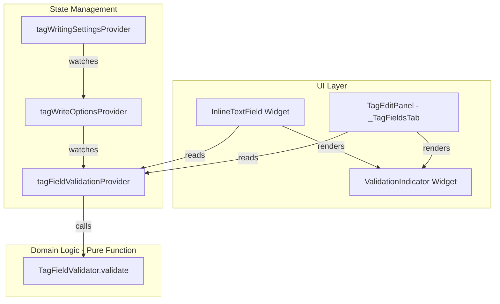

# Design Document: Tag Field Validation

## Overview

This feature adds proactive, real-time validation of tag field values based on the user's write settings and the target format's constraints. The core validation logic is a pure function (`TagFieldValidator.validate`) that accepts a field name, value, `TagWriteOptions`, and optional `TagFormat`, returning a list of issues with severity levels. The UI layer consumes these issues via a Riverpod provider and renders inline indicators (warning/error icons with tooltips) on both the `InlineTextField` and `TagEditPanel` editors.

### Key Design Decisions

1. **Pure-function validator** — All validation logic lives in `TagFieldValidator.validate`, a static method with no side effects. This makes it trivially testable with property-based tests and decouples validation from UI concerns.

2. **Riverpod provider for reactive context** — A `tagFieldValidationProvider` derives the current `TagWriteOptions` from `tagWritingSettingsProvider` and exposes a callable function. When settings change, any widget watching the provider automatically re-validates.

3. **Advisory-only indicators** — Validation never blocks input or prevents saving. Icons and tooltips inform the user but don't gate any action. This keeps the editing flow uninterrupted.

4. **Severity model (warning vs error)** — Warnings indicate lossy operations (ID3v1 truncation, non-numeric in numeric field). Errors indicate impossible operations (non-Latin-1 characters with Latin-1 encoding, exceeding absolute max length).

5. **Shared indicator widget** — A single `ValidationIndicator` widget is reused in both `InlineTextField` and `TagEditPanel` field builders, ensuring consistent appearance.

## Architecture



### Data Flow

1. **User types in field**: Text changes → widget calls `tagFieldValidationProvider` with field name, current value, and file's `tagFormat` → `TagFieldValidator.validate` returns `List<TagFieldIssue>` → widget renders `ValidationIndicator` if issues exist.

2. **User changes write settings**: `tagWritingSettingsProvider` state updates → `tagWriteOptionsProvider` rebuilds → `tagFieldValidationProvider` rebuilds → any widget watching it re-renders with new validation results.

3. **Inline cell editing**: `InlineTextField.onChanged` triggers validation on each keystroke. The `ValidationIndicator` is positioned at the trailing edge of the text field.

4. **Side panel editing**: `_TagFieldsTab._buildField` wraps each `TextField` with validation logic. The indicator appears as a suffix icon in the `InputDecoration`.

## Components and Interfaces

### TagFieldValidator (pure function — already implemented)

```dart
/// Validates tag field values against format constraints and write settings.
class TagFieldValidator {
  /// Maximum practical field length.
  static const int maxFieldLength = 10000;

  /// Maximum field length for ID3v1 text fields.
  static const int id3v1MaxLength = 30;

  /// Maximum field length for ID3v1 year field.
  static const int id3v1YearMaxLength = 4;

  /// Fields that should contain only numeric values.
  static const Set<String> numericFields = {
    'year', 'trackNumber', 'trackTotal', 'discNumber', 'discTotal', 'bpm',
  };

  /// Validates a single field value against the current write settings.
  static List<TagFieldIssue> validate({
    required String field,
    required String value,
    required TagWriteOptions options,
    TagFormat? tagFormat,
  });
}
```

### TagFieldIssue (value object — already implemented)

```dart
/// A single validation issue found for a tag field value.
class TagFieldIssue {
  const TagFieldIssue({
    required this.severity,
    required this.message,
    required this.field,
  });

  final TagFieldSeverity severity;
  final String message;
  final String field;
}

enum TagFieldSeverity { warning, error }
```

### tagFieldValidationProvider (already implemented)

```dart
/// Provides a validation function bound to the current write settings.
final tagFieldValidationProvider = Provider<TagFieldValidationFn>((ref) {
  final options = ref.watch(tagWriteOptionsProvider);
  return ({
    required String field,
    required String value,
    TagFormat? tagFormat,
  }) {
    return TagFieldValidator.validate(
      field: field,
      value: value,
      options: options,
      tagFormat: tagFormat,
    );
  };
});

typedef TagFieldValidationFn = List<TagFieldIssue> Function({
  required String field,
  required String value,
  TagFormat? tagFormat,
});
```

### ValidationIndicator (new widget)

```dart
/// Displays a warning or error icon with a tooltip explaining the issue.
///
/// Shows the highest-severity icon when multiple issues exist.
/// Tooltip lists all issue messages.
class ValidationIndicator extends StatelessWidget {
  const ValidationIndicator({
    super.key,
    required this.issues,
  });

  /// The validation issues to display. Empty list renders nothing.
  final List<TagFieldIssue> issues;

  @override
  Widget build(BuildContext context) {
    if (issues.isEmpty) return const SizedBox.shrink();

    final hasError = issues.any((i) => i.severity == TagFieldSeverity.error);
    final icon = hasError ? Icons.error_outline : Icons.warning_amber;
    final color = hasError
        ? Theme.of(context).colorScheme.error
        : Colors.orange;
    final tooltipText = issues.map((i) => i.message).join('\n');

    return Tooltip(
      message: tooltipText,
      child: Icon(icon, size: 16, color: color),
    );
  }
}
```

### InlineTextField integration

The existing `InlineTextField` will be extended to:
1. Accept the current `field` name and `tagFormat` as constructor parameters.
2. Read `tagFieldValidationProvider` to validate `_controller.text` on each change.
3. Render a `ValidationIndicator` positioned at the trailing edge of the text field.

```dart
class InlineTextField extends ConsumerStatefulWidget {
  const InlineTextField({
    super.key,
    required this.initialValue,
    required this.selectAll,
    required this.width,
    required this.field,       // NEW
    this.tagFormat,            // NEW
  });

  final String initialValue;
  final bool selectAll;
  final double width;
  final String field;          // The tag field name (e.g., 'title')
  final TagFormat? tagFormat;   // The file's detected tag format
}
```

### TagEditPanel integration

The `_buildField` method in `_TagFieldsTabState` will:
1. Call `tagFieldValidationProvider` with the field name and current controller text.
2. Pass issues to a `ValidationIndicator` rendered as the `suffixIcon` in `InputDecoration`.

```dart
Widget _buildField(String field) {
  // ... existing code ...
  final validate = ref.read(tagFieldValidationProvider);
  final issues = validate(
    field: field,
    value: _controllers[field]!.text,
    tagFormat: widget.selectedFiles.firstOrNull?.tagFormat,
  );

  return TextField(
    // ... existing props ...
    decoration: InputDecoration(
      labelText: _fieldLabels[field] ?? field,
      suffixIcon: ValidationIndicator(issues: issues),
      // ... existing decoration ...
    ),
  );
}
```

## Data Models

### TagFieldIssue

| Field | Type | Description |
|-------|------|-------------|
| `severity` | `TagFieldSeverity` | `warning` or `error` |
| `message` | `String` | Human-readable explanation of the issue |
| `field` | `String` | The field name this issue applies to |

### TagFieldSeverity

| Value | Meaning | Visual |
|-------|---------|--------|
| `warning` | Lossy but writable (truncation, non-numeric) | Orange warning icon |
| `error` | Cannot be represented (encoding, max length) | Red error icon |

### Validation Rules Summary

| Rule | Condition | Severity | Message |
|------|-----------|----------|---------|
| Max length | `value.length > 10000` | error | "Value exceeds maximum length of 10000 characters" |
| ID3v1 truncation | `writeId3v1 && value.length > 30` (or 4 for year) | warning | "Will be truncated to N characters in the ID3v1 tag" |
| Latin-1 encoding | `encoding == latin1 && hasNonLatin1Chars` | error | "Contains characters not representable in Latin-1: ..." |
| Numeric field | `numericFields.contains(field) && !isNumeric(value)` | warning | "Expected a numeric value" |

## Correctness Properties

*A property is a characteristic or behavior that should hold true across all valid executions of a system — essentially, a formal statement about what the system should do. Properties serve as the bridge between human-readable specifications and machine-verifiable correctness guarantees.*

### Property 1: ID3v1 truncation warning

*For any* non-empty string value and any text field name, when `writeId3v1` is `true`: if the value's length exceeds the ID3v1 limit (30 for general fields, 4 for year), the validation result SHALL contain a warning-severity issue mentioning truncation; if the value's length is within the limit, no truncation warning SHALL be present.

**Validates: Requirements 1.1**

### Property 2: Latin-1 encoding error

*For any* non-empty string value and any field name, when encoding is `TagEncoding.latin1`: if the value contains at least one character with a code point greater than 0xFF, the validation result SHALL contain an error-severity issue; if all characters have code points ≤ 0xFF, no Latin-1 encoding error SHALL be present.

**Validates: Requirements 1.2**

### Property 3: Maximum length enforcement

*For any* non-empty string value and any field name, regardless of write options: if the value's length exceeds 10,000 characters, the validation result SHALL contain an error-severity issue; if the value's length is ≤ 10,000 characters, no max-length error SHALL be present.

**Validates: Requirements 1.3**

### Property 4: Numeric field validation

*For any* field name in the set `{year, trackNumber, trackTotal, discNumber, discTotal, bpm}` and any non-empty string value: if the value does not match the numeric pattern (integer or "N/M" slash format), the validation result SHALL contain a warning-severity issue; if the value matches the numeric pattern, no numeric warning SHALL be present.

**Validates: Requirements 1.4**

## Error Handling

### Validation Errors (not application errors — these are expected outputs)

- **Empty value**: Returns empty list immediately (no validation needed for blank fields).
- **Multiple issues**: All applicable rules are checked independently. A single value can produce multiple issues (e.g., a 10,001-character string with non-Latin-1 characters when writeId3v1 is enabled produces 3 issues).

### UI Error Handling

- **No issues**: `ValidationIndicator` renders `SizedBox.shrink()` — zero visual footprint.
- **Provider not available**: If `tagFieldValidationProvider` cannot be read (should not happen in normal operation), the widget renders without indicators. No crash.
- **Null tagFormat**: The validator accepts `null` for `tagFormat` and applies all format-independent rules. Format-specific rules (reserved for future use) are skipped.

### Edge Cases

- **Mixed selection in TagEditPanel**: When multiple files are selected with different `tagFormat` values, validation uses the first file's format. This is acceptable because the validation rules currently don't vary by format.
- **Very long tooltip text**: When multiple issues exist, tooltip messages are joined with newlines. Flutter's `Tooltip` widget handles multi-line text natively.

## Testing Strategy

### Property-Based Tests (using `package:fast_check`)

Property-based tests validate the 4 correctness properties defined above. Each test runs a minimum of 100 iterations with randomly generated inputs.

**Test configuration:**
- Library: `package:fast_check` (project standard)
- Minimum iterations: 100 per property
- Tag format: `// Feature: tag-field-validation, Property N: <property text>`

**Generators needed:**
- `tagValueGen`: Generates random non-empty strings (1–200 chars, mix of ASCII, Latin-1, and Unicode)
- `longStringGen`: Generates strings of length 9,990–10,010 to test boundary
- `latin1StringGen`: Generates strings containing only code points 0x00–0xFF
- `nonLatin1StringGen`: Generates strings containing at least one code point > 0xFF
- `numericValueGen`: Generates valid numeric strings (integers, "N/M" format)
- `nonNumericValueGen`: Generates strings that fail the numeric pattern
- `numericFieldGen`: Generates field names from `TagFieldValidator.numericFields`
- `textFieldGen`: Generates field names not in `numericFields` (e.g., 'title', 'artist', 'album')
- `tagWriteOptionsGen`: Generates random `TagWriteOptions` combinations

**Property test file:**
- `test/shared/services/tag_field_validator_property_test.dart`

### Unit Tests (example-based — already implemented)

The existing `test/shared/services/tag_field_validator_test.dart` covers:
- Empty value returns no issues
- Max length boundary (10,000 vs 10,001)
- ID3v1 truncation at 30/31 chars and 4/5 chars for year
- Latin-1 encoding with ASCII, Latin-1 extended, CJK, Cyrillic, emoji
- Numeric field validation with integers, slash format, and non-numeric text
- Combined issues (multiple rules triggered simultaneously)
- TagFormat parameter acceptance

### Widget Tests

- **ValidationIndicator**: Renders nothing for empty issues list, warning icon for warning severity, error icon for error severity, tooltip with message text
- **InlineTextField with validation**: Renders indicator when value triggers a rule, updates indicator on text change
- **TagEditPanel with validation**: Renders suffix icon on fields with issues, updates when settings change

### Integration Tests

- **Reactive update**: Change `tagWritingSettingsProvider` (e.g., toggle writeId3v1), verify validation results update for existing field values
- **Full edit cycle**: Type a value that triggers a warning in InlineTextField, verify indicator appears, confirm edit, verify indicator persists in static cell view
