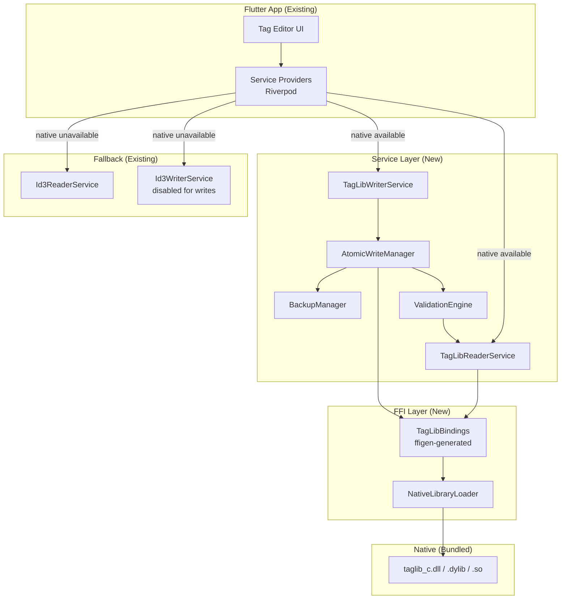
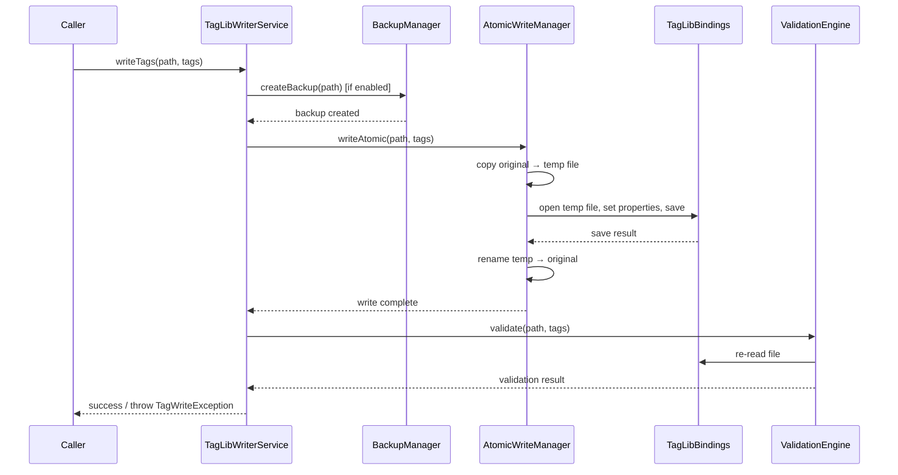

# Design Document: TagLib FFI Integration

## Overview

This design describes the integration of TagLib's C API (`taglib_c`) into the Flutter desktop app via `dart:ffi`, replacing the current unsafe pure-Dart tag reader/writer. The implementation preserves the existing `TagReaderService` and `TagWriterService` abstract interfaces, ensuring zero changes to consuming code while providing safe, atomic, format-complete metadata I/O for all 10 supported audio formats.

The architecture introduces a layered FFI binding approach:
1. **Generated bindings layer** — auto-generated via `package:ffigen` from `tag_c.h`
2. **Native library loader** — platform-aware dynamic library resolution
3. **TagLib service layer** — high-level Dart classes implementing the existing service interfaces
4. **Safety layer** — atomic writes, optional backup, and post-write validation

Key design decisions:
- Use TagLib's **Properties API** (`taglib_property_set`/`taglib_property_get`) for extended tag fields beyond the basic title/artist/album, giving access to all standard fields across all formats through a unified interface.
- Use TagLib's **Complex Properties API** for album art (PICTURE complex property), which works uniformly across all formats.
- Wrap all FFI calls in an isolate-safe manner, running native operations on the current isolate since TagLib operations are fast and file-handle-based.
- Implement atomic writes at the Dart level (temp file + rename) rather than relying on TagLib's internal behavior, for explicit control and backup support.

## Architecture



### Write Flow (Atomic + Backup + Validation)



## Components and Interfaces

### 1. NativeLibraryLoader

Responsible for locating and loading the platform-specific TagLib shared library at application startup.

```dart
/// Loads the TagLib C shared library for the current platform.
class NativeLibraryLoader {
  /// Attempts to load the native library.
  /// Returns the DynamicLibrary on success.
  /// Throws [NativeLibraryException] with platform and path details on failure.
  static DynamicLibrary load();

  /// Returns true if the native library is available.
  static bool get isAvailable;
}

class NativeLibraryException implements Exception {
  final String message;
  final String platform;
  final String attemptedPath;
}
```

**Platform resolution strategy:**
- **Windows**: Look for `taglib_c.dll` adjacent to the executable
- **macOS**: Look for `libtaglib_c.dylib` in the app bundle's `Frameworks` directory
- **Linux**: Look for `libtaglib_c.so` adjacent to the executable, then fall back to system library paths

### 2. TagLibBindings (ffigen-generated)

Auto-generated Dart FFI bindings from `tag_c.h`. Key functions exposed:

```dart
// File operations
Pointer<TagLib_File> taglib_file_new(Pointer<Char> filename);
void taglib_file_free(Pointer<TagLib_File> file);
int taglib_file_is_valid(Pointer<TagLib_File> file);
int taglib_file_save(Pointer<TagLib_File> file);

// Tag operations (basic)
Pointer<TagLib_Tag> taglib_file_tag(Pointer<TagLib_File> file);
Pointer<Char> taglib_tag_title(Pointer<TagLib_Tag> tag);
Pointer<Char> taglib_tag_artist(Pointer<TagLib_Tag> tag);
Pointer<Char> taglib_tag_album(Pointer<TagLib_Tag> tag);
// ... etc

// Properties API (extended fields)
void taglib_property_set(Pointer<TagLib_File> file, Pointer<Char> prop, Pointer<Char> value);
Pointer<Pointer<Char>> taglib_property_get(Pointer<TagLib_File> file, Pointer<Char> prop);
Pointer<Pointer<Char>> taglib_property_keys(Pointer<TagLib_File> file);
void taglib_property_free(Pointer<Pointer<Char>> props);

// Audio properties
Pointer<TagLib_AudioProperties> taglib_file_audioproperties(Pointer<TagLib_File> file);
int taglib_audioproperties_length(Pointer<TagLib_AudioProperties> props);
int taglib_audioproperties_bitrate(Pointer<TagLib_AudioProperties> props);
int taglib_audioproperties_samplerate(Pointer<TagLib_AudioProperties> props);
int taglib_audioproperties_channels(Pointer<TagLib_AudioProperties> props);

// Complex properties (album art)
int taglib_complex_property_set(Pointer<TagLib_File> file, Pointer<Char> key, Pointer<Pointer<TagLib_Complex_Property_Attribute>> value);
Pointer<Pointer<Pointer<TagLib_Complex_Property_Attribute>>> taglib_complex_property_get(Pointer<TagLib_File> file, Pointer<Char> key);
void taglib_picture_from_complex_property(...);
void taglib_complex_property_free(...);

// Memory management
void taglib_tag_free_strings();
void taglib_free(Pointer<Void> pointer);
```

### 3. TagLibReaderService

Implements `TagReaderService`. Reads tags using the Properties API for comprehensive field coverage.

```dart
class TagLibReaderService implements TagReaderService {
  TagLibReaderService(this._bindings);

  final TagLibBindings _bindings;

  @override
  Future<AudioFile> readTags(String path) async {
    // 1. Open file with taglib_file_new
    // 2. Validate with taglib_file_is_valid
    // 3. Read properties via taglib_property_keys / taglib_property_get
    // 4. Read audio properties via taglib_file_audioproperties
    // 5. Read album art via taglib_complex_property_get("PICTURE")
    // 6. Free resources
    // 7. Return populated AudioFile
  }

  @override
  Future<List<AudioFile>> readTagsBatch(List<String> paths) async {
    // Process each file, catching errors per-file
    // Return results in input order
  }
}
```

### 4. TagLibWriterService

Implements `TagWriterService`. Orchestrates atomic writes with backup and validation.

```dart
class TagLibWriterService implements TagWriterService {
  TagLibWriterService(this._bindings, this._backupManager, this._validator);

  final TagLibBindings _bindings;
  final BackupManager _backupManager;
  final ValidationEngine _validator;

  @override
  Future<void> writeTags(String path, Map<String, String> tags) async {
    // 1. Create backup if enabled
    // 2. Copy original to temp file
    // 3. Open temp file, set properties, save
    // 4. Rename temp over original (atomic)
    // 5. Validate written tags
  }

  @override
  Future<void> writeAlbumArt(String path, AlbumArtData art) async {
    // Use complex property API with PICTURE key
  }

  @override
  Future<void> removeAlbumArt(String path) async {
    // Set PICTURE complex property to NULL
  }

  @override
  Future<List<TagWriteResult>> writeTagsBatch(Map<String, Map<String, String>> fileTagsMap) async {
    // Process each file independently, collecting results
  }
}
```

### 5. AtomicWriteManager

Ensures writes never corrupt the original file.

```dart
class AtomicWriteManager {
  /// Performs an atomic write operation.
  /// 1. Copies original to a temp file in the same directory
  /// 2. Calls [writeOperation] on the temp file
  /// 3. Renames temp file over original
  /// Throws [TagWriteException] on failure, leaving original intact.
  Future<void> writeAtomic(
    String originalPath,
    Future<void> Function(String tempPath) writeOperation,
  );
}
```

### 6. BackupManager

Creates `.bak` copies before modification.

```dart
class BackupManager {
  BackupManager(this._settingsProvider);

  /// Whether backup is currently enabled (from app settings).
  bool get isEnabled;

  /// Creates a backup of [path] as [path].bak.
  /// Throws [TagWriteException] if backup fails and backup is enabled.
  Future<void> createBackupIfEnabled(String path);
}
```

### 7. ValidationEngine

Re-reads files after writes to confirm persistence.

```dart
class ValidationEngine {
  ValidationEngine(this._reader);

  final TagLibReaderService _reader;

  /// Validates that [expectedTags] were persisted to [path].
  /// Returns true if all fields match.
  /// Throws [TagWriteException] describing mismatches on failure.
  Future<void> validate(String path, Map<String, String> expectedTags);
}
```

### 8. Updated Service Provider

```dart
final tagReaderProvider = Provider<TagReaderService>((ref) {
  if (NativeLibraryLoader.isAvailable) {
    final bindings = TagLibBindings(NativeLibraryLoader.load());
    return TagLibReaderService(bindings);
  }
  return Id3ReaderService(); // fallback
});

final tagWriterProvider = Provider<TagWriterService>((ref) {
  if (NativeLibraryLoader.isAvailable) {
    final bindings = TagLibBindings(NativeLibraryLoader.load());
    final backupManager = BackupManager(ref.read(settingsProvider));
    final reader = ref.read(tagReaderProvider) as TagLibReaderService;
    final validator = ValidationEngine(reader);
    return TagLibWriterService(bindings, backupManager, validator);
  }
  // Return a disabled writer that throws on all operations
  return DisabledWriterService();
});
```

## Data Models

### Existing Models (Unchanged)

The existing `AudioFile`, `AlbumArtData`, `TagWriteResult`, `TagReadException`, and `TagWriteException` classes remain unchanged. The new implementation maps TagLib data into these existing structures.

### TagLib Property Name Mapping

Mapping between the app's internal field names and TagLib property keys:

| App Field | TagLib Property Key | Notes |
|-----------|-------------------|-------|
| `title` | `TITLE` | |
| `artist` | `ARTIST` | |
| `albumArtist` | `ALBUMARTIST` | |
| `album` | `ALBUM` | |
| `year` | `DATE` | TagLib normalizes year/date |
| `trackNumber` | `TRACKNUMBER` | |
| `trackTotal` | `TRACKTOTAL` | May be part of TRACKNUMBER as "3/12" |
| `discNumber` | `DISCNUMBER` | |
| `discTotal` | `DISCTOTAL` | May be part of DISCNUMBER |
| `genre` | `GENRE` | |
| `comment` | `COMMENT` | |
| `composer` | `COMPOSER` | |
| `conductor` | `CONDUCTOR` | |
| `lyricist` | `LYRICIST` | |
| `publisher` | `PUBLISHER` | |
| `copyright` | `COPYRIGHT` | |
| `bpm` | `BPM` | |
| `compilation` | `COMPILATION` | "1" or "0" |

### New Supporting Types

```dart
/// Represents the tag format detected in a file.
enum TagFormat {
  id3v1,
  id3v2_3,
  id3v2_4,
  vorbisComment,
  apeTag,
  asf,
  mp4Atoms,
  unknown,
}

/// Exception thrown when the native library cannot be loaded.
class NativeLibraryException implements Exception {
  const NativeLibraryException(this.message, this.platform, this.attemptedPath);

  final String message;
  final String platform;
  final String attemptedPath;

  @override
  String toString() =>
      'NativeLibraryException: $message (platform: $platform, path: $attemptedPath)';
}

/// A writer service that refuses all operations when native library is unavailable.
class DisabledWriterService implements TagWriterService {
  @override
  Future<void> writeTags(String path, Map<String, String> tags) =>
      throw TagWriteException('Native TagLib library not available. Writing is disabled.', path);

  @override
  Future<void> writeAlbumArt(String path, AlbumArtData art) =>
      throw TagWriteException('Native TagLib library not available. Writing is disabled.', path);

  @override
  Future<void> removeAlbumArt(String path) =>
      throw TagWriteException('Native TagLib library not available. Writing is disabled.', path);

  @override
  Future<List<TagWriteResult>> writeTagsBatch(Map<String, Map<String, String>> fileTagsMap) async =>
      fileTagsMap.keys.map((p) => TagWriteResult(
        path: p, success: false, error: 'Native TagLib library not available.',
      )).toList();
}
```

### File Layout

```
lib/
  shared/
    services/
      tag_reader_service.dart          (existing, unchanged)
      id3_reader_service.dart          (existing, fallback)
      id3_writer_service.dart          (existing, disabled in production)
      taglib/
        taglib_bindings.g.dart         (ffigen-generated)
        native_library_loader.dart     (new)
        taglib_reader_service.dart     (new)
        taglib_writer_service.dart     (new)
        atomic_write_manager.dart      (new)
        backup_manager.dart            (new)
        validation_engine.dart         (new)
        disabled_writer_service.dart   (new)
        tag_property_mapper.dart       (new - field name mapping)

native/
  taglib_c.h                           (header for ffigen)
  ffigen.yaml                          (ffigen configuration)

windows/
  taglib_c.dll                         (bundled binary)
macos/
  Frameworks/
    libtaglib_c.dylib                  (bundled universal binary)
linux/
  lib/
    libtaglib_c.so                     (bundled binary)
```


## Correctness Properties

*A property is a characteristic or behavior that should hold true across all valid executions of a system — essentially, a formal statement about what the system should do. Properties serve as the bridge between human-readable specifications and machine-verifiable correctness guarantees.*

### Property 1: Tag read/write round-trip

*For any* valid tag map (containing any subset of standard fields with non-empty string values) and *for any* supported audio format, writing those tags to a file and then reading the file back SHALL produce an AudioFile whose tags map contains all the written fields with identical values.

**Validates: Requirements 2.1, 8.1**

### Property 2: Album art round-trip

*For any* valid image byte sequence and valid MIME type (image/jpeg or image/png), writing album art to a file and then reading it back SHALL produce an AlbumArtData object with identical bytes and MIME type.

**Validates: Requirements 2.2, 5.1**

### Property 3: Corrupt file safety

*For any* byte sequence that is not a valid audio file, attempting to read tags SHALL either throw a TagReadException containing the file path, or return an AudioFile with an empty tags map — but SHALL never cause an unhandled exception, segfault, or crash.

**Validates: Requirements 2.5**

### Property 4: Batch read order preservation

*For any* list of valid file paths, the result of readTagsBatch SHALL be a list of AudioFile objects where the path of the i-th result equals the i-th input path, for all i.

**Validates: Requirements 3.1**

### Property 5: Batch read fault isolation

*For any* list of file paths containing a mix of valid audio files and invalid/missing paths, readTagsBatch SHALL return a result list of the same length as the input, where valid files have populated tags and invalid files have empty tags — no valid file's result is affected by the presence of invalid files in the batch.

**Validates: Requirements 3.2**

### Property 6: Selective write with metadata preservation

*For any* audio file with existing tags and *for any* subset of fields to write, after writeTags completes: (a) all fields in the write map SHALL have the new values when read back, and (b) all fields NOT in the write map SHALL retain their original values unchanged.

**Validates: Requirements 4.1, 4.2**

### Property 7: Empty string clears field

*For any* tag field name and *for any* audio file where that field has a non-empty value, writing an empty string for that field SHALL result in the field being absent or empty when the file is read back.

**Validates: Requirements 4.3**

### Property 8: Art operations preserve non-art metadata

*For any* audio file with existing tags, performing either writeAlbumArt or removeAlbumArt SHALL leave all non-art tag fields with their original values unchanged.

**Validates: Requirements 5.2, 5.3**

### Property 9: Failed write leaves original unchanged

*For any* audio file, if the write operation to the temporary file fails (simulated), the original file SHALL remain byte-for-byte identical to its state before the write was attempted.

**Validates: Requirements 6.3**

### Property 10: Backup creates identical copy

*For any* audio file content, when backup is enabled and a write operation is initiated, the created `.bak` file SHALL contain bytes identical to the original file's content before modification.

**Validates: Requirements 7.1**

### Property 11: Batch write fault isolation

*For any* batch of file paths containing both valid and invalid targets, writeTagsBatch SHALL return a TagWriteResult for every file in the input, where valid files have `success: true` and invalid files have `success: false` with a non-empty error message — and no valid file's write is affected by failures in other files.

**Validates: Requirements 9.1, 9.2**

## Error Handling

### Error Categories

| Error Type | Cause | Handling |
|-----------|-------|----------|
| `NativeLibraryException` | Library file missing, wrong architecture, or load failure | Caught at startup; triggers fallback to pure-Dart reader, disables writer |
| `TagReadException` | File not found, corrupt file, unsupported format, FFI error | Propagated to caller with file path; in batch mode, recorded per-file |
| `TagWriteException` | File not found, write failure, rename failure, validation mismatch | Propagated to caller; atomic write ensures original is safe |
| FFI segfault/crash | Null pointer from TagLib, invalid file handle | Prevented by null-checking all FFI return values before use |

### Defensive FFI Patterns

1. **Null-check every pointer** returned from TagLib before dereferencing:
   ```dart
   final file = _bindings.taglib_file_new(pathPtr);
   if (file == nullptr) {
     throw TagReadException('TagLib could not open file', path);
   }
   ```

2. **Always free resources** in a try/finally block:
   ```dart
   final file = _bindings.taglib_file_new(pathPtr);
   try {
     // ... read/write operations
   } finally {
     _bindings.taglib_file_free(file);
     _bindings.taglib_tag_free_strings();
     malloc.free(pathPtr);
   }
   ```

3. **Validate file before operations**:
   ```dart
   if (_bindings.taglib_file_is_valid(file) == 0) {
     throw TagReadException('File is not a valid audio file', path);
   }
   ```

4. **String conversion safety**: Always use `toNativeUtf8()` for Dart→C strings and null-check before `toDartString()` for C→Dart strings.

### Recovery Strategies

- **Read failure**: Return empty AudioFile in batch mode; throw in single-file mode
- **Write failure (temp file stage)**: Delete temp file, original untouched
- **Write failure (rename stage)**: Keep both files, throw with details
- **Validation failure with backup**: Restore from `.bak`, throw with field mismatch details
- **Validation failure without backup**: Throw with mismatch details, do not modify file further
- **Native library unavailable**: Fall back to read-only mode, surface clear message to user

## Testing Strategy

### Property-Based Testing

**Library**: `package:fast_check` (Dart property-based testing library)

**Configuration**: Minimum 100 iterations per property test.

**Tag format**: Each property test referencing the design document property with comment:
```dart
// Feature: taglib-ffi-integration, Property 1: Tag read/write round-trip
```

**Properties to implement:**
- Property 1: Generate random tag maps, write to test files, read back, assert equality
- Property 2: Generate random image bytes + MIME types, write/read album art, assert byte equality
- Property 3: Generate random byte sequences, attempt read, assert no crash
- Property 4: Generate random file path lists, batch read, assert order preserved
- Property 5: Generate mixed valid/invalid path lists, batch read, assert fault isolation
- Property 6: Generate existing tags + write subset, assert selective preservation
- Property 7: Generate field names, write empty string, assert field cleared
- Property 8: Generate files with tags + art operations, assert non-art tags unchanged
- Property 9: Simulate write failures, assert original file unchanged
- Property 10: Generate file content, trigger backup, assert .bak identical
- Property 11: Generate mixed valid/invalid batch, assert fault isolation

**Generators needed:**
- `arbitraryTagMap`: Random subset of standard fields with random non-empty string values
- `arbitraryAlbumArt`: Random byte sequences (valid JPEG/PNG headers) with MIME types
- `arbitraryCorruptFile`: Random byte sequences of varying lengths
- `arbitraryFilePath`: Valid paths to test audio files of various formats
- `arbitraryFieldName`: Random selection from the set of standard tag field names

### Unit Tests (Example-Based)

- Platform-specific library path resolution (one test per platform)
- Tag format detection for each of the 10 supported formats
- Field name mapping (app field ↔ TagLib property key)
- Error messages contain expected information (platform, path, field names)
- DisabledWriterService throws on all operations
- Backup setting toggle behavior
- Atomic write temp file naming convention

### Integration Tests

- End-to-end read/write cycle with real TagLib library and real audio files
- Performance benchmarks (< 10ms read, < 100ms write, < 3s for 500-file batch)
- All 10 format support verification with real files
- Native library loading on each platform

### Test File Strategy

Maintain a `test/fixtures/` directory with minimal valid audio files for each format:
- `test.mp3`, `test.flac`, `test.ogg`, `test.m4a`, `test.mp4`, `test.wma`, `test.wav`, `test.ape`, `test.opus`, `test.aac`
- `corrupt.bin` (random bytes for corruption testing)
- `no_tags.mp3` (valid audio, no metadata)

These fixtures are small (< 10KB each) and committed to source control for reproducible testing.
