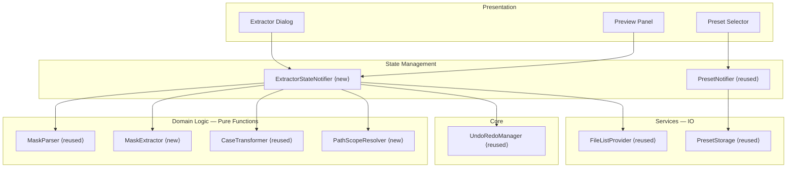

# Design Document: Tags from Filename

## Overview

This feature is the inverse of the file renaming via mask feature (PRD 02). Instead of building filenames from tags, it extracts tag values from filenames and folder paths using the same mask pattern syntax. The user defines a mask (e.g., `%artist/%year - %album/%track - %title`), the system matches it against each file's path, splits on literal delimiters, and assigns the resulting segments to the corresponding tag fields.

The design maximizes reuse of the existing renamer infrastructure — `MaskParser`, `MaskToken`, `TagVariable`, `CaseTransformer`, and the shared `PresetNotifier`/`PresetStorage` — while introducing a new `MaskExtractor` that performs the inverse operation of `MaskEvaluator`. Where the evaluator resolves variables to build a string, the extractor decomposes a string to recover variable values.

### Key Design Decisions

1. **Reuse MaskParser and token model** — The same `MaskParser` tokenizes mask patterns for both renaming and extraction. No new parsing logic is needed.

2. **New MaskExtractor as inverse of MaskEvaluator** — A dedicated `MaskExtractor` class takes a token list and a path string, splits the path on literal delimiters, and maps segments back to `TagVariable` entries. This is a pure function with no I/O.

3. **Validation: no adjacent variables** — Unlike the evaluator (which can concatenate adjacent variable outputs), the extractor cannot determine segment boundaries without literal delimiters between variables. The extractor validates this constraint and reports a parse error.

4. **Path scope as input transformation** — Rather than embedding scope logic in the extractor, the scope selection is a pre-processing step that selects which portion of the file path to feed into the extractor. This keeps the extractor itself scope-agnostic.

5. **Write via existing undo infrastructure** — The write operation creates a `WriteTagsCommand` (similar to `BatchTagEditCommand`) that stores previous values and integrates with `UndoRedoManager`.

6. **Shared preset pool** — Both features use the same `PresetNotifier` and `PresetStorage`. Presets saved in the renamer are available in the extractor and vice versa.

7. **Two write modes** — "Overwrite existing" and "Only fill empty" are mutually exclusive options that control which fields get written, implemented as a simple enum check in the write logic.

## Architecture



### Data Flow

1. User types or selects a mask pattern → `MaskParser` tokenizes it
2. `ExtractorStateNotifier` validates tokens (no adjacent variables without separator)
3. For each file: `PathScopeResolver` selects the relevant path portion based on scope
4. Path string + tokens → `MaskExtractor` splits on literal delimiters, maps segments to variables
5. Extracted values → `CaseTransformer` applies selected transformations (underscore replacement, trimming, case)
6. Results displayed in preview table → User reviews and optionally deselects files
7. User confirms → `WriteTagsCommand` applies extracted values to file tags via `FileListNotifier`
8. Command registered with `UndoRedoManager`

## Components and Interfaces

### MaskExtractor (new)

The core new component. Takes parsed tokens and a path string, returns extracted tag values.

```dart
/// Extracts tag values from a file path by matching it against parsed mask tokens.
class MaskExtractor {
  /// Extracts tag values from [path] using the given [tokens].
  ///
  /// Returns an [ExtractionResult] containing the extracted tag-value pairs,
  /// or a non-match result if the path doesn't match the mask structure.
  ///
  /// Throws [MaskParseException] if tokens contain adjacent variables
  /// without a literal separator.
  ExtractionResult extract(List<MaskToken> tokens, String path);

  /// Validates that a token list is suitable for extraction.
  /// Returns null if valid, or an error message if invalid.
  String? validateForExtraction(List<MaskToken> tokens);
}
```

**Algorithm:**

1. Validate tokens: ensure no two `VariableToken`/`IgnoreToken` are adjacent without a `LiteralToken` between them.
2. Collect literal delimiters from the token list (in order).
3. Split the input path on the first delimiter, then split the remainder on the second delimiter, etc. (left-to-right, first-occurrence matching — greedy for the leftmost variable).
4. If the number of resulting segments doesn't match the number of variable/ignore slots, return a non-match result.
5. Map each segment to its corresponding `TagVariable` (skip `IgnoreToken` segments).
6. Handle leading/trailing literals: if the mask starts or ends with a literal, verify the path starts/ends with that literal and strip it before splitting.

### PathScopeResolver (new)

Pre-processes file paths based on the selected scope.

```dart
/// Resolves the portion of a file path to use for mask extraction.
class PathScopeResolver {
  /// Returns the path portion to match against the mask.
  ///
  /// - [PathScope.filenameOnly]: filename without extension
  /// - [PathScope.relativePath]: path relative to [rootFolder] without extension
  /// - [PathScope.absolutePath]: full path without extension
  String resolve(AudioFile file, PathScope scope, String rootFolder);
}
```

### ExtractorStateNotifier (new)

Manages the complete state of the extraction dialog.

```dart
/// Manages extraction dialog state including pattern, scope, options, and previews.
class ExtractorStateNotifier extends StateNotifier<ExtractorState> {
  ExtractorStateNotifier({
    required this.files,
    required this.rootFolder,
    required this.undoRedoManager,
    required this.fileListNotifier,
  });

  /// Updates the mask pattern and regenerates previews.
  void setPattern(String pattern);

  /// Updates the path scope and regenerates previews.
  void setPathScope(PathScope scope);

  /// Updates the case transformation option and regenerates previews.
  void setCaseOption(CaseOption option);

  /// Toggles "replace underscores with spaces" and regenerates previews.
  void setReplaceUnderscores(bool value);

  /// Toggles "trim whitespace" and regenerates previews.
  void setTrimWhitespace(bool value);

  /// Sets the write mode (overwrite existing vs. only fill empty).
  void setWriteMode(WriteMode mode);

  /// Toggles selection of a specific file for writing.
  void toggleFileSelection(String filePath);

  /// Executes the write operation for all selected, matched files.
  Future<WriteExecutionResult> writeTags();
}
```

### WriteTagsCommand (new)

Undoable command for batch tag writes from extraction.

```dart
/// Undoable command that writes extracted tag values to audio files.
class WriteTagsCommand implements UndoableCommand {
  WriteTagsCommand({
    required this.fileListNotifier,
    required this.filePaths,
    required this.extractedValues,
    required this.previousValues,
    required this.writeMode,
  });

  @override
  String get description;

  @override
  void execute(); // Apply extracted values to file tags

  @override
  void undo(); // Restore previous tag values
}
```

### Reused Components

| Component | Source | Usage in Extractor |
|-----------|--------|-------------------|
| `MaskParser` | `lib/features/renamer/data/mask_parser.dart` | Tokenize mask patterns |
| `MaskToken` (sealed class) | `lib/features/renamer/data/models/mask_token.dart` | Token representation |
| `TagVariable` | `lib/features/renamer/data/models/tag_variable.dart` | Variable identification |
| `CaseTransformer` | `lib/features/renamer/data/case_transformer.dart` | Apply case/underscore transforms |
| `CaseOption` | `lib/features/renamer/data/models/case_option.dart` | Case option enum |
| `PresetNotifier` | `lib/features/renamer/data/preset_notifier.dart` | Preset management |
| `PresetStorage` | `lib/features/renamer/data/preset_storage.dart` | Preset persistence |
| `MaskPreset` | `lib/features/renamer/data/models/mask_preset.dart` | Preset model |
| `UndoRedoManager` | `lib/core/undo/undo_redo_manager.dart` | Undo/redo integration |
| `FileListNotifier` | `lib/features/tag_editor/data/providers/file_list_provider.dart` | Update file tags in-memory |

## Data Models

### ExtractionResult

```dart
/// Result of extracting tag values from a single file path.
class ExtractionResult {
  const ExtractionResult({
    required this.filePath,
    required this.matched,
    this.extractedTags = const {},
  });

  /// The original file path.
  final String filePath;

  /// Whether the path matched the mask structure.
  final bool matched;

  /// Extracted tag field → value pairs (empty if not matched).
  /// Keys are tag field names (e.g., 'artist', 'title', 'album').
  final Map<String, String> extractedTags;
}
```

### PathScope

```dart
/// Determines which portion of the file path is used for mask matching.
enum PathScope {
  /// Match against filename only (no directory, no extension).
  filenameOnly('Filename only'),

  /// Match against relative path from loaded root folder (no extension).
  relativePath('Relative path'),

  /// Match against full absolute path (no extension).
  absolutePath('Absolute path');

  const PathScope(this.displayName);

  final String displayName;
}
```

### WriteMode

```dart
/// Controls how extracted values interact with existing tag values.
enum WriteMode {
  /// Replace existing tag values with extracted values.
  overwriteExisting('Overwrite existing tags'),

  /// Only write to fields that are currently empty.
  fillEmptyOnly('Only fill empty fields');

  const WriteMode(this.displayName);

  final String displayName;
}
```

### ExtractorState

```dart
/// Complete state of the extraction dialog.
class ExtractorState {
  const ExtractorState({
    this.pattern = '',
    this.tokens = const [],
    this.parseError,
    this.extractionError,
    this.pathScope = PathScope.relativePath,
    this.caseOption = CaseOption.none,
    this.replaceUnderscores = false,
    this.trimWhitespace = true,
    this.writeMode = WriteMode.overwriteExisting,
    this.previews = const [],
    this.deselectedFiles = const {},
    this.isWriting = false,
    this.writeResult,
  });

  /// The current mask pattern string.
  final String pattern;

  /// Parsed tokens from the pattern.
  final List<MaskToken> tokens;

  /// Parse error message (invalid variable name, etc.).
  final String? parseError;

  /// Extraction validation error (e.g., adjacent variables without separator).
  final String? extractionError;

  /// Selected path scope.
  final PathScope pathScope;

  /// Selected case transformation.
  final CaseOption caseOption;

  /// Whether to replace underscores with spaces in extracted values.
  final bool replaceUnderscores;

  /// Whether to trim whitespace from extracted values.
  final bool trimWhitespace;

  /// Write mode (overwrite vs. fill empty).
  final WriteMode writeMode;

  /// Extraction preview for each file.
  final List<ExtractionPreview> previews;

  /// Set of file paths the user has deselected from writing.
  final Set<String> deselectedFiles;

  /// Whether a write operation is in progress.
  final bool isWriting;

  /// Result of the last write operation.
  final WriteExecutionResult? writeResult;

  /// Number of files that matched the mask.
  int get matchedCount => previews.where((p) => p.matched).length;

  /// Number of files that did not match.
  int get unmatchedCount => previews.where((p) => !p.matched).length;

  /// Number of files selected for writing (matched and not deselected).
  int get selectedForWriteCount => previews
      .where((p) => p.matched && !deselectedFiles.contains(p.filePath))
      .length;

  ExtractorState copyWith({...});
}
```

### ExtractionPreview

```dart
/// Preview of extraction results for a single file.
class ExtractionPreview {
  const ExtractionPreview({
    required this.filePath,
    required this.filename,
    required this.matched,
    this.extractedTags = const {},
    this.transformedTags = const {},
  });

  /// Original file path.
  final String filePath;

  /// Display filename.
  final String filename;

  /// Whether the file's path matched the mask.
  final bool matched;

  /// Raw extracted values (before transformation).
  final Map<String, String> extractedTags;

  /// Transformed values (after case/underscore/trim processing).
  final Map<String, String> transformedTags;
}
```

### WriteExecutionResult

```dart
/// Summary of a completed tag-write batch.
class WriteExecutionResult {
  const WriteExecutionResult({
    required this.writtenCount,
    required this.skippedCount,
    required this.errorCount,
    this.errors = const [],
  });

  final int writtenCount;
  final int skippedCount;
  final int errorCount;
  final List<WriteError> errors;
}

class WriteError {
  const WriteError({required this.filePath, required this.message});
  final String filePath;
  final String message;
}
```

## Correctness Properties

*A property is a characteristic or behavior that should hold true across all valid executions of a system — essentially, a formal statement about what the system should do. Properties serve as the bridge between human-readable specifications and machine-verifiable correctness guarantees.*

### Property 1: Extraction splits on literal delimiters and assigns segments in order

*For any* valid mask pattern (containing variables separated by literal delimiters) and any file path that contains those delimiters, the extractor SHALL split the path on the literal delimiters in left-to-right order and assign the resulting segments to the corresponding tag variables in sequence.

**Validates: Requirements 1.2, 1.3, 1.5**

### Property 2: Ignore token produces no tag entry

*For any* mask pattern containing one or more `%ignore` tokens and any matching file path, the extraction result SHALL contain no tag entry for the segments corresponding to `%ignore` positions, while all other variable segments are correctly assigned.

**Validates: Requirements 1.4**

### Property 3: Adjacent variables without separator produce validation error

*For any* mask pattern where two variable or ignore tokens are adjacent without a literal token between them, the extractor SHALL report a validation error and produce no extraction results.

**Validates: Requirements 1.6**

### Property 4: Path scope selects correct path portion

*For any* audio file and root folder, extraction with `filenameOnly` scope SHALL operate on only the filename (no directory, no extension); with `relativePath` scope SHALL operate on the path relative to the root folder (no extension); with `absolutePath` scope SHALL operate on the full path (no extension).

**Validates: Requirements 1.7, 2.2, 2.3, 2.4**

### Property 5: Greedy left-to-right delimiter matching

*For any* mask pattern and file path where a segment contains the same character sequence as a subsequent delimiter, the extractor SHALL split at the first occurrence of that delimiter, assigning the longest possible prefix to the earlier variable.

**Validates: Requirements 1.8, 9.1**

### Property 6: Mask parsing round-trip

*For any* valid mask pattern string, `parse(format(parse(pattern)))` SHALL produce a token list equivalent to `parse(pattern)`.

**Validates: Requirements 1.9**

### Property 7: Non-matching paths are detected

*For any* file path that does not contain the expected literal delimiters from the mask, or does not have enough segments to satisfy all variables, the extractor SHALL mark the file as a non-match with an empty extraction result.

**Validates: Requirements 3.2, 8.1, 8.2**

### Property 8: Write preserves non-mask tag fields

*For any* audio file with existing tags and any mask pattern, writing extracted values SHALL modify only the tag fields corresponding to variables present in the mask, leaving all other tag fields unchanged.

**Validates: Requirements 4.2**

### Property 9: Write mode controls field overwriting

*For any* audio file with existing tag values: when `WriteMode.overwriteExisting` is active, extracted values SHALL replace existing values; when `WriteMode.fillEmptyOnly` is active, extracted values SHALL only be written to fields that are currently empty, leaving populated fields unchanged.

**Validates: Requirements 4.3, 4.4**

### Property 10: Write-then-undo restores original tags

*For any* set of files and any extraction result, executing a `WriteTagsCommand` and then undoing it SHALL restore each file's tag map to its exact state prior to the write operation.

**Validates: Requirements 5.2**

### Property 11: Underscore replacement and whitespace trimming

*For any* extracted string value: when "replace underscores" is enabled, all underscore characters SHALL become spaces; when "trim whitespace" is enabled, the result SHALL have no leading or trailing whitespace. These transformations compose correctly (underscores replaced first, then trimmed).

**Validates: Requirements 6.1, 6.2**

### Property 12: Last variable captures remainder

*For any* mask pattern where the last token is a variable (no trailing literal), the extractor SHALL assign all remaining text after the last delimiter to that final variable.

**Validates: Requirements 9.2**

### Property 13: Track values stored without modification

*For any* value extracted by the `%track` variable (whether zero-padded, non-padded, or non-numeric), the extractor SHALL store the value exactly as it appears in the filename without any formatting or normalization.

**Validates: Requirements 10.1, 10.2, 10.3**

## Error Handling

### Parse Errors

- **Invalid variable name**: `MaskParser` throws `MaskParseException` with position and unrecognized token. The UI displays the error inline below the mask input field.
- **Adjacent variables without separator**: `MaskExtractor.validateForExtraction()` returns an error message. The UI displays this as a distinct extraction-specific error (e.g., "Cannot extract: %artist%title has no separator between variables").

### Extraction Errors

- **Path doesn't match mask**: The file is marked as non-match in `ExtractionResult`. The preview table shows it with a distinct visual indicator. No error is thrown — this is expected for heterogeneous file collections.
- **Empty extracted value**: If a segment between delimiters is empty (e.g., path `//` with `/` delimiter), the extracted value is an empty string. This is valid — the user can see it in preview and decide whether to proceed.

### Write Errors

- **TagLib write failure**: If the FFI write fails for a specific file (corrupt file, permission denied, locked), the error is captured in `WriteExecutionResult.errors`. Other files in the batch continue processing.
- **All files non-matching**: If no files match the mask, the "Write Tags" button is disabled. No error is produced.

### Undo Errors

- **File modified externally**: If a file's tags were changed outside the application between write and undo, the undo operation restores the values that were captured at write time. This may overwrite external changes — consistent with the existing `TagEditCommand` behavior.
- **File removed**: If a file no longer exists in the `FileListNotifier` state (e.g., user closed the folder), the undo skips that file gracefully.

## Testing Strategy

### Property-Based Tests (using `package:fast_check`)

Property-based tests validate the 13 correctness properties defined above. Each test runs a minimum of 100 iterations with randomly generated inputs.

**Test configuration:**
- Library: `package:fast_check` (project standard)
- Minimum iterations: 100 per property
- Tag format: `// Feature: tags-from-filename, Property N: <property text>`

**Generators needed:**
- `extractionMaskGen`: Generates valid mask patterns with variables separated by literal delimiters (no adjacent variables). Produces both the pattern string and the token list.
- `matchingPathGen(tokens)`: Given a token list, generates a file path that matches the mask structure (segments joined by the mask's literal delimiters).
- `nonMatchingPathGen(tokens)`: Given a token list, generates a file path that does NOT match (missing delimiters, wrong segment count).
- `audioFileGen`: Generates `AudioFile` instances with random tag maps and paths.
- `pathScopeGen`: Generates random `PathScope` values.
- `writeModeGen`: Generates random `WriteMode` values.
- `tagMapGen`: Generates random tag maps with various field combinations.

**Property test files:**
- `test/features/extractor/data/mask_extractor_test.dart` — Properties 1, 2, 3, 5, 7, 12, 13
- `test/features/extractor/data/path_scope_resolver_test.dart` — Property 4
- `test/features/extractor/data/mask_parser_roundtrip_test.dart` — Property 6
- `test/features/extractor/data/write_tags_command_test.dart` — Properties 8, 9, 10
- `test/features/extractor/data/value_transformer_test.dart` — Property 11

### Unit Tests (example-based)

Unit tests cover specific examples, edge cases, and integration points:

- **MaskExtractor**: Concrete examples from the PRD (e.g., `%artist/%year - %album/%track - %title` against `Pink Floyd/1973 - Dark Side of the Moon/03 - Time.mp3`)
- **PathScopeResolver**: Specific paths with known root folders, edge cases (root folder is `/`, file at root level)
- **ExtractorStateNotifier**: State transitions (pattern change triggers preview, scope change triggers preview)
- **WriteTagsCommand**: Execute/undo cycle with concrete tag maps, verify field preservation
- **Edge cases**: Empty pattern, pattern with only literals, single-variable mask, mask with all `%ignore`

### Integration Tests

- **End-to-end extraction + write**: Load files, set mask, preview, write, verify tags updated in `FileListNotifier`
- **Undo round-trip**: Write tags then undo, verify file list state matches original
- **Preset sharing**: Save preset in extractor, verify it appears in renamer's preset list
- **Performance**: 500-file extraction preview under 1 second

### Widget Tests

- **Extractor dialog**: Mask input, scope selector, option toggles, preset dropdown
- **Preview panel**: Row rendering for matched/unmatched files, deselection checkboxes, match count summary
- **Write button**: Disabled when no files match, enabled when matches exist, progress indicator during write
