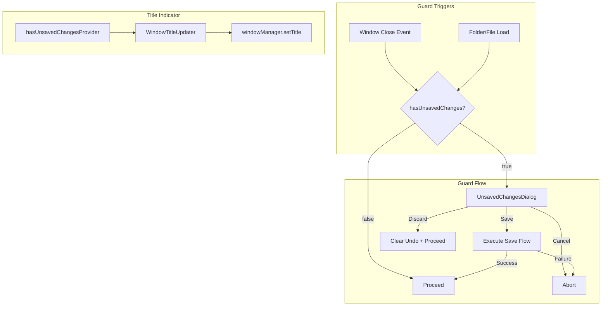

# Design Document: Unsaved Changes Protection

## Overview

This feature adds three capabilities to prevent silent data loss:

1. **Window close guard** — intercepts the OS close event via `window_manager`'s `WindowListener.onWindowClose`, shows a Save/Discard/Cancel dialog when dirty state exists.
2. **Folder/file load guard** — intercepts all load paths (Open Folder, Open Files, drag-and-drop, recent folders, address bar navigation) with the same dialog pattern.
3. **Window title dirty indicator** — reactively updates the window title bar to show `* Open Tag Editor` when any file is modified.

The design reuses existing infrastructure: `hasUnsavedChangesProvider`, `modifiedFileCountProvider`, the save flow in `SaveActionHelper`, and the `WindowListener` mixin already present in `_OpenTagEditorAppState`.

## Architecture



## Components and Interfaces

### 1. UnsavedChangesDialog

A stateless dialog widget offering Save/Discard/Cancel. Returns a `UnsavedChangesAction` enum.

```dart
enum UnsavedChangesAction { save, discard, cancel }

class UnsavedChangesDialog extends StatelessWidget {
  const UnsavedChangesDialog({required this.modifiedFileCount});

  final int modifiedFileCount;

  static Future<UnsavedChangesAction?> show(
    BuildContext context,
    int modifiedFileCount,
  ) async {
    return showDialog<UnsavedChangesAction>(
      context: context,
      barrierDismissible: false, // Prevent accidental dismiss
      builder: (_) => UnsavedChangesDialog(modifiedFileCount: modifiedFileCount),
    );
  }
}
```

**Location:** `lib/shared/widgets/unsaved_changes_dialog.dart`

The dialog is placed in `shared/widgets` because it's used from both the app-level close handler and feature-level load paths.

### 2. UnsavedChangesGuard

A utility class that encapsulates the guard logic: check dirty state → show dialog → handle result. This avoids duplicating the check-show-handle pattern at every call site.

```dart
class UnsavedChangesGuard {
  /// Returns true if the caller should proceed (either no dirty state,
  /// or user chose Save/Discard). Returns false if the action was cancelled.
  static Future<bool> check({
    required BuildContext context,
    required WidgetRef ref,
    bool clearUndoOnDiscard = false,
  }) async {
    final hasDirty = ref.read(hasUnsavedChangesProvider);
    if (!hasDirty) return true;

    final count = ref.read(modifiedFileCountProvider);
    final action = await UnsavedChangesDialog.show(context, count);

    switch (action) {
      case UnsavedChangesAction.save:
        final success = await _executeSave(context, ref);
        return success;
      case UnsavedChangesAction.discard:
        if (clearUndoOnDiscard) {
          ref.read(undoRedoProvider.notifier).clear();
        }
        return true;
      case UnsavedChangesAction.cancel:
      case null:
        return false;
    }
  }
}
```

**Location:** `lib/shared/widgets/unsaved_changes_guard.dart`

### 3. Window Close Handler (in `_OpenTagEditorAppState`)

Override `onWindowClose` in the existing `WindowListener` mixin:

```dart
@override
void onWindowClose() async {
  // Enable prevent-close so we can intercept.
  await windowManager.setPreventClose(true);

  final hasDirty = ref.read(hasUnsavedChangesProvider);
  if (!hasDirty) {
    await windowManager.destroy();
    return;
  }

  if (!mounted) {
    await windowManager.destroy();
    return;
  }

  final proceed = await UnsavedChangesGuard.check(
    context: context,
    ref: ref,
    clearUndoOnDiscard: false, // Process is terminating
  );

  if (proceed) {
    await windowManager.destroy();
  }
  // If cancelled, do nothing — window stays open.
}
```

**Key detail:** `windowManager.setPreventClose(true)` must be called during `initState` to enable the `onWindowClose` callback. Without it, the OS closes the window before the callback fires.

### 4. Window Title Updater

A reactive listener that watches `hasUnsavedChangesProvider` and updates the window title:

```dart
// In _OpenTagEditorAppState.initState():
ref.listenManual(hasUnsavedChangesProvider, (previous, next) {
  final title = next ? '* Open Tag Editor' : 'Open Tag Editor';
  windowManager.setTitle(title);
});
```

This is lightweight — a single `listenManual` call in the existing app state, no new widget needed.

### 5. Load Guard Integration Points

The guard must be called before any operation that loads new files. Integration points:

| Entry Point | Location | Integration |
|---|---|---|
| Open Folder button | `toolbar.dart` `_openFolder` | Call `UnsavedChangesGuard.check()` before `FilePicker` |
| Open Files button | `toolbar.dart` `_openFiles` | Call `UnsavedChangesGuard.check()` before `FilePicker` |
| Drag-and-drop | `FolderLoadingService.loadFromDrop` | Call guard at start |
| Address bar navigation | `AddressBar` submit | Call guard before `loadFolder` |
| Recent folder selection | Recent folders menu | Call guard before `loadFolder` |
| Startup reopen | `_maybeReopenLastFolder` | Call guard (though dirty state is always false at startup, this future-proofs it) |

## Design Decisions

### Why a shared guard utility instead of per-site logic?

The Save/Discard/Cancel flow is identical at every call site. A shared `UnsavedChangesGuard.check()` method keeps the logic DRY and ensures consistent behavior. Each call site becomes a one-liner guard check.

### Why `barrierDismissible: false`?

Clicking outside a dialog to dismiss it is a common accidental action. For a data-loss-prevention dialog, we require an explicit button press. Escape key still works (mapped to Cancel).

### Why not clear undo on window close discard?

The process is terminating — clearing undo history would be wasted work. We only clear on folder/file load where the app continues running.

### Why update the title reactively instead of imperatively?

Using `ref.listenManual(hasUnsavedChangesProvider, ...)` means the title updates automatically whenever any file's modified state changes — after edits, saves, undos, or discards. No manual `setTitle` calls scattered throughout the codebase.

## Correctness Properties

These properties define universal invariants that must hold regardless of input:

1. **Guard shown iff dirty** — The dialog is shown if and only if `hasUnsavedChangesProvider` is true at the moment of the triggering action.
2. **Cancel is always safe** — Selecting Cancel never modifies any file state, undo history, or file list.
3. **Save-then-proceed atomicity** — If Save is selected, the load/close only proceeds after ALL modified files are successfully written. Partial save failure aborts the action.
4. **Discard clears undo on load** — After Discard on a load action, `undoRedoProvider.state.canUndo` is false.
5. **Title reflects dirty state** — At any point in time, the window title starts with "* " if and only if `hasUnsavedChangesProvider` is true.
6. **No guard on clean state** — When no files are modified, all load and close operations proceed without any dialog.
