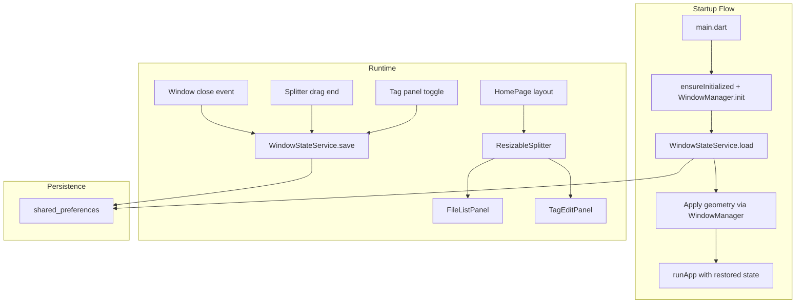

# Design Document: Window State Persistence

## Overview

This feature adds session persistence for window geometry, tag panel layout state, and last loaded folder to Open Tag Editor. It introduces three main capabilities:

1. **Window geometry persistence** — saves/restores window size and position via `window_manager` and `shared_preferences`.
2. **Resizable tag panel** — replaces the fixed 380px tag panel width with a draggable splitter widget, persisting the user's preferred width.
3. **Last folder reopening** — optionally reloads the most recent folder on startup (controlled by a new general setting).

The design ensures all state restoration completes before the first frame is painted, eliminating visible layout jumps.

## Architecture



The architecture follows the existing project pattern: a `StateNotifier` manages the in-memory state, `shared_preferences` handles persistence, and Riverpod providers expose the state to the widget tree.

**Key design decision:** Window geometry restoration happens *before* `runApp()` in `main.dart`, using `window_manager`'s API to set size/position while the window is still hidden. This prevents the default-size-then-resize flash. Tag panel state is loaded synchronously from the provider's initial value (pre-loaded before the widget tree builds).

## Components and Interfaces

### 1. WindowStateService

A pure data service (not a widget) responsible for reading/writing window state to `shared_preferences`.

```dart
class WindowStateService {
  /// Loads persisted window state. Returns null if no state is saved.
  static Future<WindowState?> load();

  /// Persists the given window state. Fire-and-forget (async, non-blocking).
  static Future<void> save(WindowState state);

  /// Clears all persisted window state.
  static Future<void> clear();
}
```

### 2. WindowState Model

An immutable data class holding all persisted layout state.

```dart
class WindowState {
  final int windowWidth;
  final int windowHeight;
  final int windowX;
  final int windowY;
  final bool isTagPanelOpen;
  final double tagPanelWidth;
  final String? lastFolderPath;
}
```

### 3. WindowStateNotifier (Riverpod StateNotifier)

Manages the runtime window state and triggers persistence on changes.

```dart
class WindowStateNotifier extends StateNotifier<WindowState> {
  WindowStateNotifier(WindowState initial) : super(initial);

  void updateGeometry(int width, int height, int x, int y);
  void setTagPanelOpen(bool open);
  void setTagPanelWidth(double width);
  void setLastFolderPath(String? path);
}
```

### 4. ResizableSplitter Widget

A stateful widget that renders a draggable vertical divider between two children.

```dart
class ResizableSplitter extends StatefulWidget {
  final Widget leftChild;
  final Widget rightChild;
  final double rightWidth;
  final double minRightWidth;
  final double maxRightWidthFraction;
  final ValueChanged<double> onWidthChanged;
  final VoidCallback onDragEnd;
}
```

### 5. Startup Initialization (main.dart changes)

```dart
Future<void> main() async {
  WidgetsFlutterBinding.ensureInitialized();
  await windowManager.ensureInitialized();

  final savedState = await WindowStateService.load();
  await _applyWindowGeometry(savedState);

  runApp(
    ProviderScope(
      overrides: [
        windowStateProvider.overrideWith(
          (_) => WindowStateNotifier(savedState ?? WindowState.defaults()),
        ),
      ],
      child: const OpenTagEditorApp(),
    ),
  );

  await windowManager.show();
}
```

### 6. GeneralSettings Extension

Add `reopenLastFolder` field to the existing `GeneralSettings` model and `GeneralSettingsNotifier`.

## Data Models

### WindowState

| Field | Type | Default | Persistence Key |
|-------|------|---------|-----------------|
| windowWidth | int | 1280 | `window_state_width` |
| windowHeight | int | 800 | `window_state_height` |
| windowX | int | (centered) | `window_state_x` |
| windowY | int | (centered) | `window_state_y` |
| isTagPanelOpen | bool | false | `window_state_tag_panel_open` |
| tagPanelWidth | double | 380.0 | `window_state_tag_panel_width` |
| lastFolderPath | String? | null | `window_state_last_folder` |

### GeneralSettings (extended)

| Field | Type | Default | Persistence Key |
|-------|------|---------|-----------------|
| confirmBeforeSaving | bool | true | `settings_v1_general_confirm_before_saving` |
| reopenLastFolder | bool | false | `settings_v1_general_reopen_last_folder` |

### Validation Rules

- `tagPanelWidth` is clamped to `[280.0, windowWidth * 0.5]` on load and during drag.
- `windowWidth` and `windowHeight` are clamped to the primary display bounds on restore.
- `windowX` and `windowY` are validated against connected displays; if off-screen, the window is centered on the primary display.

### SharedPreferences Key Namespace

All window state keys use the `window_state_` prefix to avoid collisions with existing settings keys (`settings_v1_*`, `lookup_*`, `recursive_*`, etc.).

## Correctness Properties

*A property is a characteristic or behavior that should hold true across all valid executions of a system — essentially, a formal statement about what the system should do. Properties serve as the bridge between human-readable specifications and machine-verifiable correctness guarantees.*

### Property 1: Window state serialization round-trip

*For any* valid `WindowState` object (with integer width, height, x, y, boolean isTagPanelOpen, double tagPanelWidth, and optional lastFolderPath), saving it via `WindowStateService.save()` and then loading it via `WindowStateService.load()` SHALL produce an equivalent `WindowState` object.

**Validates: Requirements 1.3, 1.4**

### Property 2: Off-screen position falls back to centered

*For any* persisted window position (x, y) and set of display bounds, if no connected display's bounds contain any portion of the window rectangle, then the restored position SHALL be centered on the primary display.

**Validates: Requirements 2.3**

### Property 3: Window size clamped to display bounds

*For any* persisted window size (width, height) and primary display bounds, the restored window size SHALL have width ≤ display width and height ≤ display height.

**Validates: Requirements 2.4**

### Property 4: Tag panel width minimum invariant

*For any* tag panel width value (from drag, from persistence, or from window resize), the effective tag panel width SHALL be ≥ 280 logical pixels.

**Validates: Requirements 3.3, 4.5**

### Property 5: Tag panel width maximum invariant

*For any* tag panel width value and any window width, the effective tag panel width SHALL be ≤ 50% of the current window width.

**Validates: Requirements 3.4, 3.7, 4.6**

### Property 6: Corrupted persisted data produces valid defaults

*For any* set of corrupted or malformed shared_preferences values (null, wrong type, out-of-range numbers, invalid strings), `WindowStateService.load()` SHALL return either a valid `WindowState` with all fields within their valid ranges, or null (triggering default fallback), and SHALL NOT throw an exception.

**Validates: Requirements 6.3**

## Error Handling

| Scenario | Behavior |
|----------|----------|
| `shared_preferences` read fails | Return `null` from `load()`, use defaults silently |
| `shared_preferences` write fails | Swallow exception, log warning (best-effort persistence) |
| Persisted values are corrupted/wrong type | Return `null` from `load()`, use defaults |
| Persisted position is off-screen | Center on primary display using persisted size |
| Persisted size exceeds display | Clamp to display bounds |
| Persisted tag panel width out of range | Clamp to [280, windowWidth * 0.5] |
| Persisted folder path doesn't exist | Start with no folder loaded, clear persisted path |
| `window_manager` initialization fails | Fall back to Flutter's default window behavior |
| Display info unavailable | Use 1280x800 centered as fallback |

All error handling is silent — no error dialogs are shown to the user for state restoration failures.

## Testing Strategy

### Unit Tests

- **WindowState model**: Default values, `copyWith`, equality.
- **WindowStateService**: Save/load round-trip with mocked `shared_preferences`. Corrupted data handling. Null/missing keys.
- **Clamp logic**: Specific examples for tag panel width clamping (below min, above max, within range). Window size clamping to display bounds.
- **Off-screen detection**: Specific examples with known display configurations.
- **GeneralSettings**: Default `reopenLastFolder` is false. Toggle persists correctly.

### Property-Based Tests

Property-based tests use the `dart_check` package (or `glados` if preferred) with minimum 100 iterations per property.

- **Property 1** (round-trip): Generate random `WindowState` instances, save → load, assert equality.
- **Property 2** (off-screen → centered): Generate random positions and display bounds where position is off-screen, assert result is centered.
- **Property 3** (size clamping): Generate random sizes exceeding display bounds, assert clamped result fits.
- **Property 4** (min width): Generate random width values including negatives and very small numbers, assert effective width ≥ 280.
- **Property 5** (max width): Generate random width values and window widths, assert effective width ≤ windowWidth * 0.5.
- **Property 6** (corrupted data): Generate random invalid preference maps, assert no exception and valid output.

Each property test is tagged: `// Feature: window-state-persistence, Property {N}: {title}`

### Widget Tests

- **ResizableSplitter**: Drag gesture updates width. Cursor changes on hover. Hit target is ≥ 8px wide. Min/max constraints enforced during drag.
- **HomePage integration**: Tag panel uses splitter when open. Panel visibility matches state.

### Integration Tests

- **Startup flow**: Verify `window_manager` receives correct geometry before `show()`.
- **Persistence triggers**: Panel toggle persists state. Drag end persists width. Window close persists geometry.
- **Last folder**: Enabled setting + valid path → folder loads. Disabled setting → no load. Missing path → cleared.

